# Linux5.15.147\_User’s Manual

Document classification: □ Top secret □ Secret □ Internal information ■ Open

## Copyright

The copyright of this manual belongs to Baoding Folinx Embedded Technology Co., Ltd. Without the written permission of our company, no organizations or individuals have the right to copy, distribute, or reproduce any part of this manual in any form, and violators will be held legally responsible.

Forlinx adheres to copyrights of all graphics and texts used in all publications in original or license-free forms.

The drivers and utilities used for the components are subject to the copyrights of the respective manufacturers. The license conditions of the respective manufacturer are to be adhered to. Related license expenses for the operating system and applications should be calculated/declared separately by the related party or its representatives.

## Overview

<font style="color:#333333;">This manual is designed to help users quickly familiarize themselves with the product, and understand the interface functions and testing methods. It primarily covers the testing of interface functions on the development board, the methods for flashing images, and troubleshooting procedures for common issues encountered in use. In the process of testing, some commands are annotated to facilitate the</font>user's understanding, mainly for practical use. Please refer to “OK527N-C \_ Linux 5.15.147 + Qt5.15.8 User’s Compilation Manual” provided by Forlinx for kernel compilation, related application compilation methods and development environment construction.

There are total six parts:

Chapter 1. provides an overview of the product, briefly introducing the interface resources of the development board, the relevant driver paths in the kernel source code, supported flashing and booting methods, as well as explanations of key sections in the documentation;

Chapter 2. is the fast boot/startup of the product, which can adopt two ways of serial port login and network login;

Chapter 3. is QT interface function test of the product;

Chapter 4. is the command line operation of the product for functional testing;

Chapter 5. is the multimedia test of the product, including the playback test of the camera and the video hardware codec test;

Chapter 6. is the image update of the product, which mainly describes the method of updating the image to the storage device. Users can choose the corresponding flashing mode according to the actual situation.

A description of some of the symbols and formats in the manual:

|    **Format**     | **Meaning**                                                  |
| :---------------: | ------------------------------------------------------------ |
|        //         | Interpretation of input instructions or output information   |
| Username@Hostname | root@OK527:~#: Development board serial port login account information, |

forlinx@ubuntu: Ubuntu development environment account information 

Users can determine the operating environment for functional operations based on this information.

Example: After inserting the TF card, you can use the "ls" command to view the mounting directory.

```plain
root@OK527:/# ls /run/media                                //List files in the/run/media directory
mmcblk0p1  mmcblk0p5  mmcblk1p1
```

root@OK527: The username is ''root'', the hostname is ''OK527'', indicating operations are being performed on the development board using the root user.

// : Explanation of ls /run/media operation, no input required.

## Application Scope

This software manual applies to the Forlinx<font style="color:rgb(0,0,0);">OK527 （V1.3） platform Linux5.15.147 operating system.</font>

## Revision History

|  **Date**  | **Manual Version** | **SoM Version** | **Carrier Board Version** | **Revision History**          |
| :--------: | :----------------: | :-------------: | :-----------------------: | ----------------------------- |
| 28/04/2025 |        V1.0        |      V1.1       |      V1.1 and Above       | User's Manual Initial Version |

## 1. OK527 Development Board Description

### 1.1 OK527 Development Board Description

<font style="color:black;">OK527 development board uses a </font>SoM<font style="color:black;">+ carrier board structure, designed and developed based on the AllWinner T527 processor. The processor features an ARM Cortex-A55, 2Tops NPU, HiFi4 DSP, G57 MC1 GPU multi-core heterogeneous architecture. The processor consists of four small cores with a frequency of 1.</font>4G<font style="color:black;">Hz and four big cores with a frequency of 1.8GHz. The SoM comes in two configurations: one with 4GB LPDDR4 memory and 32GB eMMC, and the other with 2GB LPDDR4 memory and 16GB eMMC. The OK527N-C development board offers rich interface resources and multiple peripheral interfaces, including network card, CPU built-in audio codec, GPADC, LRADC, TF Card, LVDS, HDM, DP, RGB, WiFi, 4G, PCIe, MIPI-CSI, and more.</font>


**Note：**

**The hardware parameters are not described in this software manual. Before referring to this manual for software development, please read "OK527N-C \_ Hardware Manual" under the path of "U disk Path: User Data \\ Hardware Data \\ 1-Manual" to understand the product naming rules and the hardware configuration information of the product you use, which is helpful for you to use this product.**

### 1.2 Introduction to Linux 5.15.104 System Software Resources

| **Device**| **Location of driver source code in the kernel**| **Device Name**
|----------|----------|----------
| NIC Driver| bsp/drivers/gmac/   bsp/drivers/stmmac| /sys/class/net/eth0   /sys/class/net/eth1
| LCD Backlight Driver| drivers/video/backlight/| /dev/disp
| LED Driver| drivers/leds/| /sys/class/leds/
| USB Port| drivers/usb/storage/| /dev/sd\*
| USB 4G| drivers/usb/serial/| /dev/ttyUSB\*
| USB Camera| drivers/media/usb/uvc/uvc\_video.c| /dev/video\*
| SD Driver| bsp/drivers/mmc/| /dev/block/mmcblk\_p\_
| LCD FrameBuffer| bsp/drivers/video/sunxi/| /dev/fb\*
| serial port driver| bsp/drivers/uart/sunxi-uart.c| /dev/ttyAS\*
| watchdog driver| bsp/drivers/watchdog/| /dev/watchdog
| WIFI| drivers/net/wireless/nxp/mlan/| /sys/class/net/wlan0
| Audio Driver| bsp/drivers/sound/platform| /dev/snd/
| SPI| bsp/drivers/spi/   drivers/spi/| /dev/spidev\*.\*
| TWI Driver| bsp/drivers/twi/| /dev/i2c-\*
| PWM Driver| bsp/drivers/pwm/| /dev/sunxi\_pwm\*
| GT911/GT928 touch driver| drivers/input/touchscreen/goodix.c| /dev/input/event\*
| ft5x06 Touch Driver| drivers/input/touchscreen/edt-ft5x06.c| /dev/input/event\*
| GPADC driver| bsp/drivers/gpadc/| /dev/input/event\*
| LRADC key driver| bsp/drivers/lradc/| /dev/input/event\*
| RTC Driver| drivers/rtc/rtc-rx8010.c   drivers/rtc/rtc-pcf8563.c| /dev/rtc0
| IR Driver| bsp/drivers/ir-rx/| /dev/input/event\*
| awlink driver| bsp/drivers/awlink/| /sys/class/net/awlink\*

### 1.3 Flashing and Boot Settings

OK527 supports TF card and USB OTG programming, and the hardware supports eMMC startup.

Insert the TF card into the development board before powering on. After powering on, the TF card flashing process will begin; otherwise, it will boot from eMMC. For detailed flashing instructions, please refer to the "System Flashing".

**Note: The OK527 development board does not support SPI NOR booting.**

## 2. Fast Startup

### 2.1 Preparation Before Startup

The OK527 development board has two system login methods, serial and network login. 

Hardware preparation before system startup:

- 12V3A DC Power Cable;

  Debugging serial cable (Serial Login);

- The development board features a USB Type-C port for debugging purposes, allowing you to connect it to a PC using a Type-A to Type-C cable in order to access the board's status information;

- Network cable (for network login);

- According to the development board interface to connect the screen (Based on display needs);

- Check the booting method (the system will prioritize booting from the TF card if inserted; otherwise, it will boot from eMMC).


### 2.2 Serial Port Login

#### 2.2.1 Serial Login

**Description:**

- **Serial port settings: Baud rate 115200, data bit 8, stop bit 1, no parity bit, no flow control;**
- **The serial terminal login uses the root user without password;**
- **Software requirements: PC Windows system needs to install the terminal software. Because the terminal software has many types, users can choose their familiar one.**

The following is an example of how to set up the terminal using putty (02-User Information \\01-Software Information \\04-Tools\\putty-64-bit\_x86.exe):

Step 1: Connect the development board and the PC using a serial cable, and verify the serial port number recognized by the computer through the “Device Manager”. 

The port number recognized by the computer should be considered as the accurate one; 

Choose “USB-Enhanced-SERIAL-A CH342”.

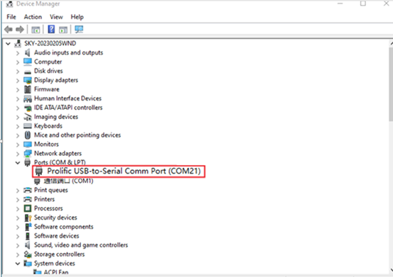

Step 2: Open and configure PuTTY; set the serial line to match the COM port of your computer with a baud rate of 115200.


Step 3: Power on the development board. Serial port will output printing information until “root@OK527:/#” appears, indicating the completion of the boot process. The system defaults to the root account with no password required for login.

#### 2.2.2 Serial Login Common Problems

Connect the PC side to the development board through the Type-C adapter cable and install the corresponding driver (User Information-Software Information\\3-Tools\\CH343SER.ZIP).

It is better to use a good quality cable to avoid error codes.

### 2.3 Network Login Methods

#### 2.3.1 Network Connection Test

**Description:**

- **The default factory IP for eth0 is 192.168.0.232;**
- **The computer and board should be on the same network segment for testing.**

Before login, you should ensure the network connection between the computer and the development board is normal, and use the ping command to test the connection status. 

The specific method of operation is as follows:

1\. Connect eth0 of the development board to the computer through the network and power up the development board. A red light on the SoM will blink after the kernel starts, and the network card connected to the computer will blink quickly after normal startup. At this point, we can test the network connection;

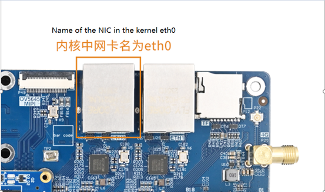

2\. Close the computer firewall (General computer operations, not described here in detail), then open the computer's run command;

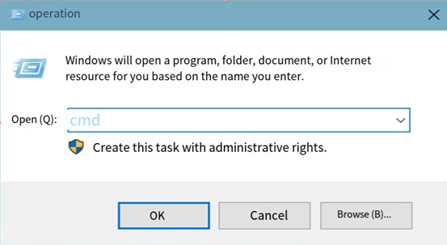

3\. Use cmd to open the administrator interface , and use the ping command to test the network connection status of the computer and the development board.

A data return indicates a normal network connection.


#### 2.3.2 SSH server

**Description:**

- **The default factory SSH login account is "root" and the password is also "root";**
- **The default factory IP for eth0 is 192.168.0.232;**
- **File transfers can be performed with scp.**

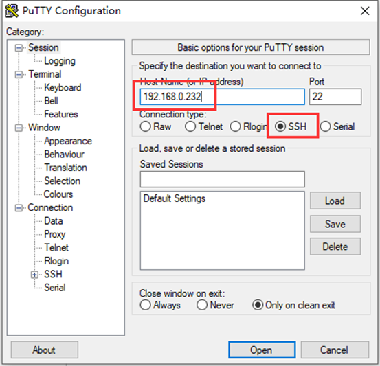

Click "Open", the following dialog box will appear, click "Yes" to enter the login screen.


```plain
Login as：root
root@192.168.0.232's password:               //Enter the password "root" for the root account of the development board as prompted.
root@OK527:~$
```

Use SFTP to copy files, refer to 4.17.2 SFTP

### 2.4 Screen Switching

Currently, screen switching supports two methods: U-Boot menu and QT application.

In addition, the following rules shall be followed for screen configuration:

```plain
 When outputting on a single screen, the other disp _ type must be none and the disp _ pri _ type must be the same as the output
```

```plain
 When LCD and DP are selected to output simultaneously, LCD must be selected as the main screen
```

a)    LCD includes “lcd 1024x600”“mipi 1024x600”“lvds 1280x800”;

b)	DP includes “dp 1080P60”“dp 2.5k”;

c)    HDMI automatically configures resolution based on edid.

#### 2.4.1 Dynamic Control of Uboot Menu

This method allows switching without recompiling and burn-in of existing supported screens.

During the Uboot boot process, pressing the spacebar will enter the uboot menu.

```plain
---------------------------------------------
0:Exit to console
1:Reboot
2:Display0 Type:lvds 1280x800
3:Display1 Type:hdmi
4:Device PHY Type:none
5:display primary screen: disp0_type
---------------------------------------------
```

The menu options are as follows:

Enter 0 to enter the uboot command line;

Enter 1 to restart uboot;

Enter 2 will cyclically select the Display0 Type screen;

Enter 3 will cyclically select the Display1 Type screen;

Enter 4 will cyclically select the multiplexing of PCIe and USB3.0.

Enter 5 will cyclically select the main screen;

Take the "LVDS 1280x800" and "HDMI" screens as an example. After entering the uboot menu, press the corresponding number until the following content is displayed, and then press 1 to restart.

```plain
---------------------------------------------
0:Exit to console
1:Reboot
2:Display0 Type:lvds 1280x800
3:Display1 Type:hdmi
4:Device PHY Type:none
5:display primary screen: disp0_type
---------------------------------------------
```

**Note: The current version does not support DP 2560x1440 resolution and HDMI 3840 × 2160 resolution**

    	**The DP screen cannot be displayed alone**

#### 2.4.2 Qt Program Screen Switching

This method allows switching without recompiling and burn-in of existing supported screens.

Refer to 3.19 Switching Screen Display.

### 2.5 System Storage

OK527 has multiple specifications, the following are 2+16GB versions.

#### 2.5.1 EMMC

The following table is the eMMC memory partition information of Linux operating system:

| **Partition Index**| **Name**| **Size**| **File system**| **Content**
|:----------:|:----------:|:----------:|:----------:|----------
| mmcblk0p1| boot-resource| 32 MB| vfat| boot-resource.fex
| mmcblk0p2| env| 16 MB| raw| env.fex
| mmcblk0p3| boot| 64 MB| raw| boot.fex
| mmcblk0p4| rootfs| 4096MB| ext4| rootfs.fex
| mmcblk0p5| userdata| Remaining total| ext4| User partition

Use the df command to view disk usage on a system. The following image depicts the default disk usage upon factory settings (using the QT file system). Please note that this is for reference only, and actual parameters may vary.

```plain
root@OK527:/# df -Th
Filesystem     Type      Size  Used Avail Use% Mounted on
/dev/root      ext4      3.9G  1.1G  2.9G  27% /
tmpfs          tmpfs     967M  440K  967M   1% /tmp
tmpfs          tmpfs     967M  460K  967M   1% /run
devtmpfs       devtmpfs  935M     0  935M   0% /dev
/dev/mmcblk0p1 vfat      128M  7.4M  121M   6% /run/media/mmcblk0p1
/dev/mmcblk0p5 ext4       11G   24K  9.7G   1% /run/media/mmcblk0p5

```

#### 2.5.2 Memory

Using the “free” command to view memory usage, the following image shows the memory usage without connecting any peripherals, in MB. It’s for reference only; actual parameters may vary.

```plain
root@OK527:/# free -m
              total        used        free      shared  buff/cache   available
Mem:           1934         258        1455          13         221        1638
Swap:             0           0           0
```

### 2.6 System Shutdown

In general, the power can be turned off directly. If there is data storage, function use, or other operations, avoid turning off the power arbitrarily during operation to prevent irreversible damage to the file. In such cases, only re-flashing the firmware can resolve the issue. Before powering off, use the sync command to ensure data is fully written.

The command ‘‘reboot’‘ can be used to restart the development board. You can also restart the hardware by pressing the K3 (RESET) key or directly power off and restart.

Long-pressing the K2 (PWRON) button on the development board can turn off the device, and long-pressing K2 again can turn it on.

**Note：If the user-designed product using the SoM experiences an unexpected shutdown due to power loss during operation, power-down protection measures can be included in the design to prevent this issue.**

## 3\. OK527 Platform Interface Function Use and Test

<font style="color:black;"> </font>**Description:**

**Users should follow this section when using the screen with the QT file system, but can skip it for non-QT operations.**

**This chapter details QT functions. With the default device and driver working normally, it's advisable to test interface functions after command line tests.**

QT test source code path: source code OK 527-linux-sdk/platform/forlinx/forlinx \_ qt \_ demo.

Testing program path in the development board’s file system: /usr/bin.

This chapter mainly explains the usage of the expansion interfaces on the development board in QT interface. The testing program is only for reference, and please make adjustments based on your actual situations when using it.

### 3.1 Introduction to Interface Function

The desktop of the OK527 development board appears as follows after startup:


Click the arrow in the upper right corner togo to the next page.


Video Player is not supported in the current version

### 3.2 Network Configuration Test

**Description:**

**By factory default, only the eth0 network card is set to STATIC mode;**

**The IP and network configuration will be stored in the system file (/etc/network/interfaces), ensuring the settings persist across system restarts.**

Icon：

Clicking on the network configuration icon will open a interface program that supports two modes: STATIC and DHCP.

STATIC Mode

After clicking on the network configuration icon, select the STATIC mode as shown in the figure. You can then configure the IP address, subnet mask, gateway, and DNS settings. Once you have set the parameters, click on "Apply and Restart Network".

| **Relevant Parameter**| **Meaning**
|----------|----------
| interface| Set up the network card
| ip| Set the IP address
| netmask| Set the subnet mask
| gateway| Set up the gateway
| dns| Set DNS

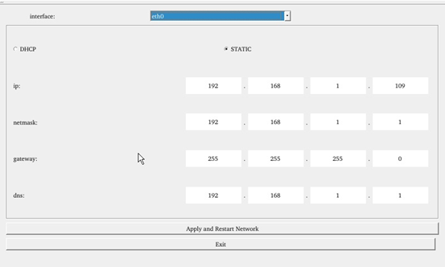

DHCP Mode:

**Note: Testing must be done on a router that supports automatic IP allocation.**

Check DHCP, select the NIC device needing to be configured, and click “Apply and Restart Network” at the bottom of the interface to restart the network and get the ip automatically.

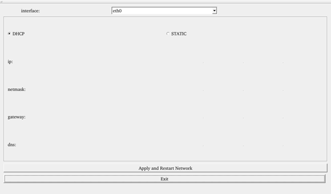

### 3.3 Browser Test

Icon：

Click the browser icon and ensure a smooth network connection with available DNS before accessing external sites. Upon browser startup, it defaults to visiting Forlinx Embedded's official website, as shown below:


**Note: If the development board time is abnormal, it will cause certificate problems.**

## 3.4 4G Test

Icon：

The "4G" test program is used to test the OK527 external 4G module (EC20). Before testing, power off the development board, insert the SIM card into the 4G module (ensure correct SIM direction), and launch the test application. This test employs the EC20 module as a reference.


Click the CONNECT button then the program will automatically enter the dialing process and get the IP to set the DNS, etc. After waiting patiently for a few seconds, click the ping button to test it.

### 3.5 UART Test

Icon：

This test uses UART4 (ttyAS4) and conducts serial port testing through the serial tool.

1\. Click the UART test icon to enter the following interface to set the serial port parameters:

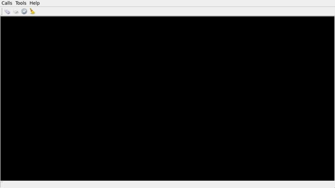

2\. Click thesetup button in the top left corner to align serial port parameters with those on the computer side, as depicted below:

| **Relevant Parameter**| **Meaning**
|----------|----------
| Select Serial Port| Setting the serial port (select UART4, i.e. ttyAS4)
| BaudRate| Set baud rate (115200)
| Data bits| Set data bits (8 bits)
| Parity| Set parity bit (no parity)
| Stop bits| Set stop bit (1 bit)
| Flow control| Set flow control (no flow control)

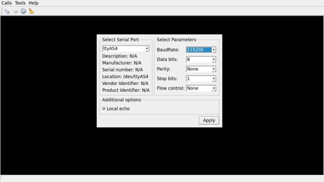

3\. After setting the serial port parameters, click the connect button in the upper left corner, then the program can conduct data sending and receiving tests;

4\. Open the serial port tool on the computer, and the data received by the serial port will be displayed on the screen at this time;

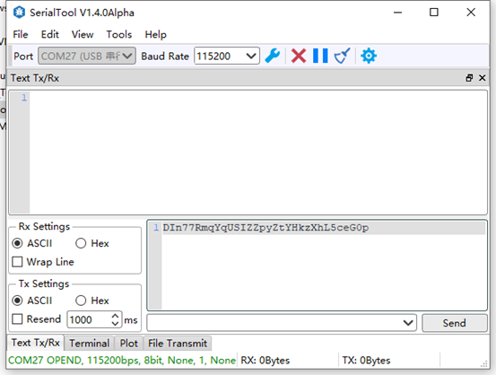


5\. Click on the black - screen area in the middle of the test interface, and a soft keyboard will pop up. After continuously entering 32 characters, the information printed by the serial port tool is the data sent by Qt.


### 3.6 ADC Test

Icon：

OK527 supports 24 x, and 14 x GPADC are led out from the OK527 carrier board. By default, all channels are floated. The value of the potentiometer can be measured by shorting the corresponding pin. Max value of 4096 corresponds to a voltage of 1.8V.

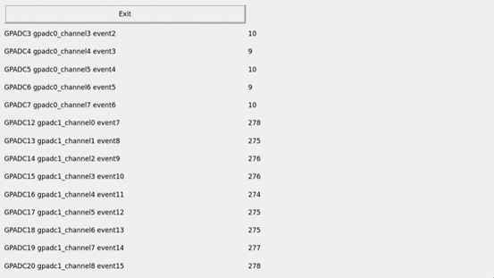

### 3.7 WIFI Test

**Description:**

**The AW-CM358 chip is soldered on the OK527 carrier board.**

**"WIFI" is a tool for configuring and testing the STA (station) mode of Wi-Fi**.

1\. Click iconto enter test interface, select module from dropdown, enter SSID for Wi-Fi connection.

Enter router name \& password in PAWD, click "connect" to WiFi；


2\. After the connection is successful, click "ping" to test the network after setting the IP;


### 3.8 RTC Test

**Note: Ensure button cell batteries are installed \& voltage is normal.**

Icon: 

RTC test includes setting time, power cycling, rerunning test software, and verifying RTC sync.

Run the RTC test software to view and set the current system time with the following interface:


Click "set" to set the time. After setting, click the save button to save the setting.<font style="color:black;"> Then power off and power on after a period of time. Run the</font><font style="color:black;"> RTC </font><font style="color:black;">test software again to read the time automatically. It can be seen that the </font><font style="color:black;"> RTC </font><font style="color:black;">time has been synchronized and the</font><font style="color:black;">RTC</font><font style="color:black;"> test is normal.</font>

### 3.9 Key Test

Icon：

"Keypad" tests platform buttons' availability by checking if pressed buttons turn blue. Interface shown below.


There are 6 physical buttons USER, VOL +, VOL-, HOME, MENU and ENTER on the side of OK527 carrier board, which respectively correspond to User, V +, V-, Home, Menu and Enter in the test program. When the button is pressed, the corresponding button in the test application will turn blue, indicating that the button function is normal.

### 3.10 Watchdog Test

Icon：

“WatchDog" tests the functionality of the watchdog feature. 

Interface as follows:


Checking "feed dog" \& clicking "open watchdog" starts watchdog function with dog-feeding. System shouldn't restart under normal conditions.

Unchecking "Feed Dog" \& clicking "Activate Watchdog” starts watchdog function without dog-feeding. After about 10 seconds, the system restarts, indicating normal watchdog function.”

### 3.11 Ping Test

Icon：

"Ping" is a graphical tool for network testing, offering a user-friendly interface for ping operations.

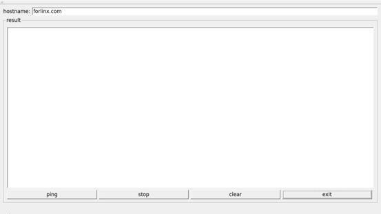

Write the target IP address in the "hostname" column. Click the "ping" button, and the "result" column will display the ping outcome. Click "stop" to end the ping test, and "clear" to erase the information in the "result" column.

As shown in the figure, the network connection is smooth.


### 3.12 Camera Test

Icon：

Click the icon to enter the camera test program, which supports MIPI CSI interface and UVC camera. During the test, the UVC camera or mipi ov5645 needs to be inserted first, the device name corresponding to the UVC is/dev/video1, and the device name of the MIPI OV5645 at the P48 position of the carrier board is/dev/video0. Carrier board P49 location MIPI OV5645 device name is/dev/video4. 

Open the QT test program.


Choose the camera video device node;

Set the camera resolution;

Click "Start" to capture video;

Click "Stop" to end capture;

Click "Picture" to take a photo;

Save the photo with a name and at a chosen path.

**Note: Please select the camera device and resolution based on your actual situation.**

Take mipiov5645 camera as an example for test.


Click "Picture" to take photos and save them in /root/. Use Windows built-in image viewer to view them.


The current MIPI OV5645 module supports resolutions of 1280x960, 1920x1080, and 2592x1944 respectively. 

The following is an example test of the OV5645 resolution of 2592x1944 connected to the carrier board P48.


**Note: If TP2855 is used for testing, the device tree needs to be modified and recompiled to generate an image.** 

The modification method is as follows:   
Open OKT527-linux-sdk1.3/kernel/linux-5.15/arch/arm64/boot/dts/allwinner/OKT527-C-Linux.dts device tree;

Uncomment TP2855 and comment out OV13855 at the same time, recompile the image after saving, and test with this application after flashing.


### 3.13 Backlight Test

Icon：

"BackLight" is an LCD backlight adjustment App with a left-right progress bar for brightness control. 

Click to open the interface as follows:


Drag the slider in the interface to set the LCD backlight brightness. 1 is the darkest, 255 is the brightest, and 0 needs to be set through the command line. Refer to“4.21 LCD Backlight Adjustment”.

### 3.14 Play/Record Test

Icon：

Before conducting the audio recording test, please insert the prepared microphone into the mic port. Click the icon to enter the recording test application, which can be used to check if the sound card recording function is working properly.

Choose where to save the recording file. Click "Start" to begin recording and "Stop" to end.

The interface is as follows:


Click the Record button to test the recording. The recording file is saved in the root directory.

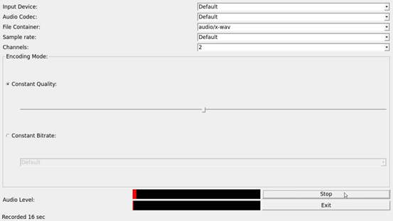

### 3.15 Music Play Test

Use the “ ” app icon to conduct a music playback test.

"music player" is a simple audio test application that can be used to test the function of the sound card or as a simple audio player.


Application Interfaces

Click the button in the lower left corner and select test audio /forlinx/media/test.mp3

### 3.16 CPU Frequency Configuration Test

OK527 has CPU0 to CPU3 with a maximum frequency of 1.4GHz, and CPU4 to CPU7 with a maximum frequency of 1.8GHz. By default, the CPU dynamically adjusts its frequency based on load. Alternatively, you can set a fixed CPU frequency.

Click the desktop setting icon toenter the next menu:


Click the desktop iconto enter the CPU main frequency setting page:

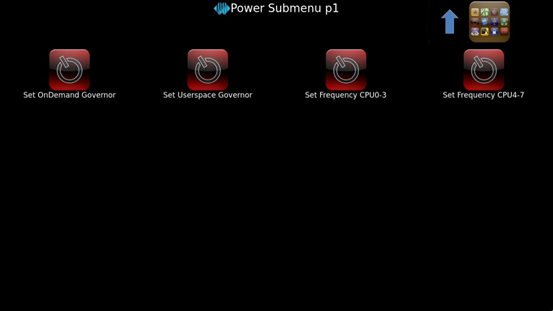

Set OnDemand Governor：Dynamically adjust the main frequency on demand;

Set Userspace Governor: Set CPU frequency in user mode;

Set Frequency CPU0-3: Adjust the frequency of the small cores;

Set Frequency CPU4-7: Adjust the frequency of the big cores;

As an example for setting the frequency of the small cores: First, click "Set Userspace Governor," then a dialog box will pop up; click "RUN."


Then, click “Set Frequency CPU0-3” to set a fixed frequency. (Click the arrow in the top right corner to return to the previous directory, and click the icon in the top right corner to return to the main directory).

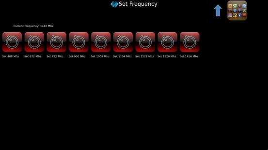

Select the desired frequency for configuration based on the needs.

### 3.17 SQLite3 Database Test

Icon：

Click on the icon to access the database testing interface.

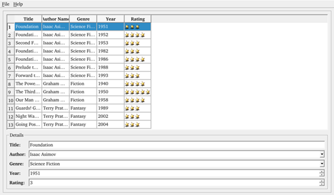

Select the column that needs to be modified, and click on an empty area after making the changes.

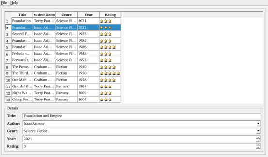

### 3.18 SPI Test

Icon：

Click on the icon to enter the SPI testing interface. Short-circuit the SPI0\_MOSI and SPI0\_MISO pins, then click “send” below to receive the data sent out and complete the test.


Short-circuit the SPI0\_MOSI and SPI0\_MISO pins, then click "send" below to receive the data sent out and complete the test.

### 3.19 Switching Display Screen

Icon：

Click the icon to enter the interface, click the corresponding button to modify the display settings, and click “Apply” to save the configuration, which will take effect in the next restart.

In addition, the following rules shall be followed for screen configuration:

```plain
When outputting on a single screen, the other disp _ type must be none and the disp _ pri _ type must be the same as the output.
```

```plain
When LCD and HDMI are selected for simultaneous output, LCD must be selected as the main screen
```

a)    LCD includes “lcd 1024x600”“mipi 1024x600”“lvds 1280x800”;

b)	DP includes “dp 1080P60”“dp 2.5k”;

c)    HDMI automatically configures resolution based on edid.


### 3.20 OpenGL

Icon：

The current frame rate is only 20 frames.

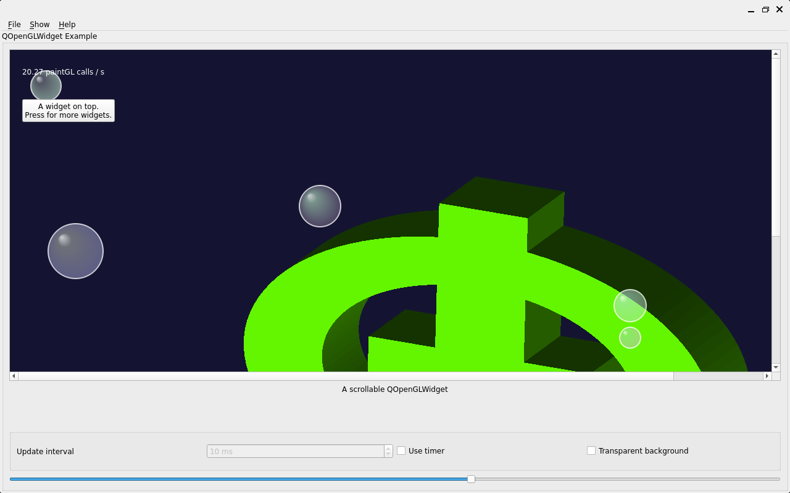

### 3.21 Video Player

Icon：

Click "open file" to select the test video to play.


### 3.22 CAN Test

Icon：

Configure can0 as shown in the figure below：


```plain
root@OK527:/# ip link set awlink1 up type can bitrate 500000
[58662.966792] IPv6: ADDRCONF(NETDEV_CHANGE): can1: link becomes ready
root@OK527:/# ip link set dev awlink1 txqueuelen 4096
root@OK527:/# cangen awlink1 
```

Configure can1 on the command line of the development board to send, and observe whether can0 receives data in the interface.


### 3.23 NPU\_AI\_CAMERA

Icon：

Insert the UVC camera and click the start button.

**Note: NPU testing is only supported in the OK 527N-C version.**


## 4. OK527 Command Line Function Test

The OK527 platform has various built-in command line tools available to users.

Test program source code path: OK527-linux-sdk/platform/forlinx/forlinx\_cmd\_demo/

Testing program path: "path": /usr/bin

### 4.1 System Information Query

To view the kernel information, enter the following command:

```plain
root@OK527:/# uname -a
Linux OK527 5.15.147 #10 SMP PREEMPT Thu Mar 13 17:01:54 HKT 2025 aarch64 GNU/Linux
```

To view CPU information:

```plain
root@OK527:/# cat /proc/cpuinfo
processor       : 0
BogoMIPS        : 48.00
Features        : fp asimd aes pmull sha1 sha2 crc32 atomics fphp asimdhp cpuid asimdrdm lrcpc dcpop asimddp
CPU implementer : 0x41
CPU architecture: 8
CPU variant     : 0x2
CPU part        : 0xd05
CPU revision    : 0

processor       : 1
BogoMIPS        : 48.00
Features        : fp asimd aes pmull sha1 sha2 crc32 atomics fphp asimdhp cpuid asimdrdm lrcpc dcpop asimddp
CPU implementer : 0x41
CPU architecture: 8
CPU variant     : 0x2
CPU part        : 0xd05
CPU revision    : 0

processor       : 2
BogoMIPS        : 48.00
Features        : fp asimd aes pmull sha1 sha2 crc32 atomics fphp asimdhp cpuid asimdrdm lrcpc dcpop asimddp
CPU implementer : 0x41
CPU architecture: 8
CPU variant     : 0x2
CPU part        : 0xd05
CPU revision    : 0

processor       : 3
BogoMIPS        : 48.00
Features        : fp asimd aes pmull sha1 sha2 crc32 atomics fphp asimdhp cpuid asimdrdm lrcpc dcpop asimddp
CPU implementer : 0x41
CPU architecture: 8
CPU variant     : 0x2
CPU part        : 0xd05
CPU revision    : 0

processor       : 4
BogoMIPS        : 48.00
Features        : fp asimd aes pmull sha1 sha2 crc32 atomics fphp asimdhp cpuid asimdrdm lrcpc dcpop asimddp
CPU implementer : 0x41
CPU architecture: 8
CPU variant     : 0x2
CPU part        : 0xd05
CPU revision    : 0

processor       : 5
BogoMIPS        : 48.00
Features        : fp asimd aes pmull sha1 sha2 crc32 atomics fphp asimdhp cpuid asimdrdm lrcpc dcpop asimddp
CPU implementer : 0x41
CPU architecture: 8
CPU variant     : 0x2
CPU part        : 0xd05
CPU revision    : 0

processor       : 6
BogoMIPS        : 48.00
Features        : fp asimd aes pmull sha1 sha2 crc32 atomics fphp asimdhp cpuid asimdrdm lrcpc dcpop asimddp
CPU implementer : 0x41
CPU architecture: 8
CPU variant     : 0x2
CPU part        : 0xd05
CPU revision    : 0

processor       : 7
BogoMIPS        : 48.00
Features        : fp asimd aes pmull sha1 sha2 crc32 atomics fphp asimdhp cpuid asimdrdm lrcpc dcpop asimddp
CPU implementer : 0x41
CPU architecture: 8
CPU variant     : 0x2
CPU part        : 0xd05
CPU revision    : 0
```

View environment variable information:

```plain
root@OK527:/# env
SHELL=/bin/sh
bt_mac=
snum=50075789d0c4c701f53
selinux=0
EDITOR=/bin/vi
PWD=/
wifi_mac=
HOME=/
LANG=en_US.UTF-8
uboot_backup=ubootA
uboot_message=2018.07-gdd4de6c(03/03/2025-07:11:21)
boot_type=2
mac1_addr=9a:76:ec:cf:ee:9a
QT_QPA_PLATFORM=wayland-egl
QT_QPA_EGLFS_NO_LIBINPUT=1
TERM=vt102
slub_debug=UFPZ
USER=root
SHLVL=1
WESTON_DISABLE_ATOMIC=1
QT_QPA_FONTDIR=/usr/share/fonts
specialstr=
XDG_RUNTIME_DIR=/var/run
bootreason=usb
partitions=boot-resource@mmcblk0p1:env@mmcblk0p2:boot@mmcblk0p3:rootfs@mmcblk0p4:UDISK@mmcblk0p5
WESTON_AFBC_GBM_MODIFIERS=1
PATH=/bin:/sbin:/usr/bin:/usr/sbin
QT_QPA_PLATFORM_PLUGIN_PATH=/usr/lib/qt/plugins
mac0_addr=9a:76:ec:cf:ee:9d
DBUS_SESSION_BUS_ADDRESS=unix:path=/var/run/dbus/system_bus_socket
_=/usr/bin/env
```

### 4.2 Frequency Test

**Description: T527 has 8 cores, the small core is CPU 0 ~ CPU3, and the large core is CPU 4 ~ CPU7. This process takes cpu0 as an example, and the actual process cpu0 to cpu3 will change at the same time.**

1. All cpufreq governor types supported in the current kernel:

```plain
root@OK527:/# cat /sys/devices/system/cpu/cpu0/cpufreq/scaling_available_governors
conservative ondemand userspace powersave performance schedutil
```

The userspace indicates user mode, in which other users' programs can adjust the CPU frequency.

2. View the current CPU supported frequency level.

```plain
root@OK527:/# cat /sys/devices/system/cpu/cpu0/cpufreq/scaling_available_frequencies
408000 672000 792000 936000 1008000 1104000 1224000 1320000 1416000
```

3. Set to user mode and modify the frequency to<font style="background-color:#c0c0c0;"> 936000</font>：

```plain
root@OK527:/# echo userspace > /sys/devices/system/cpu/cpu0/cpufreq/scaling_governor
root@OK527:/# echo 936000 > /sys/devices/system/cpu/cpu0/cpufreq/scaling_setspeed
```

View the modified current frequency:

```plain
root@OK527:/# cat /sys/devices/system/cpu/cpu0/cpufreq/cpuinfo_cur_freq
936000
```

### 4.3 Temperature Test

View the temperature value:

```plain
root@OK527:/# cat /sys/class/thermal/thermal_zone0/temp
51322
```

The temperature value is 51°C.

### 4.4 DDR Bandwidth Test

The following test results were measured by the 4 + 32G version.

```plain
root@OK527:/# fltest_memory_bandwidth.sh
L1 cache bandwidth rd test with # process
0.008192 12361.88
0.008192 12449.86
0.008192 13783.93
0.008192 12340.49
0.008192 12254.37
L2 cache bandwidth rd test
0.131072 11583.94
0.131072 11567.28
0.131072 11575.68
0.131072 11623.23
0.131072 11633.31
Main mem bandwidth rd test
52.43 6094.25
52.43 6115.57
52.43 6085.05
52.43 6068.85
52.43 6111.30
L1 cache bandwidth wr test with # process
0.008192 24473.79
0.008192 24422.20
0.008192 19275.65
0.008192 21933.80
0.008192 24428.48
L2 cache bandwidth wr test
0.131072 12644.41
0.131072 10001.18
0.131072 12649.41
0.131072 11240.93
0.131072 12613.62
Main mem bandwidth wr test
52.43 1193.16
52.43 1204.21
52.43 1198.73
52.43 1198.10
52.43 1204.82
L1 cache bandwidth rdwr test with # process
0.008192 13312.77
0.008192 13422.16
0.008192 10639.39
0.008192 13438.48
0.008192 13268.48
L2 cache bandwidth rdwr test
0.131072 9320.89
0.131072 9215.81
0.131072 9277.19
0.131072 9309.70
0.131072 9324.90
Main mem bandwidth rdwr test
52.43 2143.45
52.43 2101.27
52.43 2106.50
52.43 2102.70
52.43 2102.79
…

root@OK527:/#
```

The LPDDR4 bandwidth of the OK527-C-S is shown above, with a read bandwidth of about 6094M/s and a write bandwidth of about 1193M/s.

### 4.5 Watchdog Test

Watchdog is a frequently used function in embedded systems, and the device node for the watchdog in OK527 is /dev/watchdog. The watchdog timeout is up to 16 seconds.

To activate the watchdog, set the reset time to 10 seconds, and regularly "feed" the watchdog, you can use thefltest\_watchdogcommand. This command will open the watchdog and perform the necessary "feeding" operation, ensuring that the system does not reboot.

```plain
root@OK527:/#fltest_watchdog -t 10 -c
Watchdog Ticking Away!
```

When using ctrl+c to end the test program, kicking the dog is stopped, the watchdog is on, and the system is reset after 10s.

If you do not want to reset, please enter the command to close the watchdog within 10 seconds after ending the program:

```plain
root@OK527:/# fltest_watchdog -d                                          //Turn off the watchdog
```

Start watchdog, set reset time 10s, do not kick the watchdog.

This command turns on the watchdog, but does not feed the dog, and the system restarts after 10 seconds.

```plain
root@OK527:/# fltest_watchdog -t 10
```

### 4.6 RTC Function Test

**Note: Ensure button cell batteries are installed \& voltage is normal.**

<font style="color:black;">RTC </font><font style="color:black;">test, mainly through the use of </font><font style="color:black;"> date </font><font style="color:black;"> and </font><font style="color:black;"> hwclock </font><font style="color:black;"> tools to set the software and hardware time, test whether the software clock reads the </font><font style="color:black;"> RTC </font><font style="color:black;">clock synchronously when the board is powered off and then powered on.</font>

```plain
root@OK527:/#date -s "2023-08-01 15:16:30"                              //Set software time
Tue Aug  1 15:16:30 CST 2023
root@OK527:/# hwclock -u -w                                    //Synchronize software time to hardware time
root@OK527:/# hwclock -u -r                                                //Display hardware time
Tue Aug  1 15:16:40 2023  0.000000 seconds
```

<font style="color:black;">Then power down and power up the board, enter the system, and read the system time. After that, we can see that the time has synchronized.</font>

```plain
root@OK527:/#date
Tue Aug  1 15:20:46 CST 2023
```

### 4.7 Key Test

There are 9 keys on the carrier board, including 6 keys on the side. The key codes of USER, VOL +, VOL-, MENU, ENTER and HOME are 113, 115, 114, 139, 28 and 102 respectively, which correspond to PCB screen printing K9, K4, K5, K6, K7 and K8 respectively; In addition, the silk-screen K1 is an FEL key for flashing programs, K2 is a poweron key, and K3 is a reset key.

Execute the following command for the test of 6 keys on the side:

```plain
root@OK527:/#fltest_keytest
key113 Presse
key113 Released
key115 Presse
key115 Released
key114 Presse
key114 Released
key139 Presse
key139 Released
key28 Presse
key28 Released
key102 Presse
key102 Released
```

### 4.8 UART Test

OK527-C development board is provided with 6 x UART, wherein the UART ports on the development board are:

| **UART**| **Device Nodes**| **Description**
|:----------:|:----------:|----------
| UART0| /dev/ttyAS0| Debugging serial port cannot be used directly for this test.
| UART1| /dev/ttyAS1| Bluetooth is connected and cannot be used directly for this test.
| UART2| /dev/ttyAS2| TTL level, multiplexed with SPI, cannot be used directly for this test
| UART3| /dev/ttyAS3| TTL level, multiplexed with SPI, cannot be used directly for this test
| UART4| /dev/ttyAS4| RS485 level, can be used for this test.
| UART5| /dev/ttyAS5| RS485 level, can be used for this test.

The current version of SDK supports up to 1.5M bps.

This test uses UART4 test, respectively UART4 A and B, to the USB to 485 to test the serial port.

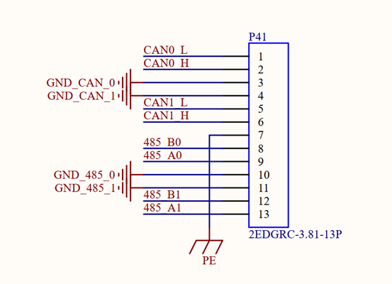

Enter the following command in the serial port of the development board:

```plain
root@OK527:/# fltest_uarttest -d /dev/ttyAS4 -b 115200 -r &
[1] 1953
root@OK527:/# fltest_uarttest -d /dev/ttyAS5 -b 115200 -w
tx_0: Gpi2GoMkYywl2IE9sEBcG6yI0DpmDbFT
rx_0: Gpi2GoMkYywl2IE9sEBcG6yI0DpmDbFT
[1]+  Done                    fltest_uarttest -d /dev/ttyAS4 -b 115200 -r
root@OK527:/#
```

### 4.9 USB to Four Serial Port Conversion Test

**Description:**

- **Support XR21V1414USB to Serial Chip Driver;**
- **USB to four serial port conversion is an optional module. If you have the need for it, please contact the sales personnel of Forlinx Embedded.**

1\. After powering on the development board, connecting the USB to four serial port modules via USB HOST shows specific printing info on the terminal;

```plain
root@OK527:/# [   93.708671] usb 1-1.2: new full-speed USB device number 4 using sunxi-ehci
[   94.019353] cdc_xr_usb_serial 1-1.2:1.0: This device cannot do calls on its own. It is not a modem.
[   94.051170] cdc_xr_usb_serial 1-1.2:1.0: ttyXR_USB_SERIAL0: USB XR_USB_SERIAL device
[   94.071060] cdc_xr_usb_serial 1-1.2:1.2: This device cannot do calls on its own. It is not a modem.
[   94.100860] cdc_xr_usb_serial 1-1.2:1.2: ttyXR_USB_SERIAL1: USB XR_USB_SERIAL device
[   94.120908] cdc_xr_usb_serial 1-1.2:1.4: This device cannot do calls on its own. It is not a modem.
[   94.140883] cdc_xr_usb_serial 1-1.2:1.4: ttyXR_USB_SERIAL2: USB XR_USB_SERIAL device
[   94.170770] cdc_xr_usb_serial 1-1.2:1.6: This device cannot do calls on its own. It is not a modem.
[   94.183344] cdc_xr_usb_serial 1-1.2:1.6: ttyXR_USB_SERIAL3: USB XR_USB_SERIAL device
[   94.197509] usbcore: registered new interface driver cdc_xr_usb_serial
[   94.208693] xr_usb_serial_common: Exar USB UART (serial port) driver
```

<font style="color:black;">2</font>. <font style="color:black;">View</font>usb</font><font style="color:black;"> device status through</font><font style="color:black;">lsusb</font><font style="color:black;">：</font>

```plain
root@OK527:/# lsusb
Bus 003 Device 001: ID 1d6b:0002
Bus 001 Device 001: ID 1d6b:0002
Bus 001 Device 002: ID 046d:0825
Bus 004 Device 001: ID 1d6b:0001
Bus 002 Device 001: ID 1d6b:0003
Bus 003 Device 005: ID 04e2:1414	 //The vid and pid of the conversion chip
Bus 003 Device 002: ID 1a40:0101
```

<font style="color:black;">Check whether there is a production node under</font><font style="color:black;">dev</font><font style="color:black;">:</font>

```plain
root@OK527:/# ls /dev/ttyXRUSB*
/dev/ttyXRUSB0  /dev/ttyXRUSB1  /dev/ttyXRUSB2  /dev/ttyXRUSB3 
```

<font style="color:black;">3. </font><font style="color:black;">The mapping between the four extended serial ports and their corresponding device nodes is shown in the diagram below:</font>


<font style="color:black;">4</font><font style="color:black;">Please refer to “UART Test” for the test method.

### 4.10 GPADC Test

The development board provides 14 channels for GPADC, with a voltage sampling range of 0 to 1.8V. Before testing the adjustable resistance value, it is necessary to short-circuit the P14 terminal. Through the P14 terminal, select which channel of the GPADC to connect to the R67 potentiometer:


Each channel corresponds to the following:

| Schematic label| Event number| Number in soc
|----------|----------|----------
| GPADC3| /dev/input/event2| gpadc0\_channel3
| GPADC4| /dev/input/event3| gpadc0\_channel4
| GPADC5| /dev/input/event4| gpadc0\_channel5
| GPADC6| /dev/input/event5| gpadc0\_channel6
| GPADC7| /dev/input/event6| gpadc0\_channel7
| GPADC12| /dev/input/event7| gpadc1\_channel0
| GPADC13| /dev/input/event8| gpadc1\_channel1
| GPADC14| /dev/input/event9| gpadc1\_channel2
| GPADC15| /dev/input/event10| gpadc1\_channel3
| GPADC16| /dev/input/event11| gpadc1\_channel4
| GPADC17| /dev/input/event12| gpadc1\_channel5
| GPADC18| /dev/input/event13| gpadc1\_channel6
| GPADC19| /dev/input/event14| gpadc1\_channel7
| GPADC20| /dev/input/event15| gpadc1\_channel8

Run the fltest \_ adc, input 3, read the/dev/input/event3 event, corresponding to channel 4 of GPADC0, corresponding to schematic GPADC4.

```plain
root@OK527:/#fltest_adc
Available devices:
/dev/input/event2:      sunxi-gpadc0/channel3/input0
/dev/input/event3:      sunxi-gpadc0/channel4/input0
/dev/input/event4:      sunxi-gpadc0/channel5/input0
/dev/input/event5:      sunxi-gpadc0/channel6/input0
/dev/input/event6:      sunxi-gpadc0/channel7/input0
/dev/input/event7:      sunxi-gpadc1/channel0/input0
/dev/input/event8:      sunxi-gpadc1/channel1/input0
/dev/input/event9:      sunxi-gpadc1/channel2/input0
/dev/input/event10:     sunxi-gpadc1/channel3/input0
/dev/input/event11:     sunxi-gpadc1/channel4/input0
/dev/input/event12:     sunxi-gpadc1/channel5/input0
/dev/input/event13:     sunxi-gpadc1/channel6/input0
/dev/input/event14:     sunxi-gpadc1/channel7/input0
/dev/input/event15:     sunxi-gpadc1/channel8/input0
Select the device event number: 3
sunxi-gpadc0/channel4/input0
[  919.877925] sunxi-gpadc 2009000.gpadc0: Enable channel 4 value 848
value 846
value 848
value 849
value 849
```

### 4.11 TF Test

**Description:**

**The SD card mounts at /run/media, allowing hot-plugging. Terminal displays SD card information.**

**If the file system doesn't support NTFS, format the TF card as FAT32 before use, especially if unsure of its current format.**

**The device node is "/dev/mmcblk1" after the eMMC version is inserted into the TF card.**

**The following test commands are based on the eMMC version.**

1\. Insert the TF card into the card slot on the carrier board. Under normal circumstances, the development board terminal will display the following printing information:

```plain
[ 1157.138343] sunxi-mmc 4020000.sdmmc: sdc set ios:clk 0Hz bm PP pm UP vdd 23 width 1 timing LEGACY(SDR12) dt B
[ 1157.149582] sunxi-mmc 4020000.sdmmc: no vqmmc,Check if there is regulator
[ 1157.169740] sunxi-mmc 4020000.sdmmc: sdc set ios:clk 400000Hz bm PP pm ON vdd 23 width 1 timing LEGACY(SDR12) dt B
[ 1157.193961] sunxi-mmc 4020000.sdmmc: sdc set ios:clk 400000Hz bm PP pm ON vdd 23 width 1 timing LEGACY(SDR12) dt B
[ 1157.208550] sunxi-mmc 4020000.sdmmc: sdc set ios:clk 400000Hz bm PP pm ON vdd 23 width 1 timing LEGACY(SDR12) dt B
[ 1157.222435] sunxi-mmc 4020000.sdmmc: sdc set ios:clk 400000Hz bm PP pm ON vdd 23 width 1 timing LEGACY(SDR12) dt B
[ 1157.237016] sunxi-mmc 4020000.sdmmc: sdc set ios:clk 400000Hz bm PP pm ON vdd 23 width 1 timing LEGACY(SDR12) dt B
[ 1157.358250] sunxi-mmc 4020000.sdmmc: sdc set ios:clk 0Hz bm PP pm ON vdd 23 width 1 timing LEGACY(SDR12) dt B
[ 1157.369389] sunxi-mmc 4020000.sdmmc: no vqmmc,Check if there is regulator
[ 1157.389574] sunxi-mmc 4020000.sdmmc: sdc set ios:clk 400000Hz bm PP pm ON vdd 23 width 1 timing LEGACY(SDR12) dt B
[ 1157.408944] mmc1: host does not support reading read-only switch, assuming write-enable
[ 1157.418575] sunxi-mmc 4020000.sdmmc: sdc set ios:clk 400000Hz bm PP pm ON vdd 23 width 4 timing LEGACY(SDR12) dt B
[ 1157.431870] sunxi-mmc 4020000.sdmmc: sdc set ios:clk 400000Hz bm PP pm ON vdd 23 width 4 timing UHS-SDR104 dt B
[ 1157.443255] sunxi-mmc 4020000.sdmmc: sdc set ios:clk 150000000Hz bm PP pm ON vdd 23 width 4 timing UHS-SDR104 dt B
[ 1157.455037] mmc1: new ultra high speed SDR104 SDHC card at address 5048
[ 1157.463121] mmcblk1: mmc1:5048 SD32G 29.7 GiB
[ 1157.470663]  mmcblk1: p1
[ 1157.474099] sunxi:sound-mach:[ERR]: 432 simple_parse_of(): simple_dai_link_of failed
[ 1157.575863] squashfs: Unknown parameter 'umask'
[ 1157.583393] FAT-fs (mmcblk1p1): Volume was not properly unmounted. Some data may be corrupt. Please run fsck.

root@OK527:/#
```

2\. Check the mount directory:

```plain
root@OK527:/# ls /run/media                                //List files in the/run/media directory
mmcblk0p1  mmcblk0p5  mmcblk1p1
```

3\. Write test:

```plain
root@OK527:/# dd if=/dev/zero of=/run/media/mmcblk1p1/test bs=1M count=500 conv=fsync
500+0 records in
500+0 records out
524288000 bytes (524 MB, 500 MiB) copied, 10.6269 s, 49.3 MB/s
```

4\. Read the test:

**Note: To ensure the accuracy of the data, please restart the development board to test the reading speed.**

```plain
root@OK527:/#dd if=/dev/mmcblk1p1 of=/dev/null bs=1M count=500 iflag=direct
500+0 records in
500+0 records out
524288000 bytes (524 MB, 500 MiB) copied, 7.56327 s, 69.3 MB/s
```

5\. After using the TF card, uninstall it with umount before ejecting it.

```plain
root@OK527:/#umount /run/media/mmcblk1p1
```

**Note: Plug and unplug the TF card after exiting the TF card mounting path.**

### 4.12 Storage Test

The OK527 platform's eMMC runs by default in HS400 mode. Below is a simple test of the eMMC's read and write speed using the ext4 file system as an example.

Write test:

```plain
root@OK527:/#dd if=/dev/zero of=/run/media/mmcblk0p5/data.img bs=1M count=500 conv=fsync
500+0 records in
500+0 records out
524288000 bytes (524 MB, 500 MiB) copied, 4.39941 s, 119 MB/s
```

Read test：

**Note: To ensure the accuracy of the data, please restart the development board to test the reading speed.**

```plain
root@OK527:/#dd if=/run/media/mmcblk0p5/data.img of=/dev/null bs=1M count=500 iflag=direct
500+0 records in
500+0 records out
524288000 bytes (524 MB, 500 MiB) copied, 2.16065 s, 243 MB/s
```

### 4.13 USB Mouse Test

**Description:**

**Hot-plugging of USB mouse and USB keyboard is supported.**

Connect the USB mouse to the USB interface of the OK527 platform, and the print information of the serial port terminal is as follows:

```plain
[  469.514707] usb 1-1.3: new low-speed USB device number 3 using sunxi-ehci
[  469.754922] usb 1-1.3: New USB device found, idVendor=17ef, idProduct=608d, bcdDevice= 1.00
[  469.764363] usb 1-1.3: New USB device strings: Mfr=1, Product=2, SerialNumber=0
[  469.772616] usb 1-1.3: Product: Lenovo USB Optical Mouse
[  469.778627] usb 1-1.3: Manufacturer: PixArt
[  469.786636] input: PixArt Lenovo USB Optical Mouse as /devices/platform/soc@3000000/4200000.ehci1-controller/usb1/1-1/1-1.3/1-1.3:1.0/0003:17EF:608D.0001/input/input18
[  469.803644] hid-generic 0003:17EF:608D.0001: input: USB HID v1.11 Mouse [PixArt Lenovo USB Optical Mouse] on usb-sunxi-ehci-1.3/input0
```

At this time, the arrow cursor appears on the screen, the mouse can work normally.

When the USB mouse is unplugged, the arrow cursor on the screen disappears and the mouse is successfully removed.

### 4.14 USB 2.0

**Description:**

**Support hot-plugging of USB flash drive devices;**

**If NTFS isn't supported and you're unsure of the USB drive's format, it's best to format it to FAT32 before using it.**

**Note the distinction between USB 3.0 and USB 2.0 interfaces.**

OK527 supports three USB2.0 interfaces. Users can connect USB mouse, USB keyboard, U disk and other devices on any on-board USB HOST interface, and support hot plug of the above devices. Here's a demo using the example of mounting a USB disk.

The terminal shows USB flash drive info, which can vary due to the many types available.

1\. Upon booting the development board, plug a USB flash drive into its USB host interface;

Serial port information:

```plain
[  299.407137] usb 1-1.1: new high-speed USB device number 3 using sunxi-ehci
[  299.623907] usb 1-1.1: New USB device found, idVendor=23a9, idProduct=ef18, bcdDevice= 1.00
[  299.633348] usb 1-1.1: New USB device strings: Mfr=1, Product=2, SerialNumber=0
[  299.641597] usb 1-1.1: Product: DISK
[  299.645655] usb 1-1.1: Manufacturer: USB
[  299.650672] usb-storage 1-1.1:1.0: USB Mass Storage device detected
[  299.658180] scsi host0: usb-storage 1-1.1:1.0
[  300.667827] scsi 0:0:0:0: Direct-Access     SCSI     DISK             1.00 PQ: 0 ANSI: 4
[  300.678224] sd 0:0:0:0: [sda] 31223936 512-byte logical blocks: (16.0 GB/14.9 GiB)
[  300.687472] sd 0:0:0:0: [sda] Write Protect is off
[  300.692856] sd 0:0:0:0: [sda] Mode Sense: 03 00 00 00
[  300.699217] sd 0:0:0:0: [sda] No Caching mode page found
[  300.705180] sd 0:0:0:0: [sda] Assuming drive cache: write through
[  300.733381]  sda: sda1
[  300.739080] sd 0:0:0:0: [sda] Attached SCSI removable disk
[  300.926482] squashfs: Unknown parameter 'umask'
[  300.935819] FAT-fs (sda1): Volume was not properly unmounted. Some data may be corrupt. Please run fsck.
```

2\. Check the mount directory:

```plain
root@OK527:/#ls /run/media/
mmcblk0p1  mmcblk0p5  sda1
```

"sda1" represents the first partition of the first USB storage device inserted, and so forth.

3\. View the contents of the USB flash drive:

```plain
root@OK527:/#ls -l /run/media/sda1
total 8
drwxrwx--- 2 root disk 8192 Sep 23  2021 'System Volume Information'
-rwxrwx--- 1 root disk    0 Apr 25 09:25  test
```

4\. Write test: Write speeds are limited by the specific storage device:

```plain
root@OK527:/#dd if=/dev/zero of=/run/media/sda1/test bs=1M count=500 conv=fsync
500+0 records in
500+0 records out
524288000 bytes (524 MB, 500 MiB) copied, 58.7372 s, 8.9 MB/s
```

5\. Read test:

**Note: To ensure the accuracy of the data, please restart the development board to test the reading speed.**

```plain
root@OK527:/#dd if=/run/media/sda1/test of=/dev/null bs=1M count=500 iflag=direct
500+0 records in
500+0 records out
524288000 bytes (524 MB, 500 MiB) copied, 18.4939 s, 28.3 MB/s
```

6\. Before removing the USB flash drive, it's necessary to unmount it using ''umount''.

```plain
root@OK527:/#umount /run/media/sda1
```

**Note: Unplug the USB disk after exiting the mount path.**

### 4.15 OTG Test

OK527-C board includes an OTG (On-The-Go) interface. In Device mode, it can be used for activities such as firmware flashing, ADB file transfer, and debugging. In Host mode, it allows you to connect regular USB devices to the board. When using a Type-C adapter cable to connect OK527-C to a PC, OK527-C will automatically configure OTG as Device mode. Similarly, when using an OTG cable to plug in a USB flash drive or other devices, the system will automatically configure OTG as Host mode.

1\. After the development board boots up, connect a USB flash drive to the development board's OTG interface using a Type-C to Type-A cable.

Serial port information:

```plain
[  854.830829] sunxi:sunxi_usbc:[INFO]: insmod_host_driver
[  854.830829]
[  854.838363] sunxi:ehci_sunxi:[INFO]: [ehci0-controller]: sunxi_usb_enable_ehci
[  854.846465] sunxi:ehci_sunxi:[INFO]: [sunxi-ehci0]: probe, pdev->name: 4101000.ehci0-controller, sunxi_ehci: 0xffffffc009691ef8, 0x:ffffffc009d0d000, irq_no:87
[  854.862647] sunxi-ehci 4101000.ehci0-controller: supply hci not found, using dummy regulator
[  854.873372] sunxi-ehci 4101000.ehci0-controller: EHCI Host Controller
[  854.880616] sunxi-ehci 4101000.ehci0-controller: new USB bus registered, assigned bus number 5
[  854.890346] sunxi-ehci 4101000.ehci0-controller: irq 135, io mem 0x04101000
[  854.910818] sunxi-ehci 4101000.ehci0-controller: USB 2.0 started, EHCI 1.00
[  854.918710] usb usb5: New USB device found, idVendor=1d6b, idProduct=0002, bcdDevice= 5.15
[  854.927990] usb usb5: New USB device strings: Mfr=3, Product=2, SerialNumber=1
[  854.936091] usb usb5: Product: EHCI Host Controller
[  854.941559] usb usb5: Manufacturer: Linux 5.15.147 ehci_hcd
[  854.947804] usb usb5: SerialNumber: sunxi-ehci
[  854.953154] hub 5-0:1.0: USB hub found
[  854.957379] hub 5-0:1.0: 1 port detected
[  854.961978] sunxi:ohci_sunxi:[INFO]: [ohci0-controller]: sunxi_usb_enable_ohci
[  854.970099] sunxi:ohci_sunxi:[INFO]: [sunxi-ohci0]: probe, pdev->name: 4101400.ohci0-controller, sunxi_ohci: 0xffffffc009692b88
[  854.983136] sunxi-ohci 4101400.ohci0-controller: supply hci not found, using dummy regulator
[  854.992743] sunxi-ohci 4101400.ohci0-controller: OHCI Host Controller
[  854.999983] sunxi-ohci 4101400.ohci0-controller: new USB bus registered, assigned bus number 6
[  855.009657] debugfs: Directory 'sunxi-ohci' with parent 'ohci' already present!
[  855.017887] sunxi-ohci 4101400.ohci0-controller: irq 136, io mem 0x04101400
[  855.086895] usb usb6: New USB device found, idVendor=1d6b, idProduct=0001, bcdDevice= 5.15
[  855.096168] usb usb6: New USB device strings: Mfr=3, Product=2, SerialNumber=1
[  855.104269] usb usb6: Product: OHCI Host Controller
[  855.109736] usb usb6: Manufacturer: Linux 5.15.147 ohci_hcd
[  855.115983] usb usb6: SerialNumber: sunxi-ohci
[  855.121260] hub 6-0:1.0: USB hub found
[  855.125483] hub 6-0:1.0: 1 port detected
[  855.218822] usb 5-1: new high-speed USB device number 2 using sunxi-ehci
[  855.382081] usb 5-1: New USB device found, idVendor=05e3, idProduct=0747, bcdDevice= 8.19
[  855.391268] usb 5-1: New USB device strings: Mfr=3, Product=4, SerialNumber=5
[  855.399272] usb 5-1: Product: USB Storage
[  855.403764] usb 5-1: Manufacturer: Generic
[  855.408353] usb 5-1: SerialNumber: 000000000819
[  855.414264] usb-storage 5-1:1.0: USB Mass Storage device detected
[  855.421491] scsi host0: usb-storage 5-1:1.0
[  856.431909] scsi 0:0:0:0: Direct-Access     Generic  STORAGE DEVICE   0819 PQ: 0 ANSI: 6
[  856.962020] sd 0:0:0:0: [sda] 31116288 512-byte logical blocks: (15.9 GB/14.8 GiB)
[  856.971757] sd 0:0:0:0: [sda] Write Protect is off
[  856.977140] sd 0:0:0:0: [sda] Mode Sense: 87 00 00 00
[  856.984008] sd 0:0:0:0: [sda] Write cache: disabled, read cache: enabled, doesn't support DPO or FUA
[  857.005850]  sda: sda1
[  857.012361] sd 0:0:0:0: [sda] Attached SCSI removable disk
[  857.237318] FAT-fs (sda1): Volume was not properly unmounted. Some data may be corrupt. Please run fsck.

```

2\. Check the mount directory:

```plain
root@OK527:/#ls /run/media/
mmcblk0p1  mmcblk0p5  sda1
```

"sda1" represents the first partition of the first USB storage device inserted, and so forth.

3\. View the contents of the USB flash drive:

```plain
root@OK527:/#ls -l /run/media/sda1
total 8
drwxrwx--- 2 root disk 8192 Sep 23  2021 'System Volume Information'
-rwxrwx--- 1 root disk    0 Apr 25 09:25  test
```

4\. Write test: Write speeds are limited by the specific storage device:

```plain
root@OK527:/#dd if=/dev/zero of=/run/media/sda1/test bs=1M count=500 conv=fsync
500+0 records in
500+0 records out
524288000 bytes (524 MB, 500 MiB) copied, 63.8278 s, 8.2 MB/s
```

5\. Read test:

**Note: To ensure the accuracy of the data, please restart the development board to test the reading speed.**

```plain
root@OK527:/#dd if=/run/media/sda1/test of=/dev/null bs=1M count=500 iflag=direct
500+0 records in
500+0 records out
524288000 bytes (524 MB, 500 MiB) copied, 18.2891 s, 28.7 MB/s
```

6\. Before removing the USB flash drive, it's necessary to unmount it using ''umount''.

```plain
root@OK527:/#umount /run/media/sda1
```

### 4.16 Ethernet Configuration

OK527-C comes with 2 x Gigabit Ethernet ports. When connected to the network via an Ethernet cable, the factory default configuration sets eth0 to the static IP 192.168.0.232. The OK527-C's network card can be configured via the configuration file /etc/network/interfaces.

#### 4.16.1 Gigabit Ethernet Static IP Configuration

**Note: In the kernel, the Gigabit Ethernet card is identified as eth0, and its default IP address is 192.168.0.232.**

After booting the development board, execute the following command to open the network configuration file/etc/network/interfaces

```plain
root@OK527:/#vi /etc/network/interfaces
```

Content as follows (slight differences may occur after software version updates; users should refer to actual information):

iface：Used to specify a network card that requires a fixed IP;

address: Used to specify an IP address that needs to be fixed;

netmask: Used to set the subnet mask;

gateway: Used to specify a gateway;

```plain
root@OK527:/# cat /etc/network/interfaces
# interface file auto-generated by buildroot

auto lo
iface lo inet loopback

auto eth0
iface eth0 inet static
address 192.168.0.232
netmask 255.255.255.0
gateway 192.168.0.1
root@OK527:/#
```

<font style="color:black;">Set</font><font style="color:black;">nameserver</font>

```plain
root@OK527:/#vi /etc/resolve.conf

nameserver  114.114.114.114
nameserver  8.8.8.8
```

After setting according to the actual situation, save and exit, use sync to synchronize, restart the development board or execute the ip addr flush dev eth0 to clear the network card ip, and then use the ifdown-a and ifup-a commands to restart and stop the configuration, so that the configuration file can take effect.

#### 4.16.2 Ethernet Speed Test

**Description:**

**Test the communication speed between the development board and the computer to ensure that they can communicate properly.**

**The iperf3 tool (02-User Data\\01-Software Data\\04-Tools\\iperf-3.1.3-win64.zip) is assumed to be installed on Windows for this test.**

<font style="color:black;">Use network speed testing tool</font><font style="color:black;">iperf3</font><font style="color:black;">,test</font><font style="color:black;">OK527-C</font><font style="color:black;">carrier board</font><font style="color:black;">eth0</font><font style="color:black;">network speed.</font>

<font style="color:black;">Run</font><font style="color:black;">iperf3</font><font style="color:black;"> server mode on the</font><font style="color:black;">cmd</font><font style="color:black;"> command terminal in </font><font style="color:black;">Windows</font><font style="color:black;">:</font>

```plain
D:\iperf-3.1.3-win64\iperf-3.1.3-win64>iperf3.exe -s
```


<font style="color:black;">Development board</font><font style="color:black;">eth0</font><font style="color:black;"></font><font style="color:black;">ip</font><font style="color:black;">is</font><font style="color:black;">192.168.1.11</font><font style="color:black;">，</font><font style="color:black;">windows</font><font style="color:black;"></font><font style="color:black;">IP</font><font style="color:black;">is</font><font style="color:black;">192.168.1.39</font><font style="color:black;">, </font><font style="color:black;"> </font><font style="color:black;">input at the OK527 serial port debugging terminal</font>.

```plain
root@OK527:/# iperf3 -c 192.168.1.39            //Test upload bandwidth
Connecting to host 192.168.1.39, port 5201
[  5] local 192.168.1.11 port 55152 connected to 192.168.1.39 port 5201
[ ID] Interval           Transfer     Bitrate         Retr  Cwnd
[  5]   0.00-1.00   sec  95.2 MBytes   799 Mbits/sec    0    217 KBytes
[  5]   1.00-2.00   sec  93.0 MBytes   780 Mbits/sec    0    217 KBytes
[  5]   2.00-3.00   sec  95.3 MBytes   800 Mbits/sec    0    217 KBytes
[  5]   3.00-4.00   sec  94.8 MBytes   796 Mbits/sec    0    217 KBytes
[  5]   4.00-5.00   sec  93.9 MBytes   787 Mbits/sec    0    217 KBytes
[  5]   5.00-6.00   sec  94.4 MBytes   792 Mbits/sec    0    217 KBytes
[  5]   6.00-7.00   sec  93.3 MBytes   783 Mbits/sec    0    217 KBytes
[  5]   7.00-8.00   sec  94.3 MBytes   791 Mbits/sec    0    217 KBytes
[  5]   8.00-9.00   sec  90.2 MBytes   756 Mbits/sec    1    217 KBytes
[  5]   9.00-10.00  sec  94.0 MBytes   789 Mbits/sec    0    217 KBytes
- - - - - - - - - - - - - - - - - - - - - - - - -
[ ID] Interval           Transfer     Bitrate         Retr
[  5]   0.00-10.00  sec   939 MBytes   787 Mbits/sec    1             sender
[  5]   0.00-10.00  sec   938 MBytes   787 Mbits/sec                  receiver

iperf Done.
root@OK527:/# iperf3 -c 192.168.1.39 -R            //Test download bandwidth
Connecting to host 192.168.1.39, port 5201
Reverse mode, remote host 192.168.1.39 is sending
[  5] local 192.168.1.11 port 40676 connected to 192.168.1.39 port 5201
[ ID] Interval           Transfer     Bitrate
[  5]   0.00-1.00   sec   113 MBytes   946 Mbits/sec
[  5]   1.00-2.00   sec   109 MBytes   916 Mbits/sec
[  5]   2.00-3.00   sec   112 MBytes   940 Mbits/sec
[  5]   3.00-4.00   sec   112 MBytes   944 Mbits/sec
[  5]   4.00-5.00   sec   108 MBytes   907 Mbits/sec
[  5]   5.00-6.00   sec   110 MBytes   924 Mbits/sec
[  5]   6.00-7.00   sec   111 MBytes   934 Mbits/sec
[  5]   7.00-8.00   sec   111 MBytes   928 Mbits/sec
[  5]   8.00-9.00   sec   112 MBytes   941 Mbits/sec
[  5]   9.00-10.00  sec   110 MBytes   919 Mbits/sec
- - - - - - - - - - - - - - - - - - - - - - - - -
[ ID] Interval           Transfer     Bitrate
[  5]   0.00-10.00  sec  1.08 GBytes   930 Mbits/sec                  sender
[  5]   0.00-10.00  sec  1.08 GBytes   930 Mbits/sec                  receiver

iperf Done.
root@OK527:/#
```

<font style="color:black;">OK527-C </font><font style="color:black;">Gigabit network bandwidth is</font><font style="color:black;">:</font>

Eth0 upload speed 787Mbps，download speed 930Mbps

Eth1 upload speed 948Mbps， download speed 945Mbps

### 4.17 Network Services

**Description:**

**The default IP for eth0 is 192.168.0.232**

#### 4.17.1 Web Services

**Note: To properly use this feature, the PC's IP address must be in the same network segment as the development board's.**

The OK527 development board comes with the lighttpd web server pre-installed, and the lighttpd service has been automatically started at system startup. Enter the IP address of the board into the PC browser to view the web pages in the board's webserver, as shown in the following figure:


#### 4.17.2 SFTP

Installation package path: 02-User information \\ 01-Software information \\ 04-Tools \\ FileZilla\*

The OK527-C development board supports SFTP service, and it is automatically enabled during system startup. Once the IP address is set, it can function as an SFTP server. The following describes how to utilize the SFTP tool for file transfer.

Install FileZilla tool on Windows and follow the steps shown in the image below to set it up.

Open the filezilla tool, click on File and select Site Manager.

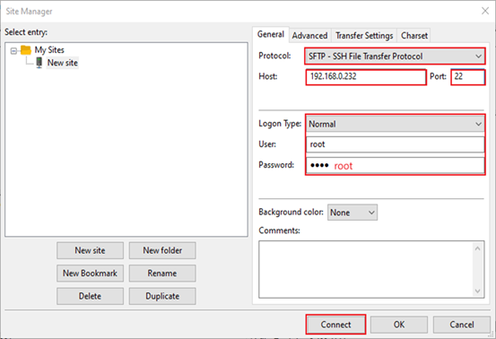

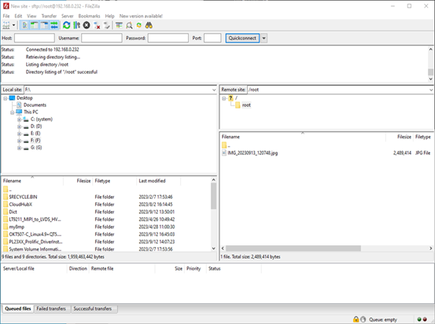

Once we have successfully logged in, we can upload and download.

### 4.18 WIFI Test

#### 4.18.1 STA Mode

**Description:**

**The network environment is different, so please set it according to the actual situation when you do this experiment.**

**The development board supports the connection of 2.4G and 5G wireless hotspots**

This mode is used as a station to connect to the wireless network. In the following test, the router uses WPA encryption, the connected wifi is 2.4GHz, the hotspot name is H3C \_ 708, and the password is 123456785. Due to the different network environments, users should set up according to the actual situation when conducting this test:

1\. Enter the following command in the development board terminal:

The meanings of the related parameters in the command are as follows:

| **Parameter**| **Meaning**
|:----------:|----------
| -i| Wireless NIC Node Name
| -s| Actual wifi hotspot connected
| -p| -p：followed by the parameter Password refers to the password of the actual wifi hotspot to be connected. If the current hotspot does not have a password, the parameter after -p is NONE.

The serial port prints as follows:

```plain
root@OK527:/# fltest_wifi.sh -i wlan0 -s H3C_708 -p 123456785.
[  204.803506] sunxi-gmac 4500000.gmac0 eth0: Link is Down
wifi wlan0
ssid H3C_708
pasw 123456785.
waiting...
[  211.388935] IPv6: ADDRCONF(NETDEV_CHANGE): wlan0: link becomes ready
udhcpc: started, v1.35.0
udhcpc: broadcasting discover
udhcpc: broadcasting discover
udhcpc: broadcasting select for 192.168.1.20, server 192.168.1.1
udhcpc: lease of 192.168.1.20 obtained from 192.168.1.1, lease time 86400
deleting routers
adding dns 192.168.1.1
adding dns 114.114.114.114
connect ok
```

2\. Check whether it can ping the external network and enter the following command in the terminal:

```plain
root@OK527:/#ping -I wlan0 baidu.com -c 4            //Assign the wlan0 NIC to ping 4 times
PING baidu.com (110.242.68.66): 56 data bytes
64 bytes from 110.242.68.66: seq=0 ttl=54 time=95.213 ms
64 bytes from 110.242.68.66: seq=1 ttl=54 time=119.289 ms
64 bytes from 110.242.68.66: seq=2 ttl=54 time=40.234 ms
64 bytes from 110.242.68.66: seq=3 ttl=54 time=64.454 ms

--- baidu.com ping statistics ---
4 packets transmitted, 4 packets received, 0% packet loss
round-trip min/avg/max = 40.234/79.797/119.289 ms
```

#### 4.18.2 AP Mode

**Description:**

**Ensure that the Gigabit LAN card is eth0 connected to the network and that the network works well before performing this test;**

**5GHz hotspot on by default**

**To enable the 2.4GHz hotspot and modify the/usr/bin/fltest \_ hostap. sh, change "hostapd/etc/hostapd-5g.conf \&" to "hostapd/etc/hostapd-2.4g.conf \&"**

1\. Configure Hotspot

WiFi Hotspot Name: OK527\_WIFI\_5G\_AP

Password: 12345678

Check by hotspot name, password and /etc/hostapd-5g.conf.

```plain
root@OK527:/# fltest_hostap.sh
done!
uap0: interface state UNINITIALIZED->COUNTRY_UPDATE
[   74.247545] IPv6: ADDRCONF(NETDEV_CHANGE): uap0: link becomes ready
uap0: interface state COUNTRY_UPDATE->ENABLED
uap0: AP-ENABLED
uap0: STA 86:de:12:63:58:96 IEEE 802.11: authenticated
uap0: STA 86:de:12:63:58:96 IEEE 802.11: associated (aid 1)
uap0: AP-STA-CONNECTED 86:de:12:63:58:96
uap0: STA 86:de:12:63:58:96 WPA: pairwise key handshake completed (RSN)
uap0: EAPOL-4WAY-HS-COMPLETED 86:de:12:63:58:96
```

### 4.19 4G Test

**Description:**

**The driver supports the Quectel EC20 4G module .**

OK527 supports a 4G module. Before starting the development board, connect the 4G module, install the 4G antenna, insert the SIM card, and then power on the board. Perform a dial-up internet connection on the EC20 module.

#### 4.19.1 EC20 Test

**Description:**

**When testing with an IoT card, ensure the module's firmware version; older versions may require upgrading to EC20 firmware for compatibility.**

**Some IoT SIM cards may require specific account credentials when dialing. Users should adjust the instructions accordingly based on the actual situation.**

**You can use the quectelCM --help command to see the meaning of the relevant parameters.**

1\. After connecting the module and powering up the board and module, check the USB status through the lsusb command;

```plain
root@OK527:/# lsusb
Bus 005 Device 001: ID 1d6b:0002
Bus 003 Device 001: ID 1d6b:0002
Bus 003 Device 003: ID 2c7c:0125        //EC20
Bus 001 Device 001: ID 1d6b:0002
Bus 005 Device 002: ID 05e3:0747
Bus 006 Device 001: ID 1d6b:0001
Bus 001 Device 002: ID 046d:0825
Bus 004 Device 001: ID 1d6b:0001
Bus 002 Device 001: ID 1d6b:0003
Bus 003 Device 002: ID 1a40:0101
```

View device node status under /dev

```plain
root@OK527:/#ls /dev/ttyUSB*
/dev/ttyUSB0  /dev/ttyUSB1  /dev/ttyUSB2  /dev/ttyUSB3
```

2\. After the equipment is successfully identified, the dial-up Internet access test can be conducted;

```plain
root@OK527:/#fltest_quectel.sh &
```

Printing information is as follows:

```plain
[08-01_15:52:56:355] Quectel_QConnectManager_Linux_V1.6.0.15
[08-01_15:52:56:356] Find /sys/bus/usb/devices/3-1.4 idVendor=0x2c7c idProduct=0x125, bus=0x003, dev=0x003
[08-01_15:52:56:356] Auto find qmichannel = /dev/cdc-wdm0
[08-01_15:52:56:356] Auto find usbnet_adapter = usb0
[08-01_15:52:56:356] netcard driver = qmi_wwan_q, driver version = V1.2.9
[08-01_15:52:56:356] ioctl(0x89f3, qmap_settings) failed: Operation not supported, rc=-1
[08-01_15:52:56:357] Modem works in QMI mode
[08-01_15:52:56:362] cdc_wdm_fd = 7
[08-01_15:52:56:448] Get clientWDS = 7
[08-01_15:52:56:480] Get clientDMS = 1
[08-01_15:52:56:512] Get clientNAS = 2
[08-01_15:52:56:544] Get clientUIM = 1
[08-01_15:52:56:576] Get clientWDA = 1
[08-01_15:52:56:608] requestBaseBandVersion EC20CEHDLGR06A09M1G
[08-01_15:52:56:736] requestGetSIMStatus SIMStatus: SIM_READY
[08-01_15:52:56:768] requestGetProfile[1] 3gnet///0
[08-01_15:52:56:800] requestRegistrationState2 MCC: 460, MNC: 1, PS: Attached, DataCap: LTE
[08-01_15:52:56:832] requestQueryDataCall IPv4ConnectionStatus: DISCONNECTED
[08-01_15:52:56:832] ifconfig usb0 0.0.0.0
[08-01_15:52:56:839] ifconfig usb0 down
[08-01_15:52:56:896] requestSetupDataCall WdsConnectionIPv4Handle: 0x86d8a500
[08-01_15:52:57:024] ifconfig usb0 up
[08-01_15:52:57:031] udhcpc -f -n -q -t 5 -i usb0
udhcpc: started, v1.35.0
udhcpc: broadcasting discover
udhcpc: broadcasting select for 10.104.48.49, server 10.104.48.50
udhcpc: lease of 10.104.48.49 obtained from 10.104.48.50, lease time 7200
[08-01_15:52:57:232] deleting routers
[08-01_15:52:57:252] adding dns 202.99.160.68
[08-01_15:52:57:252] adding dns 202.99.166.4

```

If it can automatically allocate an IP and add DNS, then the EC20 dial-up is successful.

3\. After successfully dialing, use the ifconfig command to check the network interface, which is typically named usb0 (the interface name may vary depending on the actual situation). Then, test the network status using the ping command;

```plain
root@OK527:/# ping -I usb0 baidu.com -c4
PING baidu.com (110.242.68.66): 56 data bytes
64 bytes from 110.242.68.66: seq=0 ttl=53 time=59.096 ms
64 bytes from 110.242.68.66: seq=1 ttl=53 time=69.325 ms
64 bytes from 110.242.68.66: seq=2 ttl=53 time=69.955 ms
64 bytes from 110.242.68.66: seq=3 ttl=53 time=83.063 ms

--- baidu.com ping statistics ---
4 packets transmitted, 4 packets received, 0% packet loss
round-trip min/avg/max = 59.096/70.359/83.063 ms
```

### 4.20 Play/Record Test

**Description:**

**OK527 provides 1 3.5mm audio jack and 2 XH-2.54-2PS speaker ports, with both the carrier board mic and headphone mic capable of recording.**

Playback test:

```plain
root@OK527:/# aplay /forlinx/audio/30s.wav
root@OK527:/# mpg123 /forlinx/audio/30s.mp3
```

Volume control:

```bash
root@OK527:/# amixer		//Read the audio configuration, where HPOUT Gain is the headphone volume
... ...
Simple mixer control 'HPOUT Gain',0
  Capabilities: volume volume-joined
  Playback channels: Mono
  Capture channels: Mono
  Limits: 0 - 7
  Mono: 7 [100%]
... ...
root@OK527:/# amixer set "HPOUT Gain" 5		//Set the volume to 5 and the level to 0 to 7
Simple mixer control 'HPOUT Gain',0
  Capabilities: volume volume-joined
  Playback channels: Mono
  Capture channels: Mono
  Limits: 0 - 7
  Mono: 5 [71%]
```

When the earphone is not plugged in, it is output by the speaker. When the earphone is plugged in, the speaker is muted and output by the earphone.

HDMI audio test

```plain
root@OK527:/# aplay -l
**** List of PLAYBACK Hardware Devices ****
card 0: audiocodec [audiocodec], device 0: sunxi-snd-plat-aaudio-sunxi-snd-codec 7110000.codec-0 []
Subdevices: 1/1
Subdevice #0: subdevice #0
card 1: sndhdmi [sndhdmi], device 0: sunxi-snd-plat-i2s-soc@3000000:hdmi_codec soc@3000000:hdmi_code []
Subdevices: 1/1
Subdevice #0: subdevice #0
root@OK527:/# aplay  -D plughw:1,0 /forlinx/audio/30s.wav
```

**Note: HDMI display needs to be configured on the UBOOT menu.**

Recording test:

```plain
root@OK527:/# arecord -c2 -r 48000 -f S16_LE -d 3 mic.wav
Recording WAVE 'mic.wav' : [ 4608.610608] [SNDCODEC][sunxi_card_hw_params][630]:stream_flag: 1
Signed 16 bit Little Endian, Rate 48000 Hz, Stereo
```

The recording will collect the carrier board mic and the earphone mic as the left and right channels of the recording.

### 4.21 LCD Backlight Adjustment

Backlight level range (0--255), maximum level 255, 0 indicating turn off. Enter the system and enter the following command in the terminal to perform the backlight test.

When the LCD screen (lcd 800x480, lcd 1024x600, mipi 1024x600, lvds 1280x800) is selected as “Primary Disp”, usefltest\_backlight get 0;otherwise, usefltest\_backlight get 1.The following command is an example assuming the LCD screen is selected as “Primary Disp”.

1\. View the current screen backlight value:

```plain
root@OK527:/# fltest_backlight get 0
Current brightness: 50                                          //The current backlight value is 50
```

2\. Backlight is off:

```plain
root@OK527:/# fltest_backlight set 0 0
The brightness has been set to: 0                               //Turn off the backlight
```

3\. LCD backlight is on:

```plain
root@OK527:/# fltest_backlight set 0 125
The brightness has been set to: 125                             //Set backlight to 1
root@OK527:/# fltest_backlight get 0
Current brightness: 125		                                    //Backlight modification is successful
```

### 4.22 Closing the Desktop

```plain
root@OK527:/# /etc/init.d/S42matrix-browser stop                      //Turn off the desktop
Stopping matrix-browser: OK
root@OK527:/# /etc/init.d/S42matrix-browser start					  //Turn on the desktop
Starting matrix-browser: OK
```

### 4.23 LED Test

The OK527-C SoM has a controllable red LED that flashes when the card is powered on.

The testing method is as follows:

1\. To view trigger conditions:

```plain
root@OK527:/# cat /sys/class/leds/heartbeat/trigger
none rc-feedback rfkill-any rfkill-none kbd-scrolllock kbd-numlock kbd-capslock kbd-kanalock kbd-shiftlock kbd-altgrlock kbd-ctrllock kbd-altlock kbd-shiftllock kbd-shiftrlock kbd-ctrlllock kbd-ctrlrlock mmc0 mmc1 [heartbeat] rfkill0
```

Where \[heartbeat] indicates that the current trigger condition is the system heartbeat light. Write the above string in trigger to modify the trigger condition.

2\. User Control

When the led trigger condition is set to none, the user can control the on and off of the led lamp through the command:

```plain
root@OK527:/# echo none > /sys/class/leds/heartbeat/trigger
root@OK527:/# echo 1 > /sys/class/leds/heartbeat/brightness
root@OK527:/# echo 0 > /sys/class/leds/heartbeat/brightness
```

3\. Change the red LED to a heartbeat light

```plain
root@OK527:/# echo heartbeat > /sys/class/leds/heartbeat/trigger
```

At this time, the LED has a system clock control, blinking according to a certain rhythm.

### 4.24 SQLite3 Test

SQLite3 is a lightweight, ACID-compliant relational database management system with a low footprint. The OK527-C development board is ported with version 3.25.3 of sqlit3.

```plain
root@OK527:/# sqlite3
SQLite version 3.38.5 2022-05-06 15:25:27
Enter ".help" for usage hints.
Connected to a transient in-memory database.
Use ".open FILENAME" to reopen on a persistent database.
root@OK527:/# sqlite3
SQLite version 3.38.5 2022-05-06 15:25:27
Enter ".help" for usage hints.
Connected to a transient in-memory database.
Use ".open FILENAME" to reopen on a persistent database.
sqlite> create table tbl1 (one varchar(10), two smallint);	//Create tbl1
sqlite> insert into tbl1 values('hello!',10);		
sqlite> insert into tbl1 values('goodbye', 20);				//Insert data in the table tbl1
sqlite> select * from tbl1;									//Query the contents in table tbl1
hello!|10
goodbye|20
sqlite> delete from tbl1 where one = 'hello!';				//Delete the data
sqlite> select * from tbl1;									//Query the contents in table tbl1
goodbye|20
sqlite> .quit												//Exit the database (or use the.exit command)
root@OK527:/#
```

### **4.25 Boot Script Configuration**

#### **4.25.1 Temporary Autoboot Script Setup**

1\. Create a shell script first:

```plain
root@OK527:/# vi /etc/autorun.sh
```

Modify the file reference as follows (users need to modify according to the actual situation):


2\. After modification, save and exit, and add execution permission to the script

```plain
root@OK527:/#chmod +x /etc/autorun.sh
```

3\. Add at the end of the /etc/init.d/rcS file

/etc/autorun.sh \&

Save and Exit

#### **4.25.2 Flash-Image Boot Script Integration**

Add a startup script during image flashing, you need to modify the source code in the development environment. Here are the steps to follow:

1\. Enter the OK527-linux-sdk source code package, and create a autorun. sh file under the following path: buildroot/buildroot-202205/board/forlinx/okt527/fs-overlay/etc.

The format of the content is as follows, and the user can modify it according to the actual needs:


Use thechmod +x autorun.shcommand toadd execution permissions to the file.

2\. Add the newly created shell script to the OK527 root filesystem rcS file.

Copy rcS from out/t527/okt527/buildroot/buildroot/target/etc/init.d/rcS

to buildroot/buildroot-202205/board/worldinx/okt527/fs overlay/etc/init.d/

Add a shell statement at the end of the buildroot/buildroot-202205/board/worldinx/okt527/fs overlay/etc/init.d/rcS file:/etc/autorun.sh\&.

3\. Recompile and package

Please refer to the compilation chapter of "OK527-C\_Linux5.15.104+Qt5.12.5 User's Compilation Manual".

### 4.26 A55 CoreMark Test

The most well-known and commonly used Benchmarks in the field of embedded processors are Dhrystone and CoreMark. CoreMark is a comprehensive benchmark that is used to measure the performance of the central processing unit (CPU) employed in embedded systems. It was developed by shay gal-on of eembc in 2009, aiming to become an industry standard and replace the outdated dehrystone benchmark.

The OK527-C platform has the CoreMark test program ported by default, and you can use the following commands to test it:

1\. Set the CPU small core and large core to high-performance mode respectively.

```plain
root@OK527:/# echo performance > /sys/devices/system/cpu/cpu0/cpufreq/scaling_governor
root@OK527:/# echo performance > /sys/devices/system/cpu/cpu4/cpufreq/scaling_governor
```

2\. CoreMark test

```plain
root@OK527:/# coremark
2K performance run parameters for coremark.
CoreMark Size    : 666
Total ticks      : 16379
Total time (secs): 16.379000
Iterations/Sec   : 6715.916723
Iterations       : 110000
Compiler version : GCC10.3.1 20210621
Compiler flags   : -O2   -lrt
Memory location  : Please put data memory location here
(e.g. code in flash, data on heap etc)
seedcrc          : 0xe9f5
[0]crclist       : 0xe714
[0]crcmatrix     : 0x1fd7
[0]crcstate      : 0x8e3a
[0]crcfinal      : 0x33ff
Correct operation validated. See readme.txt for run and reporting rules.
CoreMark 1.0 : 6715.916723 / GCC10.3.1 20210621 -O2   -lrt / Heap
root@OK527:/#
```

### 4.27 A55 Dhrystone Test

Dhrystone is a comprehensive benchmark program designed by Reinhold P. Weicker in 1984, used to test CPU (integer) computing performance. Dhrystone does not include floating-point operations, and its output is the number of times Dhrystone is run per second, which corresponds to the number of iterations of the main loop per second.

The Dhrystone testing program has been successfully ported to the OK527-C platform. You can use the following command to run the test.

1\. Set the CPU to high performance mode

```plain
root@OK527:/# echo performance > /sys/devices/system/cpu/cpu0/cpufreq/scaling_governor
root@OK527:/# echo performance > /sys/devices/system/cpu/cpu4/cpufreq/scaling_governor
```

2\. Dhrystone test

```plain
root@ OK527:/# echo 50000000 | dhrystone        //Run the Dhrystone test 50000000 times

Dhrystone Benchmark, Version 2.1 (Language: C)

Program compiled without 'register' attribute

Please give the number of runs through the benchmark:
Execution starts, 50000000 runs through Dhrystone
Execution ends

Final values of the variables used in the benchmark:

Int_Glob:            5
should be:   5
Bool_Glob:           1
should be:   1
Ch_1_Glob:           A
should be:   A
Ch_2_Glob:           B
should be:   B
Arr_1_Glob[8]:       7
should be:   7
Arr_2_Glob[8][7]:    50000010
should be:   Number_Of_Runs + 10
Ptr_Glob->
Ptr_Comp:          -1692515680
should be:   (implementation-dependent)
Discr:             0
should be:   0
Enum_Comp:         2
should be:   2
Int_Comp:          17
should be:   17
Str_Comp:          DHRYSTONE PROGRAM, SOME STRING
should be:   DHRYSTONE PROGRAM, SOME STRING
Next_Ptr_Glob->
Ptr_Comp:          -1692515680
should be:   (implementation-dependent), same as above
Discr:             0
should be:   0
Enum_Comp:         1
should be:   1
Int_Comp:          18
should be:   18
Str_Comp:          DHRYSTONE PROGRAM, SOME STRING
should be:   DHRYSTONE PROGRAM, SOME STRING
Int_1_Loc:           5
should be:   5
Int_2_Loc:           13
should be:   13
Int_3_Loc:           7
should be:   7
Enum_Loc:            1
should be:   1
Str_1_Loc:           DHRYSTONE PROGRAM, 1'ST STRING
should be:   DHRYSTONE PROGRAM, 1'ST STRING
Str_2_Loc:           DHRYSTONE PROGRAM, 2'ND STRING
should be:   DHRYSTONE PROGRAM, 2'ND STRING

Microseconds for one run through Dhrystone:    0.2
Dhrystones per Second:                      6090134.0

root@OK527:/#
```

### 4.28 Chip-ID Verification

Serial debug terminal input:

```plain
root@OK527:/# cat /sys/class/sunxi_info/sys_info
sunxi_platform    : T527
sunxi_secure      : normal
sunxi_serial      : 40821e9375789d0c000050c000000000
sunxi_chiptype    : 00005f10
sunxi_batchno     : 0x18900002
sunxi_soc_ver    : 0x2
```

### 4.29 CAN Test

There are 2 x CAN on the carrier board, which are led out to the P41 connecting seat.

Short H, L, and GND of can0 and can1, respectively, to test.


Set the Can service：

```plain
root@OK527:/# ip link set awlink0 up type can bitrate 500000
[58659.636796] IPv6: ADDRCONF(NETDEV_CHANGE): can0: link becomes ready
root@OK527:/# ip link set awlink1 up type can bitrate 500000
[58662.966792] IPv6: ADDRCONF(NETDEV_CHANGE): can1: link becomes ready
root@OK527:/# ip link set dev awlink0 txqueuelen 4096
root@OK527:/# ip link set dev awlink1 txqueuelen 4096
```

Set can0 to receive and can1 to send:

```plain
root@OK527:/# candump awlink0 &
[1] 18633
root@OK527:/# cangen  awlink1
awlink0  790   [1]  A4
awlink0  3A0   [3]  31 A1 15
awlink0  04B   [2]  DD EF
awlink0  39D   [8]  AE 37 BF 78 59 95 FB 68
awlink0  6A6   [2]  D2 DE
awlink0  59D   [4]  A5 60 7F 04
awlink0  019   [0]
```

### 4.30 SPI Test

SPI1 (located at the P29 terminal), led out from the OK527 carrier board.

Short-circuit SPI1\_MOSI \& SPI1\_MISO for testing.

```plain
root@OK527:/# fltest_spidev_test -D /dev/spidev0.0 -s 1000000
spi mode: 0
bits per word: 8
max speed: 1000000 Hz (1000 KHz)

FF FF FF FF FF FF
40 00 00 00 00 95
FF FF FF FF FF FF
FF FF FF FF FF FF
FF FF FF FF FF FF
DE AD BE EF BA AD
F0 0D

PASS
```

If there is a problem with SPI communication, all received data is 00.

```plain
root@OK527:/# fltest_spidev_test -D /dev/spidev0.0 -s 1000000
spi mode: 0
bits per word: 8
max speed: 1000000 Hz (1000 KHz)

00 00 00 00 00 00
00 00 00 00 00 00
00 00 00 00 00 00
00 00 00 00 00 00
00 00 00 00 00 00
00 00 00 00 00 00
00 00

ERR: rx != tx
```

### 4.31 GPIO Test

Take PJ24 as an example, PJ24 can control D10 blue led.


Set PJ24 output low level

```plain
root@OK527:/# fltest_gpio.sh PJ24 0
=== PJ24 === gpio312 ===
out: 0
```

Read PJ24 pin input level

```plain
root@OK527:/# fltest_gpio.sh PJ24 in
=== PJ24 === gpio312===
read: 1
```

### 4.32 Buzzer Test

The buzzer of OK527-C is a passive buzzer, and the PWM signal can be input.


Set PJ24 output high level

```plain
root@OK527:/# echo 8 > /sys/class/pwm/pwmchip0/export
root@OK527:/# echo 10000000 > /sys/class/pwm/pwmchip0/pwm8/period
root@OK527:/# echo 5000000 > /sys/class/pwm/pwmchip0/pwm8/duty_cycle
root@OK527:/# echo 1 > /sys/class/pwm/pwmchip0/pwm8/enable    //使能蜂鸣器
root@OK527:/# echo 0 > /sys/class/pwm/pwmchip0/pwm8/enable    //关闭蜂鸣器
root@OK527:/# echo 8 > /sys/class/pwm/pwmchip0/unexport
```

### 4.33 USB3.0

OK527-C's USB3.0 and PCIE are multiplexed functions, and only one works at the same time. Need to switch functions in the uboot menu

Change the carrier board DIP switch, select USB3.0, press the space to enter the uboot menu interface after the development board is powered on, press 4 to cycle in "pcie" "USB 3.0", and select "USB 3.0" as shown below:

```plain
---------------------------------------------
0:Exit to console
1:Reboot
2:Display0 Type:lvds 1280x800
3:Display1 Type:hdmi
4:Device PHY Type:usb 3.0
5:display primary screen: disp0_type
---------------------------------------------
```

Then press 1 to restart to test the USB 3.0 function. Refer to “[4.14 USB 2.0](#_4.14_USB_2.0)” for the test method.

### 4.34 PCIE

USB3.0 and PCIE of OK527-C are multiplexing functions, and only one can work at the same time. Need to switch functions in the uboot menu

Change the DIP switch on the carrier board, select PCIE2.1. After powering on the development board, press the space bar to enter the uboot menu interface. Press 4 to cycle through "PCIe” and "USB 3.0". Select "PCIe" as shown below:

```plain
---------------------------------------------
0:Exit to console
1:Reboot
2:Display0 Type:lvds 1280x800
3:Display1 Type:hdmi
4:Device PHY Type:pcie
5:display primary screen: disp0_type
---------------------------------------------
```

Then press 1 to restart to test the pcie function.

The following test uses the RTL8125 network card.

```plain
root@OK527:/# lspci
01:00.0 Class 0200: 10ec:8168
00:00.0 Class 0604: 16c3:abcd
root@OK527:/# ifconfig -a | grep enp
enp1s0    Link encap:Ethernet  HWaddr 00:00:00:00:00:05
```

Note: The network speed follows the "barrel effect". In this test, the RTL8125 is a 2.5g network card, but the network card of the 192.168.1.39 computer is a gigabit network card, so the final test speed is a gigabit speed.

### 4.35 IR-RX

The OK527-C supports infrared receiving.

```plain
root@OK527:/# evtest 
No device specified, trying to scan all of /dev/input/event*
Available devices:
/dev/input/event0:sunxi-keyboard
/dev/input/event1:sunxi_ir_recv
/dev/input/event2:sunxi-gpadc0/channel3/input0
/dev/input/event3:sunxi-gpadc0/channel4/input0
/dev/input/event4:sunxi-gpadc0/channel5/input0
/dev/input/event5:sunxi-gpadc0/channel6/input0
/dev/input/event6:sunxi-gpadc0/channel7/input0
/dev/input/event7:sunxi-gpadc1/channel0/input0
/dev/input/event8:sunxi-gpadc1/channel1/input0
/dev/input/event9:sunxi-gpadc1/channel2/input0
/dev/input/event10:     sunxi-gpadc1/channel3/input0
/dev/input/event11:     sunxi-gpadc1/channel4/input0
/dev/input/event12:     sunxi-gpadc1/channel5/input0
/dev/input/event13:     sunxi-gpadc1/channel6/input0
/dev/input/event14:     sunxi-gpadc1/channel7/input0
/dev/input/event15:     sunxi-gpadc1/channel8/input0
/dev/input/event16:     axp2202-pek
/dev/input/event17:     audiocodec Headphones
Select the device event number [0-17]: 1      //选择sunxi_ir_recv对应的event编号
Input driver version is 1.0.1
Input device ID: bus 0x19 vendor 0x1 product 0x1 version 0x100
Input device name: "sunxi_ir_recv"
Supported events:
Event type 0 (EV_SYN)
Event type 1 (EV_KEY)
Event code 14 (KEY_BACKSPACE)
Event code 15 (KEY_TAB)
Event code 52 (KEY_DOT)
Event code 83 (KEY_KPDOT)
Event code 102 (KEY_HOME)
Event code 103 (KEY_UP)
Event code 105 (KEY_LEFT)
Event code 106 (KEY_RIGHT)
Event code 108 (KEY_DOWN)
Event code 113 (KEY_MUTE)
Event code 114 (KEY_VOLUMEDOWN)
Event code 115 (KEY_VOLUMEUP)
Event code 116 (KEY_POWER)
Event code 119 (KEY_PAUSE)
Event code 128 (KEY_STOP)
Event code 139 (KEY_MENU)
Event code 141 (KEY_SETUP)
Event code 158 (KEY_BACK)
Event code 163 (KEY_NEXTSONG)
Event code 164 (KEY_PLAYPAUSE)
Event code 165 (KEY_PREVIOUSSONG)
Event code 166 (KEY_STOPCD)
Event code 168 (KEY_REWIND)
Event code 207 (KEY_PLAY)
Event code 208 (KEY_FASTFORWARD)
Event code 256 (BTN_0)
Event code 352 (KEY_OK)
Event code 365 (KEY_EPG)
Event code 377 (KEY_TV)
Event code 402 (KEY_CHANNELUP)
Event code 403 (KEY_CHANNELDOWN)
Event code 407 (KEY_NEXT)
Event code 412 (KEY_PREVIOUS)
Event code 512 (KEY_NUMERIC_0)
Event code 513 (KEY_NUMERIC_1)
Event code 514 (KEY_NUMERIC_2)
Event code 515 (KEY_NUMERIC_3)
Event code 516 (KEY_NUMERIC_4)
Event code 517 (KEY_NUMERIC_5)
Event code 518 (KEY_NUMERIC_6)
Event code 519 (KEY_NUMERIC_7)
Event code 520 (KEY_NUMERIC_8)
Event code 521 (KEY_NUMERIC_9)
Event code 717 (BTN_TRIGGER_HAPPY14)
Event code 719 (BTN_TRIGGER_HAPPY16)
Event code 721 (BTN_TRIGGER_HAPPY18)
Event type 2 (EV_REL)
Event code 0 (REL_X)
Event code 1 (REL_Y)
Event type 4 (EV_MSC)
Event code 4 (MSC_SCAN)
Key repeat handling:
Repeat type 20 (EV_REP)
Repeat code 0 (REP_DELAY)
Value    400
Repeat code 1 (REP_PERIOD)
Value     80
Properties:
Property type 5 (INPUT_PROP_POINTING_STICK)
Testing ... (interrupt to exit)
Event: time 1704962021.400475, type 4 (EV_MSC), code 4 (MSC_SCAN), value 15
Event: time 1704962021.400475, type 1 (EV_KEY), code 519 (KEY_NUMERIC_7), value 1
Event: time 1704962021.400475, -------------- SYN_REPORT ------------
Event: time 1704962021.452943, type 4 (EV_MSC), code 4 (MSC_SCAN), value 15
Event: time 1704962021.452943, -------------- SYN_REPORT ------------
Event: time 1704962021.696805, type 1 (EV_KEY), code 519 (KEY_NUMERIC_7), value 0
Event: time 1704962021.696805, -------------- SYN_REPORT ------------
Event: time 1704962024.777524, type 4 (EV_MSC), code 4 (MSC_SCAN), value 46
Event: time 1704962024.777524, -------------- SYN_REPORT ------------
Event: time 1704962024.829971, type 4 (EV_MSC), code 4 (MSC_SCAN), value 46
Event: time 1704962024.829971, -------------- SYN_REPORT ------------
^Croot@OK527:/#
```

### 4.36 Bluetooth Test

The AW-CM358 module of the OK527-C carrier board, with integrated Bluetooth capability. This section demonstrates the use of Bluetooth for file transfer between the phone and the board.

Bluetooth Configuration

```plain
root@OK527:/# bluetoothctl                             //Open the BlueZ Bluetooth device         
Agent registered
[CHG] Controller E8:FB:1C:66:FA:A6 Pairable: yes
[bluetooth]# power on          //Enable the Bluetooth device
[CHG] Controller E8:FB:1C:66:FA:A6 Class: 0x00100000
Changing power on succeeded
[CHG] Controller E8:FB:1C:66:FA:A6 Powered: yes
[bluetooth]# pairable on       // Set to pairable mode
Changing pairable on succeeded
[bluetooth]# discoverable on   //Set to discoverable mode
Changing discoverable on succeeded
[CHG] Controller E8:FB:1C:66:FA:A6 Discoverable: yes
[bluetooth]# agent on        //Enable the agent
Agent is already registered
[bluetooth]# default-agent    // Set the current agent as the default agent
Default agent request successful
[bluetooth]# 
```

1\. Development Board Passive Pairing.

After the above settings, open the computer to search for Bluetooth, click "Add Bluetooth or other devices", a "OKT527" device will appear, click this Bluetooth to try to pair.


At the same time, the information printed on the development board is as follows. Enter yes:

```plain
[CHG] Device 2C:DB:07:C7:4F:F6 Connected: yes
Request confirmation
[agent] Confirm passkey 153732 (yes/no): yes
```

2\. View and remove connected devices:

```plain
[bluetooth]# devices                                           //View connected Bluetooth device
Device 2C:DB:07:C7:4F:F6 DESKTOP-VND9V1F
[bluetooth]# remove 2C:DB:07:C7:4F:F6                         //Remove the device
[DEL] Device 2C:DB:07:C7:4F:F6 DESKTOP-VND9V1F
Device has been removed
```

3\. Development board active pairing

In addition to passive pairing, it is also possible to send an active pairing request from the development board terminal

```plain
[bluetooth]# scan on        //Start scanning
Discovery started
[CHG] Controller E8:FB:1C:66:FA:A6 Discovering: yes
[NEW] Device 7B:01:59:ED:69:50 7B-01-59-ED-69-50
[NEW] Device 7C:71:13:5F:A3:8F 7C-71-13-5F-A3-8F
[NEW] Device 14:16:9E:62:39:BD zzy 
[NEW] Device 2C:DB:07:C7:4F:F6 DESKTOP-VND9V1F  //Locate the device to pair
[CHG] Device 14:16:9E:62:39:BD RSSI: -74
[bluetooth]# scan off        //Turn off scanning
Discovery stopped
[CHG] Device 2C:DB:07:C7:4F:F6 TxPower is nil
[CHG] Device 2C:DB:07:C7:4F:F6 RSSI is nil
[CHG] Device 14:16:9E:62:39:BD RSSI is nil
[CHG] Device 7C:71:13:5F:A3:8F TxPower is nil
[CHG] Device 7C:71:13:5F:A3:8F RSSI is nil
[CHG] Device 7B:01:59:ED:69:50 RSSI is nil
[CHG] Controller E8:FB:1C:66:FA:A6 Discovering: no
[bluetooth]# pair 2C:DB:07:C7:4F:F6        //Pair with the specified device
Attempting to pair with 14:16:9E:62:39:BD
[CHG] Device 14:16:9E:62:39:BD Connected: yes
Request confirmation
[agent] Confirm passkey 807166 (yes/no): yes        //Confirm the key
[CHG] Device 14:16:9E:62:39:BD Modalias: bluetooth:v000Fp1200d1436
[CHG] Device 14:16:9E:62:39:BD UUIDs: 00001105-0000-1000-8000-00805f9b34fb
......
[CHG] Device 14:16:9E:62:39:BD UUIDs: fa88c0d0-afac-11de-8a99-0800200c9a67
[CHG] Device 14:16:9E:62:39:BD ServicesResolved: yes
[CHG] Device 14:16:9E:62:39:BD Paired: yes
Pairing successful
[CHG] Device 14:16:9E:62:39:BD ServicesResolved: no
[CHG] Device 14:16:9E:62:39:BD Connected: no
[bluetooth]# 
```

At the same time, the pairing request appears on the computer interface, click the pairing, the board end prints and inputs yes, and the end pairing is successful.

4\. Development board to receive documents

After successful pairing, you can use Bluetooth to send files to the board on the computer side.

Click on "Send or receive files via Bluetooth"


Select "Send File"

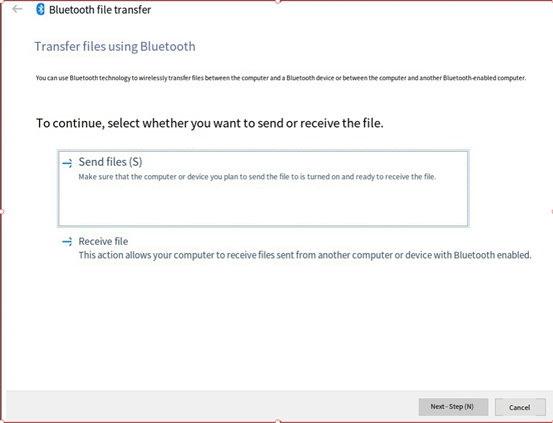

Select OKT527.

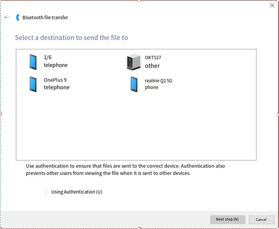

Select a file to send.


Wait for the send completion


Received files are saved in the /tmp directory.

5\. The development board is to send files.

Similarly, you can use the development board to send files to the computer. 

The test method is as follows:

Select "Receive File" on the computer side.

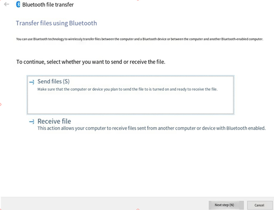

```plain
root@OK527:~# bluetoothctl 
Agent registered
[CHG] Controller E8:FB:1C:66:FA:A6 Pairable: yes
[bluetooth]# paired-devices        //View paired device
Device 2C:DB:07:C7:4F:F6 DESKTOP-VND9V1F
[bluetooth]# exit
root@OK527:~# fltest_obexctl.sh
[NEW] Client /org/bluez/obex 
[obex]# connect   2C:DB:07:C7:4F:F6     //Link the specified device
Attempting to connect to 2C:DB:07:C7:4F:F6
[NEW] Session /org/bluez/obex/client/session0 [default]
[NEW] ObjectPush /org/bluez/obex/client/session0 
Connection successful
[2C:DB:07:C7:4F:F6]# send /run/media/mmcblk0p1/bootlogo.bmp  //Send files
Attempting to send /run/media/mmcblk0p1/bootlogo.bmp to /org/bluez/obex/client/session0
[NEW] Transfer /org/bluez/obex/client/session0/transfer0 
Transfer /org/bluez/obex/client/session0/transfer0
Status: queued
Name: bootlogo.bmp
Size: 1339239
Filename: /run/media/mmcblk0p1/bootlogo.bmp
Session: /org/bluez/obex/client/session0
[CHG] Transfer /org/bluez/obex/client/session0/transfer0 Status: active
[CHG] Transfer /org/bluez/obex/client/session0/transfer0 Transferred: 65433 (@65KB/s 00:19)
[CHG] Transfer /org/bluez/obex/client/session0/transfer0 Transferred: 130961 (@65KB/s 00:18)
.....
[CHG] Transfer /org/bluez/obex/client/session0/transfer0 Status: complete
[DEL] Transfer /org/bluez/obex/client/session0/transfer0 
[2C:DB:07:C7:4F:F6]# exit
root@OK527:~# 
```

The computer will receive the incoming file request for file transfer.

6\. Board sink, connected to mobile phone

```plain
//Execute the following instructions in order root@OK527:/# bluealsa -p a2dp-source -p a2dp-sink -p hfp-hf -p hfp-ag -p hsp-hs -p hsp-ag &
root@OK527:/# bluetoothctl
[bluetooth]# power on
[bluetooth]# pairable on
[bluetooth]# discoverable on
[bluetooth]# agent on
# Then connect the mobile phone to the board.
# And then all kinds of yes
# Trust the mobile
[bluetooth]# trust 54:09:10:2A:01:75
[bluetooth]# quit

root@OK527:/# bluealsa-aplay -l
**** List of PLAYBACK Bluetooth Devices ****
hci0: 54:09:10:2A:01:75 [1/6], phone
SCO (CVSD): S16_LE 1 channel 8000 Hz
**** List of CAPTURE Bluetooth Devices ****
hci0: 54:09:10:2A:01:75 [1/6], phone
A2DP (SBC): S16_LE 2 channels 44100 Hz
SCO (CVSD): S16_LE 1 channel 8000 Hz

# Record from bluealsa, then play to default device (soc internal codec)
root@OK527:/# arecord -fcd -D bluealsa | aplay

# When the mobile phone plays music, the board rings.
```

### 4.37 NPU Test

OK527N-C integrates 2Tops NPU and currently has six models built-in: Fairmot, MobileNet\_V2, VGG19, struct 2depth, yolact, and yolov5s-sim-640.

This section mainly demonstrates the use of NPU through routines.

The location of the NPU test routine is as follows:

```plain
root@OK527:/# ls /etc/npu/sample_viplite
Fairmot  MobileNet_V2  VGG19  struct2depth  yolact  yolov5s-sim-640

root@OK527:/# ls /etc/npu/sample_viplite/Fairmot/
1088x608x3.dat  network_binary.nb  sample.txt


//  1088x608x3.dat   Input data for test
//  network_binary.nb Network model for testing
//  sample.txt        Configuration file for test
```

The configuration file is as follows:

```plain
root@OK527:/# cd /etc/npu/sample_viplite/Fairmot
root@OK527:/etc/npu/sample_viplite/Fairmot# cat sample.txt

vpm_run is a framework for testing VIPLite driver.

#You may put comment by starting with a '#'.
#####################################################A separator makes the list clear.
[network]
/etc/npu/sample_viplite/Fairmot/network_binary.nb      //Specify the network model to use
[input]
/etc/npu/sample_viplite/Fairmot/1088x608x3.dat        //Specify the input data                 

You can also add comparison files and output files by adding [golden] and [output] in the configuration file:
[network]
./ network_binary.nb
[input]
./ input_0.dat
[ golden]                                   //Compare files
./ output0_10_1.dat
[output]                                     //Output files
./ output_0.dat             
Here's how to run it: -l 10 means execute the test 10 times, and the results are as follows
root@OK527:/etc/npu/sample_viplite/Fairmot# vpm_run -s sample.txt -l 10
loop_count=10, device_id=0, file_name=sample.txt
test started.
init vip lite, driver version=0x00010d00...
VIPLite driver software version 1.13.0.0-AW-2023-10-19
vip lite init OK.

cid=0x10000016, device_count=1
device[0] core_count=1
init test resources, batch_count: 1 ...
create/prepare networks ...
batch i=0, binary name: /etc/npu/sample_viplite/Fairmot/network_binary.nb
input 0 dim 1088 608 3 1, data_format=2, quant_format=2, name=input[0], scale=1.000000, zero_point=0
ouput 0 dim 272 152 1 1, data_format=2, name=uid_9_out_0, scale=0.003889, zero_point=0
ouput 1 dim 272 152 4 1, data_format=2, name=uid_8_out_0, scale=0.123799, zero_point=39
ouput 2 dim 272 152 2 1, data_format=2, name=uid_7_out_0, scale=0.024050, zero_point=32
ouput 3 dim 272 152 1 1, data_format=2, name=uid_6_out_0, scale=0.003889, zero_point=0
ouput 4 dim 128 272 152 1, data_format=1, name=uid_41_out_0, none-quant
nbg name=/etc/npu/sample_viplite/Fairmot/network_binary.nb
create network 0: 26301 us.
memory pool size=17419776byte
network core count=1
input 0 name: /etc/npu/sample_viplite/Fairmot/1088x608x3.dat
prepare network 0: 35679 us.
batch: 0, loop count: 1
start to run network=/etc/npu/sample_viplite/Fairmot/network_binary.nb
run time for this network 0: 346532 us.
run network done...
profile inference time=344865us, cycle=239992405
******* nb TOP5 ********
--- Top5 ---
40528: 0.987698
1088: 0.979921
1360: 0.976033
1632: 0.976033
1904: 0.976033
******* nb TOP5 ********
--- Top5 ---
165375: 26.740648
165374: 20.055487
165373: 18.941294
165105: 15.846311
81599: 14.979715
******* nb TOP5 ********
--- Top5 ---
80179: 3.246813
80312: 3.246813
80327: 3.246813
80351: 3.246813
80359: 3.246813
******* nb TOP5 ********
--- Top5 ---
40256: 0.987698
40257: 0.987698
40528: 0.987698
40529: 0.987698
40800: 0.987698
******* nb TOP5 ********
--- Top5 ---
7: 0.329834
5222406: 0.302002
5222534: 0.301758
5222662: 0.300781
5222790: 0.290527
```

## 5. OK527 Platform Multimedia Test

The audio and video part of OK527 platform supports hardware decoding. All of the examples in this section are based on command line forms.

There is a video processing unit VPU inside the OK527 platform, which supports video hard decoding in the following formats:

Video Decoding: H265 supports up to 4K @ 30fps and H264 supports up to 4K @ 24fps

Video Encoding: JPEG, up to 4096x4096

Table of hardware decoder parameters for the OK527 platform:

| Video Decoder| Format| Resolution| Frame rate
|:----------:|----------|----------|----------
| | H.265| 4K| 60 fps
| | H.264| 4K| 30 fps
| | VP9| 4K| 60 fps
| Video Encoder| H264| 4K| 24 fps

### 5.1 UVC Play Test

**Note:**

**Before performing the tests in this section, refer to “Closing the Desktop" to close the desktop test program and clear the screen.**

**The device node recognized by the OK527 UVC camera is /dev/video1, and this test uses LVDS as the display device.**

1\. Capture Test

```plain
root@OK527:/# gst-launch-1.0 v4l2src device=/dev/video1 ! videoconvert ! video/x-raw,format=NV12,width=640,height=480,framerate=30/1 ! waylandsink

.
.
.
```

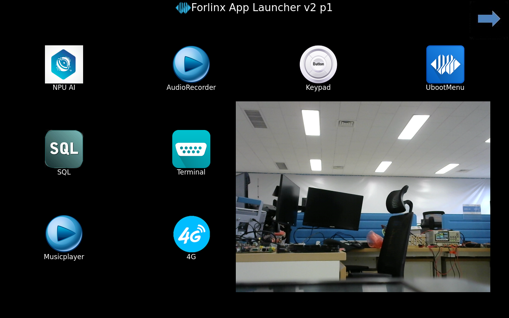

### 5.2 OV5645 Acquisition Test

Command line collection of MIPI cameras is currently not supported, but can be collected using the Qt application.

### 5.3 Video Hardware Decoding

OK527 supports H264, H265 video hard decoding, H265 supports up to 4K @ 60fps, H264 supports up to 4K @ 30 fps

The current encoding and decoding uses the gstreamer method, which can only decode without encoding.

```plain
root@OK527:/# gst-launch-1.0  filesrc location=/forlinx/1080p_60fps_h264.mp4  ! parsebin ! omxh264dec ! filesink location=h264.yuv

...
stream stopped, reason error
WARNING: omx_vdec_aw <standbyOutBufferArr:659>: ** return pic when flush,i[0],pPic[0x7f70001328]
WARNING: omx_vdec_aw <standbyOutBufferArr:659>: ** return pic when flush,i[1],pPic[0x7f70001498]
WARNING: omx_vdec_aw <standbyOutBufferArr:659>: ** return pic when flush,i[4],pPic[0x7f700018e8]
WARNING: omx_vdec_aw <standbyOutBufferArr:659>: ** return pic when flush,i[5],pPic[0x7f70001a58]

Freeing pipeline ...

```

Check if the h264.yuv file has been generated after completion.

Video Preview

```plain
root@OK527:/# gst-launch-1.0  filesrc location=/forlinx/1080p_30fps_h265.mp4  ! parsebin ! omxhevcvideodec ! waylandsink

.
.
.

```

## 6\. System Flashing

The OK527-C development board currently supports both OTG and TF card programming. The corresponding burning tool is provided in the user information, and the user can choose anyone to burn the image.

### 6.1 Image Required for Flashing

Image Path: 02-User Profile\\01-Software Profile\\03-Mirror \& Source Code\\01-Image File

| **Image**| **Description**
|----------|----------
| t527\_linux\_okt527\_uart0.img| Factory default image (eMMC)

Note: The provided image file has been compressed. Please decompress it before burning it.

### 6.2 OTG Flashing

#### 6.2.1 Flashing Tools Installation

Path: 02-User Information \\ 01-Software Information \\ 04-Tools \\ PhoenixSuit \_ V1.10.zip

Unzip the Phoenix Suit \_ V1.10.zip and connect the development board to the PC using the Type-C cable.

Use the Type-C cable to connect the development board and the host. Press and hold the FEL key and press the RESET key to reset the system. Release the RESET key for about two seconds and then release the FEL key.

**Note: Make sure to release the RESET button first, then release the FEL button.**  

Open the windows device manager, find an unknown device with a yellow exclamation mark, select to install the driver manually, right-click the unknown device, and select "Update Driver"


Select "Browse my computer for drivers" and then select the extracted V1.10 directory of the Phoenix Suit \_.


Wait for the driver to finish installing, and run PhoenixSuit.exe, the bottom left corner shows "The device has been connected successfully".


#### 6.2.2 OTG Flashing Method

1\. OTG Full Flashing Test

This method will flash the entire img image.

As shown in the following interface:


In the following interface, click on “One-click Flash” and then click on “Browse” to select the firmware image file.

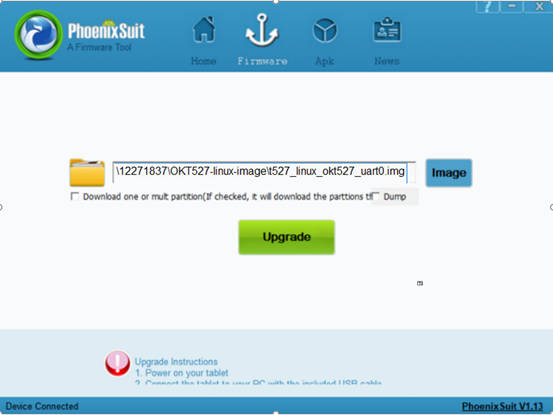

Connect the development board and the host using a Type-A to Type-C cable, do not power on the board initially, press the FEL key, power on the board, then release the FEL key.

**Note: Be sure to press the FEL key when the power is off.**

In the following interface, click "Yes" to enter the formatting upgrade mode.


Waif for the flashing to finish, the following interface will pop up:

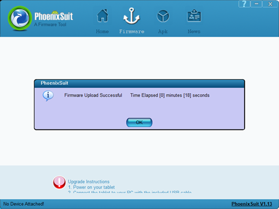

Power on and start the OK527 board.

2\. Update the image separately.

1\) Separate flashing test for OTG Uboot

In the following interface, check the checkbox "Single or Multi-zone Download (Check this option, the flashing tool downloads the partitions you selected)", check "BOOT-RESOURCE", "ENV", checkboxes.


Connect the development board and the host using a Type-A to Type-C cable, do not power on the board initially, press the FEL key, power on the board, then release the FEL key. Wait for flashing to finish, the following interface will pop up:

**Note: Be sure to press the FEL key when the power is off.**


2\) Flash the kernel image and device tree (dtb) file via OTG

Check the "Single/Multiple Partition Download" box in the interface (flashing tool downloads selected partitions), also check "BOOT-RESOURCE" and "BOOT".

Place the kernel image in the "BOOT" partition, and the device tree (DTB) file and U-Boot in the "BOOT-RESOURCE" partition.

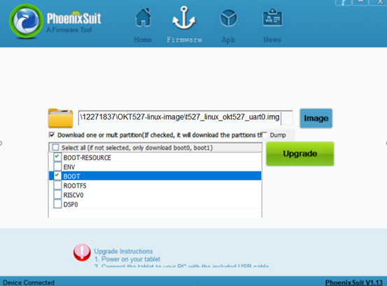

Connect the development board and the host using a Type-A to Type-C cable, do not power on the board initially, press the FEL key, power on the board, then release the FEL key. Wait for flashing to finish, the following interface will pop up:

**Note:Be sure to press the FEL key when the power is off.**


3\) OTG flashing File System

Check the "Single/Multiple Partition Download" box in the interface (flashing tool downloads selected partitions), also check "ROOTFS".


Connect the development board and the host using a Type-A to Type-C cable, do not power on the board initially, press the FEL key, power on the board, then release the FEL key. Wait for flashing to finish, the following interface will pop up:

**Note: Be sure to press the FEL key when the power is off.**


#### 6.2.3 OTG Flashing Common Issues

1\. Driver installation failed

Some users still see an "Unknown Device" after installing USB drivers per the manual. Clicking on it shows a message about a third-party INF lacking digital signature info, as shown below.

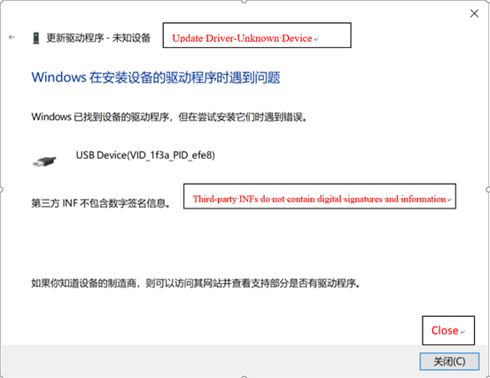

This occurs because some Windows systems disallow unsigned drivers to ensure system stability, resulting in failed installation of unsigned drivers. Users need to disable driver signature enforcement on their computers before installing drivers according to the manual.

- Solution to the problem that the third-party INF does not contain digital signature information.


1）<font style="color:black;">First press and hold Shift + to restart</font>


2）<font style="color:black;">At startup, select Troubleshooting -- Advanced Options -- Startup Settings</font>


3\. <font style="color:black;">In the boot settings screen, click Reboot in the lower right corner to reboot into the boot settings; you can use the number keys 7 or functional keys F7; disable driver forced signing;</font>

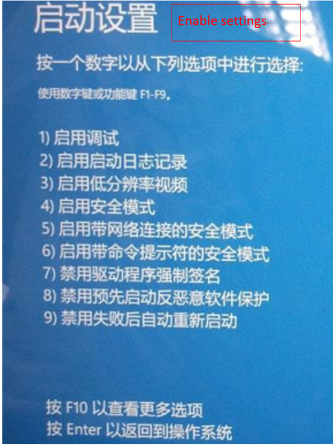

2\. Improper use of FEL key

When flashing, do not power up the board first, press the FEL key and then power up the board, and then release the FEL key.

3\. The device name has appeared, but the board still cannot be recognized.


Due to numerous unknown devices in Device Manager, choosing the wrong one might install the driver incorrectly. Right-click the device, uninstall it and the device driver.


Then unplug other USB devices, set the development board to flashing mode, connect to the host, and reinstall the driver.

### 6.3 TF Card Flashing

#### 6.3.1 TF Flashing Card Creation

Creation path: 02-user information\\01-software information\\04-tools\\PhoenixCard\_V4.1.9.zip

1\. Insert the 8GB/16GB/32GB TF card into the USB port of the PC using a card reader;

2\. Copy the PhoenixCard\_V4.1.9.zip to any directory on Windows, then double-click the PhoenixCard.exe file inside the PhoenixCard\_V4.1.9 directory.

As shown in the following interface:


**Note: When there are multiple partitions on the TF card, please click on “Restore Card” first, and then click on “Burn Card”. Otherwise, it may result in a failed burn process.**

3\. Click on "Firmware" to browse OK527 firmware image, select "Mass Production Card," and click “Flash Card".

After flashing, as shown in the following interface:


#### 6.3.2 TF Card Flashing

1\. Insert the TF card, power on and start the card, and the system will automatically enter the programming process.

After the programming is completed, the screen and serial port will prompt:

```plain
…

chunk 4392(4395)
chunk 4393(4395)
chunk 4394(4395)
[76.477]successed in writting part rootfs
origin_verify value = b32fc317, active_verify value = b32fc317
[76.486]successed in verify part rootfs
[76.490]successed in download part rootfs
[76.494]begin to download part riscv0
partdata hi 0x0
partdata lo 0x1f39bc
sparse: bad magic
[76.599]successed in writting part riscv0
origin_verify value = 1cc2c38d, active_verify value = 1cc2c38d
[76.619]successed in verify part riscv0
[76.623]successed in download part riscv0
[76.627]begin to download part dsp0
partdata hi 0x0
partdata lo 0x4c4b0
sparse: bad magic
[76.650]successed in writting part dsp0
origin_verify value = 9720f44d, active_verify value = 9720f44d
[76.662]successed in verify part dsp0
[76.665]successed in download part dsp0
[76.672]successed in downloading part
uboot size = 0x16c000
storage type = 2
sunxi_sprite_deal_uboot ok
[76.761]successed in downloading uboot
[76.768][mmc]: write mmc 2 info ok
storage type = 2
[76.780]successed in downloading boot0
CARD OK
[76.784]sprite success
sprite_next_work=1
next work 1
SUNXI_UPDATE_NEXT_ACTION_NULL
==================================================
|                                                |
|                 update  finish                 |
|                                                |
==================================================
remind_type : GPIO_LED
```

2\. Pull out the TF card and power on the board to start the system.

During mass production, monitor the red light on the SoM to gauge flashing completion. The process changes as follows:

Flashing preparation stage: The red light of the SoM is always off.

Flashing completion stage: The red light of the SoM is off.

3\. TF Card Restoration

Path of recovery tool: 02-User information \\ 01-Software information \\ 04-Tools \\ PanasonicSDFormatter.zip

Copy PanasonicSDFormatter.zip to any window directory and unzip it, insert the TF card into the Windows host, and run SDFormatter.exe as administrator.


Click on "Options Settings," select Erase and Format, and then click Format to restore the burned TF card to a regular TF card.