# MCU User’s Compilation Manual_V1.0

Document classification: □ Top secret □ Secret □ Internal information ■ Open

## Copyright

The copyright of this manual belongs to Baoding Folinx Embedded Technology Co., Ltd. Without the written permission of our company, no organizations or individuals have the right to copy, distribute, or reproduce any part of this manual in any form, and violators will be held legally responsible.

Forlinx adheres to copyrights of all graphics and texts used in all publications in original or license-free forms.

The drivers and utilities used for the components are subject to the copyrights of the respective manufacturers. The license conditions of the respective manufacturer are to be adhered to. Related license expenses for the operating system and applications should be calculated/declared separately by the related party or its representatives.

## Overview

This manual is designed to enable Forlinx Embedded development board users to quickly understand the compilation process and the compilation method of M core. The application program requiresusingIARsoftware to compile the executable file， copyit to the development board for execution.By following the methods outlined in the compilation manual and through practical operation, users will be able to complete the compilation,downloading, and simulation of their own software code.

The manual will provide instructions based on the IDE tool. Since the i.MX 8M processor is a recently released chip from NXP, previous versions of the IDE tool may encounter some unforeseen issues. It is recommended for beginners to directly use the IDE installation program in our SDK package, which enables a quick start and shorter development time.

There are total four chapters:

+ Chapter 1. primarily focuses on setting up the development environment, including the installation and configuration of the visual editing software IAR compiler and the J-Link emulator. Users can use these tools to modify and compile programs, generating executable files；
+ Chapter 2. mainly focuses on program downloading. Following the instructions in the manual, users can download the program for the M-core to Flash memory and load it for execution；
+ Chapter 3. primarily focuses on the program boot process, understanding the different methods of loading M-core programs on a multi-core heterogeneous processor；
+ Chapter 4. mainly focuses on the usage and operational steps of the simulation tool, allowing users to complete real-time simulation of the program.

| **Format**| **Meaning**
|----------|----------
| Blue font on gray background| Refers to commands entered at the command line(Manual input required).
| Black font on gray background| Serial port output message after entering a command
| **Bold black on gray background**| Key information in the serial port output message
| //| Interpretation of input instructions or output information

## Application

This software manual is applicable to the OKMX8MPQ-C platform Linux 5.4.70 operating system of Forlinx.

## Revision History

| Date| Version| Revision History
|----------|----------|----------
| 20/04/2023| v1.0| OKMX8MPQ-C M7 User’s Compilation Manual Intial Version

### 1. Environment Setup

IAR’s Embedded Workbench series is an enhanced integrated development platform that integrates file editing, project management, compilation, linking, and debugging tools required for developing embedded systems. IAR’s distinctive CSPY debugger not only allows for pure software simulation without target hardware during the early stages of system development but also enables real-time on-line simulation and debugging in conjunction with the J-Link/J-Trace hardware emulator.

J-Link is an open source project of SEGGER. Its goal is to enable embedded developers to burn, verify and debug with open hardware and software systems through JTAG interfaces.

For M-core development of the i.MX 8M Plus processor, IAR is used to manage program configuration, compilation, and software simulation, while J-Link is integrated for hardware emulation capabilities.

#### 1.1 IAR

Users can download the IAR used by OKMX8MPQ-C development board routines, or use the installation package under the M-core SDK package tool file. Please select to use 9.20.1 and above.

Step1: In the M Core SDK package tools file， double-click the IAR installer to install it.

Step 2:Click the “Next”.

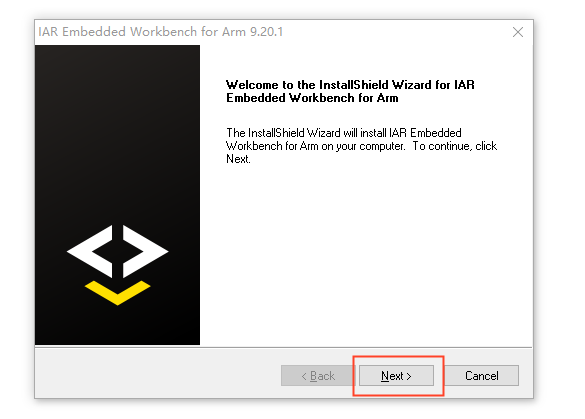

Step 3: Check the “I accept the terms of the license agreement”and click the “Next”.

Step 4: Select the default installation path of the software, and then click the “Next”.

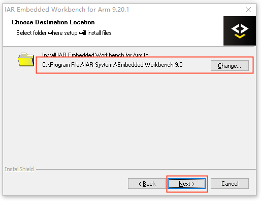

Step 5: Click the “Next”.

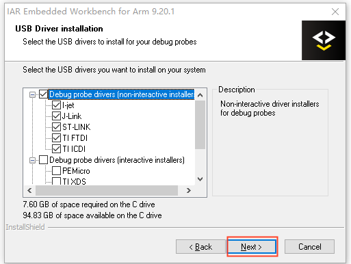

Step 6: After the installation is completed, the following interface is displayed. Click the “Finish” to complete the installation.

#### 1.2 Installation of J-Link Driver

Step 1: In the M core SDK package tool->- file, double-click the- installer to install it. The J-Link version should be above 7.56.

Step 2: Click the “Next”.

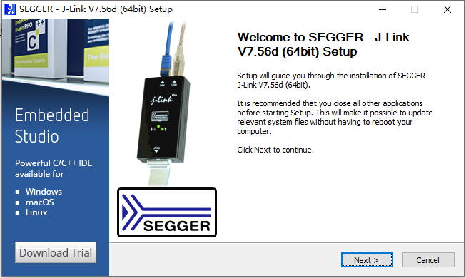

Step 3: Click the “I Agree”.

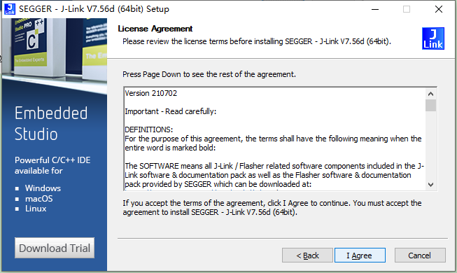

Step 4: Keep the default configuration and click the “Install”.

Step 5: Select the IAR software and click ”OK” to complete the installation.

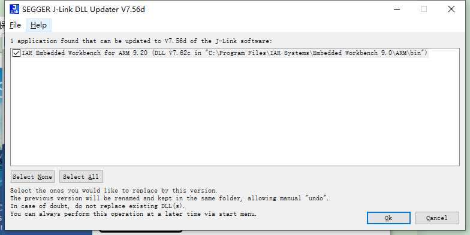

Step 6: Replace the latest im8 driver, copy the NXP folder to the C: \\ Program Files \\ SEGGER \\ JLink \\ Devices directory, and paste and overwrite it.

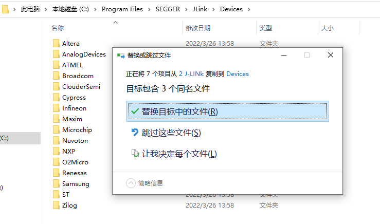

Step 7: Replace the startup file, copy startup\_MIMX8ML8\_cm7.s to \<sdk\_path>\\devices\\MIMX8ML8\\iar\\ to overwrite, where is the location of the<sdk-path>SDK package on the computer.

After completing the above steps, the IAR software and J-link have been installed and updated, and the M7 core of 8MP can use IAR to compile and simulate programs like other microcontrollers.

#### 1.3 Development Environment Validation

Step 1: As shown in the figure below, open the hello-world routine project in the SDK, and double-click to open the IAR project.

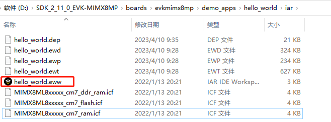

Step 2: Click the Compile button on the toolbar or press the shortcut key F7 to finish compiling the program.

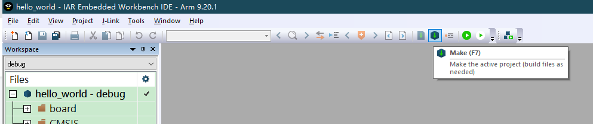

Step 3: You can see the program compilation success message in the information column.

Step 4: Generate the settings and debug folders under the project directory.

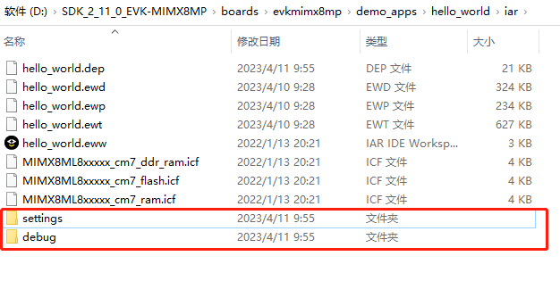

Step 5: The hello \_ world. bin under the debug folder is the executable file.

### 2\. Program Compilation \& Download

#### 2.1 Compilation Program

There are three ways to load the M-core program for the i.MX 8M Plus processor, on-chip memory TCM, off-chip memory DDR, and off-chip Flash. The on-chip memory TCM has the highest execution efficiency but a relatively small capacity; the off-chip memory DDR has the second-highest efficiency and a larger capacity; the off-chip Flash has the lowest efficiency.

The Forlinx OKMX8MPQ - C development board does not have an externally expanded NorFlash, so it only supports the first two loading methods. Most of the programs in the SDK package use the TCM method. Only the ASRC example involves audio files with different sampling rates, which exceed the size of the TCM, so the DDR method is used instead.

The following details how to use IAR to generate executable files for the three different loading methods.

Step 1: Click the workspace drop-down option on the left side of the project, you can see 6 options, including debug for the TCM way debug version, which can be simulated; release for the TCM way release version, which can not be simulated. The “ddr\_debug” is the debug version for the DDR loading method and supports simulation; the “ddr\_release” is the release version for the DDR loading method and does not support simulation. 

The “flash\_debug” is the debug version for the flash loading method and supports simulation; the “flash\_release” is the release version for the flash loading method and does not support simulation.

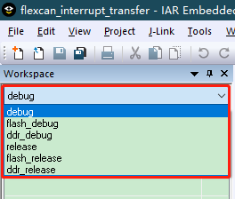

Step 2: The differences among the three loading methods are mainly reflected in the following aspects:

(1) In the left-hand project space, right-click and select Options. On the left side, select the Output column in the General Option option with a different catalog.

(2) On the left, select C in the Static Analysis option-Output Directory under the STAT Static Analysis column. The directories are different.

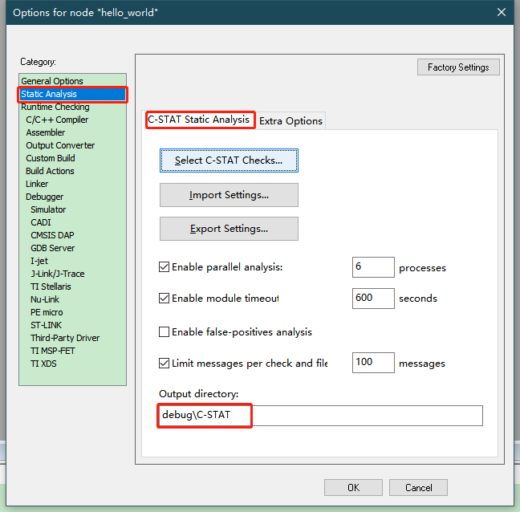

(3) Select Output in the Output Converter option on the left side to change the name of the executable file. forlinx\_m7\_tcm\_firmware.bin is used by default when uboot loads the M-core program on the Forlinx Development Board.

**Note: The file name is involved in the subsequent uboot manual loading and automatic loading, which should be consistent with the subsequent loading command.**

(4) On the left side, select different scatter loading files in the “Config” option under the “Linker” settings. In this way, the compiled programs can be loaded and run on different media.

#### 2.2 Program Download

1. You can use the IAR software to compile the program of the Forlinx M-core software development kit to generate \*.bin and files in the project directory /IAR/debug directory.

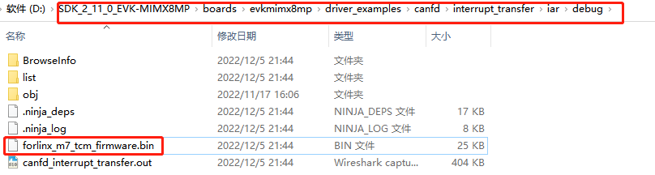

2. Use various methods such as serial port Xmodem, network FTP, SCP, USB flash drive, TF card, etc., to copy the \*.bin file from the computer to the /run/media/mmcblk2p1/ directory of the SoM. Then, enter the sync command to synchronize the program to the eMMC.

Power cycle the development board. The A-core U-Boot can load the M-core program either manually or automatically.

## 3\. Program Load

There are generally two ways to load M-core programs on multi-core heterogeneous processors: Uboot loading and Remoteproc framework loading.

The uboot loading is to load the M-core program first and then load the A-core program in the uboot phase. There are manual loading and automatic loading. Remoteproc framework loading refers to a method where, after the A-core Linux system is fully booted, the M-core program can be manually run or stopped using commands.

The Linux version of the OKMX8MPQ - C development board is lower than 5.10, so it does not currently support the Remoteproc framework for loading the M-core program. This chapter mainly introduces the two methods of manual and automatic loading through U-Boot. When the Linux version is upgraded to above 5.10, we will elaborate on the method of loading the M-core program using the Remoteproc framework.

### 3.1 Manually Loading

There are three ways of M core loading and running: TCM, DDR and Flash, and the corresponding loading commands in the uboot stage are also different. Manually load the M-core program, but do not load the A-core program later to avoid the same pin initializing in both the M-core and A-core at the same time, which may cause functional abnormalities. It is suitable for debugging programs during the development phase.

#### 3.1.1 TCM

Step 1: Restart the OKMX8MPQ-C board and press the space bar to enter the uboot command line.

Step 2: Enter "1" to enter the uboot console. And enter the following commands in order, copy forlinx\_m7\_tcm\_firmware.bin from the/run/media/mmcblk2p1 directory to TCM and run it.

**Note: forlinx\_m7\_tcm\_firmware.bin is the name of the Forlinx executable program and can be modified by the user.**

| 1| fatload mmc 2:1 0x48000000 forlinx\_m7\_tcm\_firmware.bin
|:----------:|----------
| 2| cp.b 0x48000000 0x7e0000 20000
| 3| bootaux 0x7e0000

Step 3: Enter the reset command to restart the development board.

#### 3.1.2 DDR

**DDR loading is not applicable to 1GB memory version. Please choose a SoM with 2G, 4G or above memory.**

Step 1: Restart the OKMX8MPQ-C board and press the space bar to enter the uboot command line.

Step 2: Enter "1" to enter the uboot console. And enter the following commands in order, copy forlinx\_m7\_tcm\_firmware.bin from the/run/media/mmcblk2p1 directory to DDR and run it.

**Note: forlinx\_m7\_tcm\_firmware.bin is the name of the Forlinx executable program and can be modified by the user.**

| 1| fatload mmc 2:1 0x80000000 forlinx\_m7\_tcm\_firmware.bin
|:----------:|----------
| 2| dcache flush
| 3| bootaux 0x80000000

Step 3: Enter the reset command to restart the development board.

#### 3.1.3 FLASH

Step 1: Restart the OKMX8MPQ-C board and press the space bar to enter the uboot command line.

Step 2: Enter "1" to enter the uboot console. And enter the following commands in order, copy forlinx\_m7\_tcm\_firmware.bin from the/run/media/mmcblk2p1 directory to Flash and run it.

**Note:**

**（1）The name of Forlinx’s executable program is forlinx\_m7\_tcm\_firmware.bin, which can be modified by users;**

**（2）The OKMX8MPQ - C development board currently lacks NorFlash support for this loading method. Users may expand the NorFlash themselves if needed.**

| 1| sf probe
|:----------:|----------
| 2| sf read 0x80000000 0 4
| 3| fatload mmc 2:1 0x80000000 forlinx\_m7\_tcm\_firmware.bin
| 4| dcache flush
| 5| sf erase 0 0x100000
| 6| sf write 0x48000000 0 0x100000
| 7| bootaux 0x8000000

Step 3: Enter the reset command to restart the development board.

### 3.2 Automatic Loading

Manual loading is suitable for use in the debugging phase. When the product is formally produced, uboot is required to automatically load and modify the environment variables. The M-core program will be loaded in the uboot phase, and then the A-core Linux kernel will be loaded.

#### 3.2.1 TCM

Step 1: Restart the OKMX8MPQ-C board and press the space bar to enter the uboot command line.

Step 2: Enter "1" to enter the uboot console. Enter the following commands in order to modify the uboot environment variable so that the M-core program can be loaded into the TCM.

**Note: forlinx\_m7\_tcm\_firmware.bin is the name of the Forlinx executable program and can be modified by the user.**

**Because the command is too long, there will be a line break when you copy it directly in PDF. Please copy the command to TXT, delete the line break and then copy it.**

| 1| setenv loadm "fatload mmc 2:1 0x48000000 forlinx\_m7\_tcm\_firmware.bin;cp.b 0x48000000 0x7e0000 20000;bootaux 0x7e0000"
|:----------:|----------
| 2| setenv bootcmd "run loadm;mmc dev 2; if mmc rescan; then if run loadbootscript; then run bootscript; elif test mmc2 = mmc1 \&\& run loadupdate; then run mmcupdate; else if run loadimage; then run mmcboot; else run netboot; fi; fi; fi;"
| 3| saveenv
| 4| reset

#### 3.2.2 DDR

**DDR loading is not applicable to 1GB memory version. Please choose a SoM with 2G, 4G or above memory.**

Step 1: Restart the OKMX8MPQ-C board and press the space bar to enter the uboot command line.

Step 2: Enter "1" to enter the uboot console. Enter the following commands in order to modify the uboot environment variable so that the M-core program can be loaded into the DDR.

**Note: forlinx\_m7\_tcm\_firmware.bin is the name of the Forlinx executable program and can be modified by the user.**

**Because the command is too long, there will be a line break when you copy it directly in PDF. Please copy the command to TXT, delete the line break and then copy it.**

| 1| setenv loadm "fatload mmc 2:1 0x80000000 forlinx\_m7\_tcm\_firmware.bin;dcache flush;bootaux 0x80000000"
|:----------:|----------
| 2| setenv bootcmd "run loadm;mmc dev 2; if mmc rescan; then if run loadbootscript; then run bootscript; elif test mmc2 = mmc1 \&\& run loadupdate; then run mmcupdate; else if run loadimage; then run mmcboot; else run netboot; fi; fi; fi;"
| 3| saveenv
| 4| reset

#### 3.2.3 FLASH

Step 1: Restart the OKMX8MPQ-C board and press the space bar to enter the uboot command line.

Step 2: Enter "1" to enter the uboot console. Enter the following commands in order to modify the uboot environment variable so that the M-core program can be loaded into the FLASH.

**Note: forlinx\_m7\_tcm\_firmware.bin is the name of the Forlinx executable program and can be modified by the user.**

**Because the command is too long, there will be a line break when you copy it directly in PDF. Please copy the command to TXT, delete the line break and then copy it.**

| 1| setenv loadm "sf probe;sf read 0x80000000 0 4;fatload mmc 2:1 0x80000000 flash.bin;dcache flush;sf erase 0 0x100000;sf write 0x48000000 0 0x100000;bootaux 0x8000000"
|:----------:|----------
| 2| setenv bootcmd "run loadm;mmc dev 2; if mmc rescan; then if run loadbootscript; then run bootscript; elif test mmc2 = mmc1 \&\& run loadupdate; then run mmcupdate; else if run loadimage; then run mmcboot; else run netboot; fi; fi; fi;"   
| 3| saveenv
| 4| reset

 

## 4\. Simulation Program

Forlinx OKMX8MPQ-C supports J-Link hardware emulation for M-core. Users can set breakpoints, view and modify variables in real time, run the program at full speed or single-step in IAR, etc., which improves the efficiency of the program when troubleshooting errors. In addition, OKMX8MPQ-C also supports serial output debugging.

### 4.1 J-Link

#### 4.1.1 Hardware Connection

The computer and the development board can be connected through a J-Link and a 20-pin adapter board. Note that Pin 1 of the J-Link emulator should correspond to Pin 1 of the JTAG on the development board.

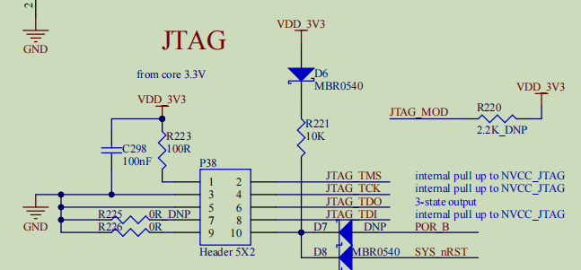

#### 4.1.2 Hardware Simulation

After the program is compiled, place the executable program in the /run/media/mmcblk2p1/ directory of the SoM. Since hardware simulation involves loading the program from the SDK package into the memory for execution, the program to be simulated doesn’t have to be the same as the forlinx\_m7\_tcm\_firmware.bin in the SoM. However, there must be a forlinx\_m7\_tcm\_firmware.bin file; otherwise, the simulation cannot be carried out normally.

(1) Enter the simulation: Click the simulation button on the toolbar or press the shortcut key Crtl + D to enter the program simulation;

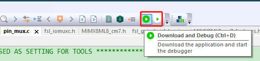

(2) Breakpoint: The program stays at the entrance of the main function. Click the mouse on the left to set the breakpoint. Click again to cancel the breakpoint;

(3) Execution: In the toolbar, you can select multiple execution modes, such as single-step execution, full-speed execution, jump in function, jump out function, etc;

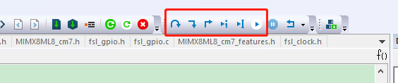

(4) View the variables: Right click on the variable and select Add to Watch to see the real-time value of the variable in the watch window;

(5) Modify the variable: Click the value under Value in the watch window to modify the variable;

(6) Memory view: Click the menu View-Memory to open the memory view window, and enter the memory address to view the real-time value of the memory;

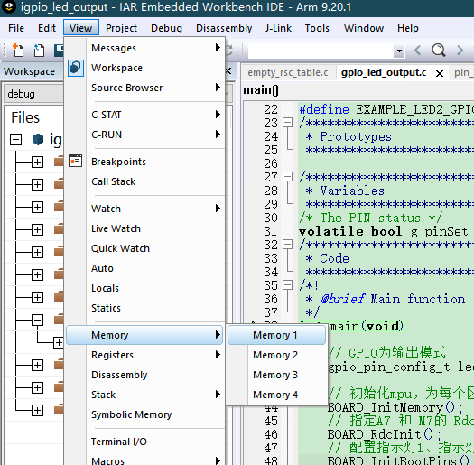

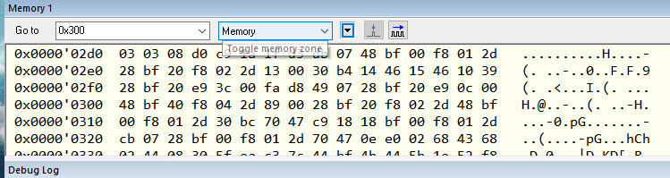

(7) Re-run: Click the reset button in the menu bar to re-run the program;

(8) Exit the simulation: Click the stop button in the menu bar to exit the simulation program.

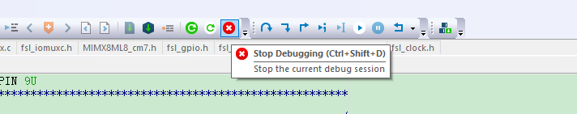

### 4.2 Serial Port Output

Through USB to Type-C, you can connect the computer and development board Debug port, the computer device manager will have two serial ports. One serial port is for debugging the A-core Linux, and the other one is for debugging the M-core. The serial port is configured as follows: the baud rate is 115200, the data bit is 8 bits, no flow control, and the stop bit is 1 bit.

In the application program, the PRINTF function can be used to output print information to the M-core serial port to understand the running process of the program.

