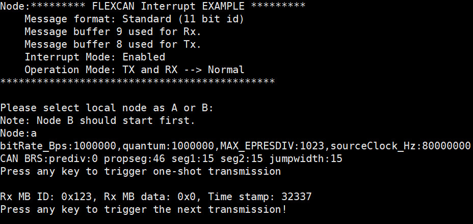
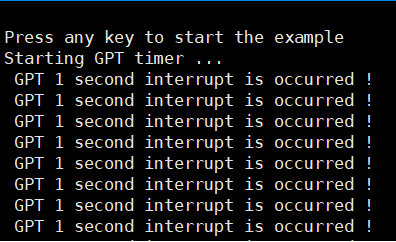
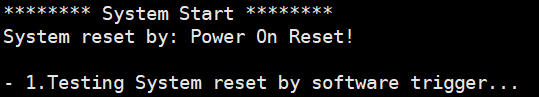
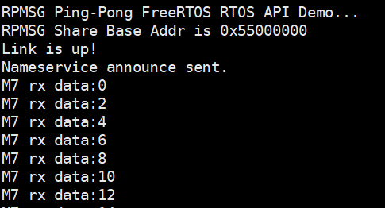
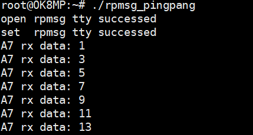

# MCU_User's Manual_V1.0

Document classification: □ Top secret □ Secret □ Internal information ■ Open

## Copyright Notice

The copyright of this manual belongs to Baoding Folinx Embedded Technology Co., Ltd. Without the written permission of our company, no organizations or individuals have the right to copy, distribute, or reproduce any part of this manual in any form, and violators will be held legally responsible.

Forlinx adheres to copyrights of all graphics and texts used in all publications in original or license-free forms.

The drivers and utilities used for the components are subject to the copyrights of the respective manufacturers. The license conditions of the respective manufacturer are to be adhered to. Related license expenses for the operating system and applications should be calculated/declared separately by the related party or its representatives.

## Overview

This manual is intended to familiarize users with the product quickly, understand the functions and testing methods of the M core interface. It mainly describes the overview of the M core interface on the development board, source code analysis and testing methods, as well as how to troubleshoot some issues that may arise during usage. In the process of testing, some commands are annotated to facilitate the user's understanding, mainly for practical use. Please refer to the MCU User Compilation Manual provided by Forlinx to view application program compilation, development environment building, program download and simulation, etc.

There are total five chapters:

+ Chapter 1. provides an overview of the NXP i.MX 8M Plus, giving a brief introduction to the overall architecture and features of the i.MX 8M Plus processor;
+ Chapter 2. is the overall overview of the M-core on the development board, which briefly introduces the resources of the M-core;
+ Chapter 3. is the M core interface bare machine (no system) use function introduction, program analysis and test;
+ Chapter 4. is the introduction of the function of Freertos system of M-core interface, program analysis and test;
+ Chapter 5. is an introduction to the M core SDK usage.

| **Format**                                                   | **Meaning**                                                  |
| ------------------------------------------------------------ | ------------------------------------------------------------ |
| Blue font on gray background | Refers to commands entered at the command line(Manual input required). |
| Black font on gray background | Serial port output message after entering a command          |
| **Bold black on gray background** | Key information in the serial port output message            |
| //                                                           | Interpretation of input instructions or output information   |

## Application

This software manual is applicable to the OKMX8MPQ-C platform Linux 5.4.70 operating system of Forlinx.

## Revision History

| Date       | Version | Revision History      |
| ------------------------------------------------- | ---------------------------------------------- | ------------------------------------------------------------ |
| 20/04/2023 | v1.0    | OKMX8MPQ-C M7 User’s Manual Initial Version |

## 1. NXP i.MX 8M Plus Series Description

### 1.1 Overview

It features a 4 x Cortex-A53+Cortex-M7 heterogeneous architecture, with the M7 core operating at a high frequency of up to 800 MHz. It supports dual floating-point operations, enabling rapid program loading and enhanced real-time signal response. The Co-processor M7 core serves as the MCU to simulate real-time control, catering to the industrial control, communications networking, and other complex application scenarios that require real-time control. This helps to enhance the safety and dependability of various application scenarios.

### 1.2  Features

• High-performance Arm® Cortex®-M7，800MHz operating frequency

• Double floating point budget

• 32 KB instruction cache

• 32 KB data cache

• 256 KB TCM

## 2\. OKMX8MPQ-C Development Board M Core Description

### 2.1 Overview

OKMX8MPQ-C is a cost-effective development board developed by Forlinx based on the industrial-grade NXP i.MX 8M Plus processor. The OKMX8MPQ-C is composed of a SoM and a carrier board. The carrier board features a wealth of peripheral resource module interfaces and comes with detailed module demonstration routines. For detailed information about the SoM and carrier board, please refer to the document OKMX8MPQ-C\_Linux User Manual. This manual primarily introduces the resources and usage of the M-core.

### 2.2  M Core Interfaces

| **Function**| **Description**| **Table of Contents**
|:----------:|----------|----------
| GPIO| User’s light| boards\\evkmimx8mp\\driver\_examples\\gpio
| UART| Debugging serial port| \\boards\\evkmimx8mp\\driver\_examples\\uart
| I2C| RTC| \\boards\\evkmimx8mp\\driver\_examples\\i2c
| CAN| Master-slave pair test| \\boards\\evkmimx8mp\\driver\_examples\\flexcan
| CAN-FD| Master-slave pair test| \\boards\\evkmimx8mp\\driver\_examples\\canfd
| SPI| Master-slave pair test| \\boards\\evkmimx8mp\\driver\_examples\\ecspi
| GPT| Timer and input capture| \\boards\\evkmimx8mp\\driver\_examples\\gpt
| PWM| Waveform output| \\boards\\evkmimx8mp\\driver\_examples\\pwm
| SAI| Recording and playback| \\boards\\evkmimx8mp\\driver\_examples\\sai
| ASRC| Audio sample rate conversion| \\boards\\evkmimx8mp\\driver\_examples\\asrc
| WDOG| Watchdog| \\boards\\evkmimx8mp\\driver\_examples\\wdog
| TMU| Processor temperature detection| \\boards\\evkmimx8mp\\driver\_examples\\tmu
| SDMA| Memory-to-memory copy| \\boards\\evkmimx8mp\\driver\_examples\\sdma
| RDC| Multi-core peripherals, memory allocation| \\boards\\evkmimx8mp\\driver\_examples\\rdc
| RPMSG| Multi-core communication| \\boards\\evkmimx8mp\\multicore\_examples
| FreeRTOS| Examples of real-time systems| \\boards\\evkmimx8mp\\rtos\_examples

## 3\. Software Design Bare Metal Routines

### 3.1  GPIO

The OKMX8MPQ-C development board supports 2 GPIO output (running water light).

#### 3.1.1 Hardware Connection

The demo does not have any special hardware connections, only utilizing the carrier board's 2 x LED.

#### 3.1.2 Software Implementation

（1）Initialization

GPIO initialization mainly includes pin and mode configuration. 

The details are as follows:

Pin configuration: LED1 is connected to pin GPIO5\_08, and LED2 is connected to pin GPIO5\_09

IOMUXC\_SetPinMux(IOMUXC\_ECSPI1\_MISO\_GPIO5\_IO08, 0U); // LED1  

IOMUXC\_SetPinMux(IOMUXC\_ECSPI1\_SS0\_GPIO5\_IO09, 0U);  // LED2  

Mode Configuration: Set two GPIOs as output pins

gpio\_pin\_config\_t led\_config = {kGPIO\_DigitalOutput, 0, kGPIO\_NoIntmode};//Output mode  

GPIO\_PinInit(EXAMPLE\_LED1\_GPIO, EXAMPLE\_LED1\_GPIO\_PIN, \&led\_config)

GPIO\_PinInit(EXAMPLE\_LED2\_GPIO, EXAMPLE\_LED2\_GPIO\_PIN, \&led\_config)

(2) Execution process

After the GPIO initialization is completed, turn over the level of the GPIO every 1 second to control the on and off of the indicator light.

**while** (1)  

{  

    SDK\_DelayAtLeastUs(1000000, SDK\_DEVICE\_MAXIMUM\_CPU\_CLOCK\_FREQUENCY);  

    **if** (g\_pinSet)  

    {  

        GPIO\_PinWrite(EXAMPLE\_LED1\_GPIO, EXAMPLE\_LED1\_GPIO\_PIN, 0U);  

        GPIO\_PinWrite(EXAMPLE\_LED2\_GPIO, EXAMPLE\_LED2\_GPIO\_PIN, 0U);  

        g\_pinSet = **false**;  

    }  

    **else**  

    {  

        GPIO\_PinWrite(EXAMPLE\_LED1\_GPIO, EXAMPLE\_LED1\_GPIO\_PIN, 1U);  

        GPIO\_PinWrite(EXAMPLE\_LED2\_GPIO, EXAMPLE\_LED2\_GPIO\_PIN, 1U);  

        g\_pinSet = **true**;  

    }  

}  

#### 3.1.3 Experimental Phenomena

(1) After the compilation is completed, as described in Chapter 3.1.1 of “OKMX8MPQ-C\_MCU \_ User’s Compilation Manual-V1.0”, manually load the M-core program in uboot;

(2) M-core debugging serial port displays the information shown below, and you will observe 2 LEDs blinking at the same time.

### 3.2  UART

In the M-core SDK package, there are 7 serial port examples. These include "auto\_baudrate\_detect" for automatic baud rate detection, "polling" for polling-based sending and receiving, and "sdma\_transfer" and "idle\_detect\_sdma\_transfer" for DMA-based sending and receiving. Interrupt, interrupt _ transfer, and interrupt _ rb _ transfer are interrupt methods to complete the sending and receiving routine. We primarily introduce interrupt routines.

#### 3.2.1 Hardware Connection

By using a USB to Type-C connection, you can connect the debug port of a computer and a development board. The computer's Device Manager will generate two serial ports. One serial port is for debugging the A-core Linux, and the other one is for debugging the M-core. Serial port configuration: Baud rate is 115200, data bits are 8, no flow control, stop bits are 1.

#### 3.2.2 Software Implementation

（1）Initialization

UART initialization typically includes the following steps: 

The details are as follows:

Clock Configuration: Select UART4 clock as 80MHZ.

CLOCK\_SetRootMux(kCLOCK\_RootUart4, kCLOCK\_UartRootmuxSysPll1Div10); // Use SysPLL1 10 frequency 80MHZ   

CLOCK\_SetRootDivider(kCLOCK\_RootUart4, 1U, 1U);         // uart4 divided by 1 80MHZ/ 1= 80MHZ  

Pin configuration: select the transceiver pin of UART4.

IOMUXC\_SetPinMux(IOMUXC\_UART4\_RXD\_UART4\_RX, 0U);  

IOMUXC\_SetPinMux(IOMUXC\_UART4\_TXD\_UART4\_TX, 0U);  

Communication configuration: Baud rate is 115 200, no check, data bit is 8, no flow control, stop bit is 1.

config->baudRate\_Bps       = 115200U;               // Baud rate  

config->parityMode         = kUART\_ParityDisabled;  //No parity   

config->dataBitsCount      = kUART\_EightDataBits;   // 8-bit data bits  

config->stopBitCount       = kUART\_OneStopBit;      // 1 stop bit  

config->enableRxRTS        = **false**;  

config->enableTxCTS        = **false**;  

Interrupt enable: configures and enables the receive completion and exception overload interrupts.

UART\_EnableInterrupts(DEMO\_UART, kUART\_RxDataReadyEnable \| kUART\_RxOverrunEnable);  

EnableIRQ(DEMO\_IRQn);  

(2) Execution process

After initialization, if data is received, an interrupt is triggered and the received data is resent.

**while** ((UART\_GetStatusFlag(DEMO\_UART, kUART\_TxReadyFlag)) \&\& (rxIndex != txIndex))  

{  

    UART\_WriteByte(DEMO\_UART, demoRingBuffer\[txIndex]);  

    txIndex++;  

    txIndex %= DEMO\_RING\_BUFFER\_SIZE;  

}  

#### 3.2.3 Experimental Phenomena

(1) After the compilation is completed, as described in Chapter 3.1.1 of “OKMX8MPQ-C\_MCU \_ User’s Compilation Manual-V1.0”, manually load the M-core program in uboot；

(2) Input any character in the M core debugging serial port, trigger the receiving interrupt, and then send it out. The typed character can be seen in the M core debugging serial port.

### 3.3 I2C

In the M Core SDK package, there are three serial port routines. Among them, “polling\_b2b\_transfer” is a polling-based example for bidirectional data transfer between a master and a slave device. “interrupt\_b2b\_transfer” is an example that uses interrupts for bidirectional data transfer between a master and a slave device. interrupt\_PCF8563 controls the RTC routine using interrupt mode. We focus on the interrupt \_ PCF8563 routine.

#### 3.3.1 Hardware Connection

This routine mainly uses the RTC chip PCF8563 on the development board, and there is no other special connection.

#### 3.3.2 Software Implementation

（1）Initialization

I2C initialization mainly includes clock configuration, pin configuration, communication configuration and interrupt configuration. 

The details are as follows:

Clock Configuration: Select I2C3 clock as 16MHZ.

CLOCK\_SetRootMux(kCLOCK\_RootI2c3, kCLOCK\_I2cRootmuxSysPll1Div5); // Set I2C clock source160MHZ   

CLOCK\_SetRootDivider(kCLOCK\_RootI2c3, 1U, 10U);// After dividing the frequency by 10, the I2C bus clock is 160 MHz / 10 = 16 MHz.    

Pin configuration: select the transceiver pin of I2C3.

IOMUXC\_SetPinMux(IOMUXC\_I2C3\_SCL\_I2C3\_SCL, 1U);  

IOMUXC\_SetPinMux(IOMUXC\_I2C3\_SDA\_I2C3\_SDA, 1U);   

Communication configuration: Baud rate is 100K, master mode, PCF8563 address is 0x51.

masterConfig->baudRate\_Bps = 100000U;// I2C bus baud rate of 100K  

masterConfig->enableMaster = **true**;   // Set master station mode  

#define PCF8563\_ADDR  0x51  

Interrupt Enable: install and enable interrupts.

s\_i2cMasterIsr = I2C\_MasterTransferHandleIRQ;// Install interrupt  

(**void**)EnableIRQ(s\_i2cIrqs\[instance]);// Enable interrupt  

(2) Execution process

After initialization is complete, wait for commands. If it's a command to set the time, retrieve the time value via the debug serial port and update it to the RTC chip through an I2C write command. If reading the time command, use the I2C read command to obtain RTC time, as displayed via debug serial port.

PRINTF("\\r\\n  Please input 'S/R'?  If set time ,press 'S' and read time press 'R' \\r\\n");

ch = 0;  

ch = GETCHAR();  

PUTCHAR(ch);  

**if**((ch == 's')\|\|(ch == 'S'))// set means setting time  

{     

    get\_input\_time();     

    PCF8563\_set\_time();  

}     

**else** **if**((ch == 'r')\|\|(ch == 'R'))// read means reading time  

{  

    PCF8563\_get\_time();  

}   

#### 3.3.3 Experimental Phenomena

(1) After the compilation is completed, as described in Chapter 3.1.1 of “OKMX8MPQ-C\_MCU \_ User’s Compilation Manual-V1.0”, manually load the M-core program in uboot;

(2) Debugging via the M-core serial port, after entering ''s'', you can set the time. Enter the command ''2023-01-18 15:34:06'' to successfully set the time;

(3) Debugging via the M-core serial port, after entering ''r'', you can read the time, observing it continuously running.

### 3.4  CAN

M-core SDK package contains four CAN examples. Among them, ‘‘loopbac” and ‘‘loopback\_transfer” are examples of self-loopback sending and receiving. ‘‘interrupt\_transfer” demonstrates master-slave communication using interrupt mode. The ping \_ pong \_ buffer \_ transfer is to complete the master-slave receiving and sending in the interrupt buffer mode. We will focus on the interrupt \_ transfer routine.

#### 3.4.1 Hardware Connection

This routine demonstrates the process of CAN master-slave communication, which requires two 8mp development boards, using DuPont cables to connect the H and L of CAN1.

#### 3.4.2 Software Implementation

（1）Initialization

CAN initialization typically includes the following steps: 

The details are as follows:

Clock Configuration: Select CAN1 clock as 80MHZ.

CLOCK\_SetRootMux(kCLOCK\_RootFlexCan1, kCLOCK\_FlexCanRootmuxSysPll1); // CAN1 clock source is：SYSTEM PLL1 800MHZ  

CLOCK\_SetRootDivider(kCLOCK\_RootFlexCan1, 2U, 5U);                   // Divide-by-10 to 80MHz    

Pin configuration: select the transceiver pin of CAN1.

IOMUXC\_SetPinMux(IOMUXC\_SAI2\_TXC\_CAN1\_RX, 0U);  

IOMUXC\_SetPinMux(IOMUXC\_SAI2\_RXC\_CAN1\_TX, 0U);     

Baud rate: Standard CAN speed of 100 Kbit/s. Subsequent programs allocate segment settings such as seg1 and seg2 based on the bus clock and the configured baud rate.

pConfig->bitRate   = 100000U;   // The baud rate of CAN control area is 100KB  

Turn off the self-loop: If the self-loop is turned on, the CAN1 data will loop back in the chip and will not reach the external pin. During program debugging, the interference of the external terminal can be eliminated. However, in real applications, it is necessary to turn off the self-loop and send and receive data from the external pin.

pConfig->enableLoopBack       = **false**; // Do not loop, use external pin  

Frame format: 11-bit standard data frame is used, and the user can also try the extended frame later. You need to set your own ID so that other devices on the bus can identify it.

mbConfig.format = kFLEXCAN\_FrameFormatStandard; // 11-bit standard frame, non-extended frame  

mbConfig.type   = kFLEXCAN\_FrameTypeData;       // Data frame non-remote frame    

mbConfig.id     = FLEXCAN\_ID\_STD(rxIdentifier); // The frame ID is used to distinguish between different devices on the but 

Receive filtering: The user can set the receive filtering rules, so that only the data of a specific frame ID can be received to reduce the amount of data processed by the application.

rxIdentifier = 0;

FLEXCAN\_SetRxMbGlobalMask(EXAMPLE\_CAN, FLEXCAN\_RX\_MB\_STD\_MASK(rxIdentifier, 0, 0));//Receive all ID data  

Interrupt Enable: install and enable interrupts.

FLEXCAN\_EnableInterrupts(base, (uint32\_t)kFLEXCAN\_BusOffInterruptEnable \| (uint32\_t)kFLEX	CAN\_ErrorInterruptEnable \|(uint32\_t)kFLEXCAN\_RxWarningInterruptEnable \| (uint32\_t)kFLEXCAN\_TxWarningInterruptEnable \|(uint32\_t)kFLEXCAN\_WakeUpInterruptEnable)  

(**void**)EnableIRQ((IRQn\_Type)(s\_flexcanRxWarningIRQ\[instance]));  

(**void**)EnableIRQ((IRQn\_Type)(s\_flexcanTxWarningIRQ\[instance]));  

(**void**)EnableIRQ((IRQn\_Type)(s\_flexcanWakeUpIRQ\[instance]));  

(**void**)EnableIRQ((IRQn\_Type)(s\_flexcanErrorIRQ\[instance]));  

(**void**)EnableIRQ((IRQn\_Type)(s\_flexcanBusOffIRQ\[instance]));  

(**void**)EnableIRQ((IRQn\_Type)(s\_flexcanMbIRQ\[instance]));  

(2) Execution process

After initialization is complete, wait for a command. On one development board, entering “B” via the serial port sets it as a CAN slave station awaiting receiving. Upon completing data receiving, print a message and send back the received data.

FLEXCAN\_TransferReceiveNonBlocking(EXAMPLE\_CAN, \&flexcanHandle, \&rxXfer);// Receive data  

LOG\_INFO("Rx MB ID: 0x%3x, Rx MB data: 0x%x, Time stamp: %d\\r\\n", frame.id >> CAN\_ID\_STD\_SHIFT,frame.dataByte0, frame.timestamp);  

FLEXCAN\_TransferSendNonBlocking(EXAMPLE\_CAN, \&flexcanHandle, \&txXfer);    // Return data  

Enter ‘A’ via the serial port, followed by any key. It is actively transmitted as a can master station, and then receives the return data from the slave station. After completing a transfer, enter any key to trigger the next transfer.

FLEXCAN\_TransferSendNonBlocking(EXAMPLE\_CAN, \&flexcanHandle, \&txXfer) // Send data  

FLEXCAN\_TransferReceiveNonBlocking(EXAMPLE\_CAN, \&flexcanHandle, \&rxXfer); // Receive data  

LOG\_INFO("Rx MB ID: 0x%3x, Rx MB data: 0x%x, Time stamp: %d\\r\\n", frame.id >> CAN\_ID\_STD\_SHIFT,frame.dataByte0, frame.timestamp);  

LOG\_INFO("Press any key to trigger the next transmission!\\r\\n\\r\\n");  

#### 3.4.3 Experimental Phenomena

（1）After the compilation is completed, as described in Section 3.1.1 of the "OKMX8MPQ-C\_MCU - User Compilation Manual - V1.0", manually load the M-core program in U-Boot;

（2）Debug the serial port in the M core. Input data B into the serial port of the development board which will act as the CAN slave station and wait for incoming data. Once data receiving is complete, print a message and return the received data;

（3）Debug the serial port in the M core, input A in the serial port of the other development board, input any key as the active transmission of the CAN master station, and then receive the return data from the slave station. After completing a transfer, enter any key to trigger the next transfer.

### 3.5  CAN-FD

There are four CAN-FD routines in the M-core SDK package, in which the loopback and loopback \_ transfer are self-loopback and self-receiving autonomous routines, and the interrupt \_ transfer is an interrupt mode to complete the master-slave transceiver routines. The ping \_ pong \_ buffer \_ transfer is to complete the master-slave receiving and sending in the interrupt buffer mode. We will focus on the interrupt \_ transfer routine.

#### 3.5.1 Hardware Connection

This routine demonstrates the process of CAN-FD master-slave communication. Two 8mp development boards are required, and DuPont cable is used to connect the H and L of the two development boards CAN1.

#### 3.5.2 Software Implementation

（1）Initialization

CAN initialization typically includes the following steps: 

The details are as follows:

Clock Configuration: Select CAN1 clock as 80MHZ.

CLOCK\_SetRootMux(kCLOCK\_RootFlexCan1, kCLOCK\_FlexCanRootmuxSysPll1); // CAN1 clock source is：SYSTEM PLL1 800MHZ  

CLOCK\_SetRootDivider(kCLOCK\_RootFlexCan1, 2U, 5U);                   // Divide-by-10 to 80MHz    

Pin configuration: select the transceiver pin of CAN1.

IOMUXC\_SetPinMux(IOMUXC\_SAI2\_TXC\_CAN1\_RX, 0U);  

IOMUXC\_SetPinMux(IOMUXC\_SAI2\_RXC\_CAN1\_TX, 0U);     

Baud rate: \*\* CAN Baud rate: CAN-FD supports variable rate, that is, the baud rate of the control area and the data area can be different. The maximum baud rate of the control area is 1Mbit/s, and the maximum baud rate of the data area is 8Mbit/s. The subsequent program assigns the values of seg1, seg2, etc. set for the time period according to the bus clock and the set baud rate.

pConfig->bitRate   = 1000000U;   // Baud rate of CAN-FD control area is 1m  

pConfig->bitRateFD = 8000000U;   // Baud rate of CAN-FD data area is 8m

CAN-FD enable: In addition to enabling the CAN-FD, the variable baud rate also needs to be enabled, otherwise the maximum rate of the data area is the same as that of the control area, and the maximum rate is 1Mbit/s.

base->MCR \|= CAN\_MCR\_FDEN\_MASK;   // CAN-FD enable  

fdctrl \|= CAN\_FDCTRL\_FDRATE\_MASK; // Variable baud rate enable  

Turn off the self-loop: If the self-loop is turned on, the CAN1 data will loop back in the chip and will not reach the external pin. During program debugging, the interference of the external terminal can be eliminated. However, in real applications, it is necessary to turn off the self-loop and send and receive data from the external pin.

pConfig->enableLoopBack       = **false**; // Do not loop, use external pin  

Frame format: This time we use the 11-bit standard data frame, and the customer can also try the extended frame later. You need to set your own ID so that other devices on the bus can identify it.

mbConfig.format = kFLEXCAN\_FrameFormatStandard; // 11-bit standard frame, non-extended frame  

mbConfig.type   = kFLEXCAN\_FrameTypeData;       // Data frame non-remote frame    

mbConfig.id     = FLEXCAN\_ID\_STD(rxIdentifier); // The frame ID is used to distinguish between different devices on the but 

Receive filtering: The user can set the receive filtering rules, so that only the data of a specific frame ID can be received to reduce the amount of data processed by the application.

rxIdentifier = 0;

FLEXCAN\_SetRxMbGlobalMask(EXAMPLE\_CAN, FLEXCAN\_RX\_MB\_STD\_MASK(rxIdentifier, 0, 0));//Receive all ID data  

Interrupt Enable: install and enable interrupts.

FLEXCAN\_EnableInterrupts(base, (uint32\_t)kFLEXCAN\_BusOffInterruptEnable \| (uint32\_t)kFLEX	CAN\_ErrorInterruptEnable \|(uint32\_t)kFLEXCAN\_RxWarningInterruptEnable \| (uint32\_t)kFLEXCAN\_TxWarningInterruptEnable \|(uint32\_t)kFLEXCAN\_WakeUpInterruptEnable)  

(**void**)EnableIRQ((IRQn\_Type)(s\_flexcanRxWarningIRQ\[instance]));  

(**void**)EnableIRQ((IRQn\_Type)(s\_flexcanTxWarningIRQ\[instance]));  

(**void**)EnableIRQ((IRQn\_Type)(s\_flexcanWakeUpIRQ\[instance]));  

(**void**)EnableIRQ((IRQn\_Type)(s\_flexcanErrorIRQ\[instance]));  

(**void**)EnableIRQ((IRQn\_Type)(s\_flexcanBusOffIRQ\[instance]));  

(**void**)EnableIRQ((IRQn\_Type)(s\_flexcanMbIRQ\[instance]));  

(2) Execution process

After initialization is complete, wait for commands. On one of the development boards, input “B” through the serial port to configure it as a CAN-FD slave station that waits for data receiving. Upon completing data receiving, print a message and send the received data back.

FLEXCAN\_TransferFDReceiveNonBlocking(EXAMPLE\_CAN, \&flexcanHandle, \&rxXfer);// Receive data  

LOG\_INFO("Rx MB ID: 0x%3x, Rx MB data: 0x%x, Time stamp: %d\\r\\n", frame.id >> CAN\_ID\_STD\_SHIFT,frame.dataByte0, frame.timestamp);  

FLEXCAN\_TransferFDSendNonBlocking(EXAMPLE\_CAN, \&flexcanHandle, \&txXfer);    // Return data  

Input A in the serial port of the other development board as the active transmission of the CAN-FD master station, and then receive the return data from the slave station. After completing a transfer, enter any key to trigger the next transfer.

FLEXCAN\_TransferSendNonBlocking(EXAMPLE\_CAN, \&flexcanHandle, \&txXfer) // Send data  

FLEXCAN\_TransferFDReceiveNonBlocking(EXAMPLE\_CAN, \&flexcanHandle, \&rxXfer);// Receive data  

LOG\_INFO("Rx MB ID: 0x%3x, Rx MB data: 0x%x, Time stamp: %d\\r\\n", frame.id >> CAN\_ID\_STD\_SHIFT,frame.dataByte0, frame.timestamp);  

LOG\_INFO("Press any key to trigger the next transmission!\\r\\n\\r\\n");  

#### 3.5.3 Experimental Phenomena

（1）After the compilation is completed, as described in Section 3.1.1 of the "OKMX8MPQ-C\_MCU - User Compilation Manual - V1.0", manually load the M-core program in U-Boot;

（2）Debug the serial port in the M core. Input data B into the serial port of the development board which will act as the CAN-FD slave station and wait for incoming data. Once data receiving is complete, print a message and return the received data.

（3）Debug the serial port in the M core, input A in the serial port of the other development board, and then input any key as the active transmission of the CAN-FD master station, and then receive the return data from the slave station. After completing a transfer, enter any key to trigger the next transfer.

### 3.6  SPI

There are three SPI routines in the M-core SDK package, in which the ecspi \_ loopback is a self-loop self-receiving self-sending routine, and the interrupt \_ B2B \_ transfer is a master-slave receiving and sending routine completed in the interrupt mode. The polling \_ b2b \_ transfer completes the master-slave transceiver routine in the polling mode. We focus on the interrupt \_ b2b \_ transfer routine.

#### 3.6.1 Hardware Connection

This routine demonstrates the process of SPI master-slave communication. Two 8 MP development boards are required. Connect the two development boards SPI with Dupont cable.

Connect the SPI of the two development boards one-to-one using DuPont wires with the followingwire sequence:

| Development Board 1-SPI Master Mode| | Development Board 2-SPI Slave Mode| 
|:----------:|----------|:----------:|----------
| Pin name| Development board location| Pin name| Development board location
| MISO| P40-10| MISO| P40-10
| MOSI| P40-8| MOSI| P40-8
| SCK| P40-1| SCK| P40-1
| SS0| P40-3| SS0| P40-3
| GND| P40-4/P40-7| GND| P40-4/P40-7

#### 3.6.2 Software Implementation

(1) SPI main initialization

SPI initialization mainly includes initializing the bus clock, pins, and corresponding registers. 

The details are as follows:

Bus Clock: The SPI bus clock is sourced at 800 MHz, divided by 10 to 80 MHz.

CLOCK\_SetRootMux(kCLOCK\_RootEcspi2, kCLOCK\_EcspiRootmuxSysPll1);//SPI bus clock PLL1-800MHZ  

CLOCK\_SetRootDivider(kCLOCK\_RootEcspi2, 2U, 5U);//The frequency division factor is 2 \* 5 = 10, and the bus clock is set to 80MHZ  

Pin configuration: Select the four pins of SPI2.

IOMUXC\_SetPinMux(IOMUXC\_ECSPI2\_MISO\_ECSPI2\_MISO, 0U);  // SPI2-MISO   

IOMUXC\_SetPinMux(IOMUXC\_ECSPI2\_MOSI\_ECSPI2\_MOSI, 0U);  // SPI2-MOSI   

IOMUXC\_SetPinMux(IOMUXC\_ECSPI2\_SCLK\_ECSPI2\_SCLK, 0U);  // SPI2-SCLK   

IOMUXC\_SetPinMux(IOMUXC\_ECSPI2\_SS0\_ECSPI2\_SS0, 0U);    // SPI2-SSO  

SPI rate: Set the rate to 500K.

#define TRANSFER\_BAUDRATE 500000U // rate 500K  

Data length selection: 8 bit.

config->burstLength           = 8; // Data lengt 8bit  

Four Mode Selection: The four combinations of CPOL and CPHA are the four modes of SPI.

config->clockInactiveState    = kECSPI\_ClockInactiveStateLow;   // Clock SCL: Low when active, high when idle  

config->dataLineInactiveState = kECSPI\_DataLineInactiveStateLow;// data MOSI\&MISO: Low when active, high when idle  

config->chipSlectActiveState  = kECSPI\_ChipSelectActiveStateLow;// chip selection SS: Low is selected, high is invalid  

config->polarity              = kECSPI\_PolarityActiveHigh;     // Clock signal polarity, i.e., SCLK active high (idle low) if CPOL is 0 and SCLK active low (idle high) if CPOL is 1.  

config->phase                 = kECSPI\_ClockPhaseFirstEdge;    //Clock phase: If CPHA is 0, data is sampled on the first edge (rising or falling) of the serial clock. If CPHA is 1, data is sampled on the second edge (rising or falling) of the serial clock.  

Main mode selection: Set SPI as the main mode.

config->channelConfig.channelMode = kECSPI\_Master; // Master mode  

Channel selection: A SPI has four hardware chip selection signals, and each chip selection signal is a hardware channel. This program selects channel 0.

config->channel               = kECSPI\_Channel0;   // Channel 0  

Turn off the self-loop: If the self-loop is turned on, the SPI data will loop back in the chip and will not reach the external pin. During program debugging, the interference of the external terminal can be eliminated. However, in real applications, it is necessary to turn off the self-loop and send and receive data from the external pin.

Config->enableLoopBack        = **false**; // Do not loop, use external pin  

(2) SPI main execution flow

The SPI interface of development board 1 is in master mode, which enables sending and receiving interrupts. The SPI interface of development board 2 is in slave mode, which enables receiving and sending interrupts.

The SPI master sends a 64-byte receipt, and the SPI slave sends the data back after receiving it. After receiving the returned information, the SPI master compares whether the received and transmitted data are consistent, and outputs the comparison result. If they are consistent, this transmission is over, and wait for the input of any key to start the next transmission.

Sending data: EXAMPLE\_ECSPI\_MASTER\_BASEADDR represents SPI2, g\_m\_handle is the SPI instance which includes sending and receiving interrupts along with their callback functions, and masterXfer is the 64-byte data to be sent.

ECSPI\_MasterTransferNonBlocking(EXAMPLE\_ECSPI\_MASTER\_BASEADDR, \&g\_m\_handle, \&masterXfer); //Master mode interrupt mode send data 

Receiving data: Both the sending and receiving on the SPI bus are controlled in master mode, so the process for the receiving function is the same as sending.

**Comparison of receiving and sending data:**

**for** (i = 0U; i \< TRANSFER\_SIZE; i++)  

{  

    **if** (masterTxData\[i] != masterRxData\[i])  

    {  

       errorCount++;  

    }  

}  

（3）SPI slave initialization

SPI slave mode initialization should be consistent with the master mode, except for setting the operating mode to slave mode, all other settings remain the same. 

The details are as follows:

Master-slave mode selection: Set SPI to slave mode

config->channelConfig.channelMode = kECSPI\_Slave; // Slave mode  

**SPI main execution flow**

The SPI interface of development board 2 is in slave mode, which enables receiving and sending interrupts.

The SPI slave enters the waiting - for - receiving state. After the chip select signal becomes valid, it acquires data through the reception interrupt and sends back information, then enters the receiving state again. 

Receiving data: EXAMPLE\_ECSPI\_SLAVE\_BASEADDR represents SPI2. g\_m\_handle is an SPI instance, which includes the send and receive interrupts and their callback functions. slaveXfer stores the received data.

ECSPI\_SlaveTransferNonBlocking(EXAMPLE\_ECSPI\_SLAVE\_BASEADDR, \&g\_s\_handle, \&slaveXfer);

//Receive data in slave interrupt mode

Data transmission: Both the sending and receiving of the SPI bus are controlled by the master mode. Therefore, the process of the receiving function is the same as sending.

#### 3.6.3 Experimental Phenomena

（1）After the compilation is completed, as described in Section 3.1.1 of the "OKMX8MPQ-C\_MCU - User Compilation Manual - V1.0", manually load the M-core program in U-Boot;

（2）Board 2 is powered on first. The M-core program starts, initializes the SPI, and enters a waiting state for receiving;

（3）Board 1 is powered on later. The M-core program starts, initializes the SPI, and actively sends 64 bytes of data;

（4）Board 2 receives the data through the SPI, prints the received data through the serial port, and then sends the received data again;

（5） Board 1 receives the feedback information through the SPI, prints the received data through the serial port; Compare it with the sent data and output the result.

（6）At this time, enter any key in the development board 1 debugging serial port, and it will start a new round of the SPI send and receive process.

### 3.7 GPT-Timer

The timer in the M-core SDK package is a 1-second interrupt routine.

#### 3.7.1 Hardware Connection

This routine does not have any special wiring.

#### 3.7.2 Software Implementation

（1）Initialization

Timing interrupt initialization mainly includes bus clock, working status, counting mode, timing setting and interrupt initialization. 

The details are as follows:

Bus Clock: The timer timing interrupt uses the ipg\_clk bus with a frequency of 66M, then 2 divided to 33M.

config->clockSource  = kGPT\_ClockSource\_Periph; //Clock source：ipg\_clk 66M  

config->divider      = 1U;  

Operating state in the same mode: In sleep and debug modes, timer interrupts do not function.

config->enableRunInStop = **true**;  // In stop mode, the timer's periodic interrupt continues to work.  

config->enableRunInWait = **true**;  // In wait mode, the timer's periodic interrupt continues to work.  

config->enableRunInDoze = **false**; // In sleep mode, the timer's periodic interrupt doesn’t work.  

config->enableRunInDbg  = **false**; // In debugging mode,  the timer's periodic interrupt doesn’t work. 

Counting mode selection: The timer has two working modes: set-and-forget and free-running. The difference between these two working modes is as follows:

set-and-forget mode: The EPIT counter fetches its initial value from the load register EPITx\_LR and cannot directly write data to the counter register. Whenever the counter reaches 0, data from EPITx\_LR is reloaded into the counter, repeating indefinitely.

free-running mode：When the counter reaches 0, it restarts counting from 0xFFFFFFFF, not from the load register EPITx\_LR. Watch out for technological overflow when calculating the difference.

This routine is in set-and-forget mode.

config->enableFreeRun   = false;    

Timing setting: By setting different initial comparison values, interrupts can be obtained at different times. If gptFreq is set to 33M, it results in a 1-second interrupt; if set to 3.3M, it results in a 100-ms interrupt. If it is 0.33M, it is a 10ms interrupt.

GPT\_SetOutputCompareValue(EXAMPLE\_GPT, kGPT\_OutputCompare\_Channel1, gptFreq); 

Interrupt Enable: Enable the timer interrupt.

GPT\_EnableInterrupts(EXAMPLE\_GPT, kGPT\_OutputCompare1InterruptEnable);  

(2) Execution process

After the initialization of the timed interrupt is completed, the timed interrupt function will start, and the interrupt will be triggered after the timer count reaches the comparison value, and the user can execute the corresponding business application in the interrupt.

**void** EXAMPLE\_GPT\_IRQHandler(**void**)  

{  

    // Clear interrupt flag  

    GPT\_ClearStatusFlags(EXAMPLE\_GPT, kGPT\_OutputCompare1Flag);  

    PRINTF("\\r\\n GPT 1 second interrupt is occurred !")；  

}  

#### 3.7.3 Experimental Phenomena

(1) After the compilation is completed, as described in Chapter 3.1.1 of “OKMX8MPQ-C\_MCU \_ User’s Compilation Manual-V1.0”, manually load the M-core program in uboot;

(2) After powering on the development board, the M-core program starts and completes the initialization of the timer interrupt. Press any key, and you will see the timer interrupt output printing information on the M-core’s debug serial port.

### 3.8  GPT-Capture

The capture in the M-core SDK package is an input capture routine.

#### 3.8.1 Hardware Connection

Channel 1 pin capture near resistor R206, defaulting to high level on the WM8960 audio chip attachment.

#### 3.8.2 Software Implementation

（1）Initialization

Timer capture initialization includes bus clock, pin configuration, operating mode, trigger method, and interrupt initialization. 

The details are as follows:

Bus clock: The timer capture uses the ipg\_clk bus at a frequency of 66 MHz, divided by 2 to 33 MHz.

config->clockSource  = kGPT\_ClockSource\_Periph; //Clock source：ipg\_clk 66M  

config->divider      = 1U;  

Pin configuration: The 8MP supports dual input capture, each with independent pins. This example uses the first input capture route.

IOMUXC\_SetPinMux(IOMUXC\_SAI3\_TXC\_GPT1\_CAPTURE1, 0U);  

Operating mode in different modes: In sleep and debug modes, timer capture does not output.

config->enableRunInStop = **true**;  // In stop mode, the timer captures and continues to work  

config->enableRunInWait = **true**;  // In wait mode, the timer captures and continues to work  

config->enableRunInDoze = **false**; // Timer capture does not work in sleep mode  

config->enableRunInDbg  = **false**; // Timer capture does not work in debugging mode 

Counting mode selection: The timer has two working modes: set-and-forget and free-running. The difference between these two working modes is as follows:

set-and-forget mode: The EPIT counter fetches its initial value from the load register EPITx\_LR and cannot directly write data to the counter register. Whenever the counter reaches 0, data from EPITx\_LR is reloaded into the counter, repeating indefinitely.

free-running mode：When the counter reaches 0, it restarts counting from 0xFFFFFFFF, not from the load register EPITx\_LR. Watch out for technological overflow when calculating the difference.

This routine is in set-and-forget mode.

config->enableFreeRun   = false; 

Triggering methods: Support for rising edge trigger, falling edge trigger, any edge trigger. This example uses rising edge trigger.

GPT\_SetInputOperationMode(DEMO\_GPT\_BASE,BOARD\_GPT\_INPUT\_CAPTURE\_CHANNEL kGPT\_InputOperat	ion\_RiseEdge)

Interrupt Enable: Upon detecting a rising edge at the capture pin, the system enters an interrupt.

GPT\_EnableInterrupts(DEMO\_GPT\_BASE, BOARD\_GPT\_CHANNEL\_INTERRUPT\_ENABLE);    

(2) Execution process

After timer capture initialization is completed, the timer capture function starts. The timer count begins with the initial value loaded from the register EPITx\_LR and decrements continuously. After detecting a rising edge on the input pin, you can read the current timer value at that moment.

To obtain the timer count: Upon entering the capture interrupt, you can read the timer count from DEMO\_GPT\_BASE, representing capture channel 1.

captureVal = GPT\_GetInputCaptureValue(DEMO\_GPT\_BASE, BOARD\_GPT\_INPUT\_CAPTURE\_CHANNEL);  

#### 3.8.3 Experimental Phenomena

(1) After the compilation is completed, as described in Chapter 3.1.1 of “OKMX8MPQ-C\_MCU \_ User’s Compilation Manual-V1.0”, manually load the M-core program in uboot;

(2) To wait for a rising edge interrupt after timer capture initialization. When shorting the R206 pin to the GND pin repeatedly, you will observe the timer count at the moment of capturing the rising edge in the debugging serial port of the M core.

### 3.9  PWM

In the M-core SDK package, there is an example routine for PWM output with a continuously changing duty cycle waveform.

#### 3.9.1 Hardware Connection

Use a DuPont wire to extend pin U36-4 (PWM4) on the development board, and connect an oscilloscope to this pin and GND.

#### 3.9.2 Software Implementation

（1）Initialization

PWM initialization mainly includes bus clock, pin, working state, default level and interrupt initialization. 

The details are as follows:

Bus Clock: PWM uses a low rate 32 K clock bus, divided by 1 again is still 32 K.

config->clockSource = kPWM\_LowFrequencyClock; // Select clock source, low rate 32K  

config->prescale = 0U;                        // Clock division, 0 represents 1 division  

Pin configuration: Select PWM4 as the output pin.

IOMUXC\_SetPinMux(IOMUXC\_SAI5\_RXFS\_PWM4\_OUT, 0U);  

Chip mode operating status: In stop, sleep, idle, and debug modes, PWM does not output.

config->enableStopMode  = **false**; // PWM does not work in stop mode  

config->enableDozeMode  = **false**; // PWM does not work in sleep mode  

config->enableWaitMode  = **false**; // PWM does not work in waiting mode  

config->enableDebugMode = **false**; // PWM does not work in debugging mode 

Output level: Set to output high level first, and then output low level when flipping.

config->outputConfig = kPWM\_SetAtRolloverAndClearAtcomparison;   // By default, output high level first, and output low level when flipping  

FIFO setting: No special settings.

config->fifoWater    = kPWM\_FIFOWaterMark\_2;  // When set to 2, it means that the FIFO is empty when the free position is greater than or equal to 3  

config->sampleRepeat = kPWM\_EachSampleOnce;   // Use FIFO once per sample  

config->byteSwap     = kPWM\_ByteNoSwap;       //  The byte order remains unchanged  

config->halfWordSwap = kPWM\_HalfWordNoSwap;   //  Do not perform half character exchange  

Frequency setting: Set the period value to 30, the frequency is: 32K / (30+2)=1K，DEMO\_PWM\_BASEADDR represents PWM4.

PWM\_SetPeriodValue(DEMO\_PWM\_BASEADDR, 30);  

Interrupt Enable: When the PWM count reaches the period value of 30, indicating the completion of PWM waveform output and an empty FIFO, an interrupt is generated.

PWM\_EnableInterrupts(DEMO\_PWM\_BASEADDR, kPWM\_FIFOEmptyInterruptEnable);  

1. Execution process

After PWM initialization is complete and PWM functionality begins, upon entering the interrupt, the duty cycle continues to increase until it reaches 100%. Afterward, it decreases continuously until it reaches 0%. Then, it increases again continuously, followed by another decrease. A PWM wave with changing duty cycle is continuously output according to this rule.

Set Duty Cycle: Duty Cycle = (pwmDutycycle + 2) / (30 + 2). You can change the duty cycle by increasing or decreasing the value of pwmDutyCycle.

PWM\_SetSampleValue(DEMO\_PWM\_BASEADDR, pwmDutycycle);  

Increase Duty Cycle: After one PWM output cycle completes and enters the interrupt, continuously increase pwmDutyCycle to increase the duty cycle. Until it reaches 100%.

**if** (pwmDutyUp)  

{  

    // Increase the duty cycle until it reaches the limited value of 30.   

    **if** (++pwmDutycycle > PWM\_PERIOD\_VALUE)  

    {  

        pwmDutycycle = PWM\_PERIOD\_VALUE;  

        pwmDutyUp    = **false**;  

    }  

 }  

Reduce Duty Cycle: Once the duty cycle reaches 100%, begin to decrease the pwmDutycycle value, thereby reducing the duty cycle until it ultimately reaches 0.

**else**  

{  

   // Reduce the duty cycle until it reaches 0.  

   **if** (--pwmDutycycle == 0U)  

   {  

      pwmDutyUp = **true**;  

   }  

} 

#### 3.9.3 Experimental Phenomena

(1) After the compilation is completed, as described in Chapter 3.1.1 of “OKMX8MPQ-C\_MCU \_ User’s Compilation Manual-V1.0”, manually load the M-core program in uboot;

(2) After the M-core program starts and completes PWM initialization, PWM begins outputting a waveform with continuously changing duty cycle;

(3) On the oscilloscope, you can observe the waveform, and if you look closely, you will see that the frequency is 1 kHz and the duty cycle is continuously changing.

### 3.10  Audio SAI

In the M-core SDK package, there are four audio routines/examples. interrupt\_transfer uses interrupts to play sound; sdma\_transfer uses DMA to play sound; interrupt\_record\_playback uses interrupts for simultaneous recording and playback; sdma\_record\_playback uses DMA for simultaneous recording and playback. We will mainly focus on the interrupt\_transfer routine.

#### 3.10.1 Hardware Connection

Insert the headphones into the headphone jack and plug the speaker into the left or right speaker.

#### 3.10.2 Software Implementation

Initialization

The 8MP audio functionality includes SAI and I2C components. I2C is used to configure Codec chip registers, while SAI handles clock output and audio data sending and receiving. Initialization includes I2C, SAI and Codec chips.

\*\* I2C\*\*

I2C initialization mainly includes initializing the bus clock, pins, baud rate, and address. 

The details are as follows:

Bus clock: I2C uses SysPLL1 Div5 bus, operating at a frequency of 160M, further divided by 10 to 16M.

CLOCK\_SetRootMux(kCLOCK\_RootI2c3, kCLOCK\_I2cRootmuxSysPll1Div5); // I2C audio source: SysPLL1 Div5 160MHZ  

CLOCK\_SetRootDivider(kCLOCK\_RootI2c3, 1U, 10U);        // Divide-by-10 160MHZ / 10 = 16MHZ  

Pin configuration: This routine uses I2C3.

IOMUXC\_SetPinMux(IOMUXC\_I2C3\_SCL\_I2C3\_SCL, 1U);  

IOMUXC\_SetPinMux(IOMUXC\_I2C3\_SDA\_I2C3\_SDA, 1U);    

Baud rate and address: Set the baud rate to 100 K and the Codec chip address to 0x1A.

#define WM8960\_I2C\_ADDR      0x1A  

#define WM8960\_I2C\_BAUDRATE (100000U)  

Transmission Function: Write configuration parameters to the Codec registers via the transmission function.

I2C\_MasterTransferBlocking(s\_i2cBases\[i2cMasterHandle->instance], \&transfer);  

**SAI**

SAI initialization mainly includes the initialization of the bus clock, pins, audio settings, synchronization mode, etc. The details are as follows:

Bus clock: SAI uses the AUDIO PLL1 bus with a frequency of 393M and a frequency division of 32 to 12.288M.

CLOCK\_SetRootMux(kCLOCK\_RootSai3, kCLOCK\_SaiRootmuxAudioPll1); // audio source: AUDIO PLL1 393216000HZ  

CLOCK\_SetRootDivider(kCLOCK\_RootSai3, 1U, 32U);  // Divide-by-32 393216000HZ / 32 = 12.288MHz   

Pin configuration: This routine uses SAI3.

IOMUXC\_SetPinMux(IOMUXC\_SAI3\_MCLK\_AUDIOMIX\_SAI3\_MCLK, 0U);  

IOMUXC\_SetPinMux(IOMUXC\_SAI3\_TXC\_AUDIOMIX\_SAI3\_TX\_BCLK, 0U);  

IOMUXC\_SetPinMux(IOMUXC\_SAI3\_TXD\_AUDIOMIX\_SAI3\_TX\_DATA0, 0U);  

IOMUXC\_SetPinMux(IOMUXC\_SAI3\_TXFS\_AUDIOMIX\_SAI3\_TX\_SYNC, 0U);    

\*\* Audio configuration: \*\* 8MP acts as the master, MCLK configured at 12.288MHz, sampling rate at*16KHz*, audio data is 16-bit, dual-channel (left and right). According to the above configuration, BCLK = 16KHz \* 2 channels \* 16 bits = 512KHz. The codec chip needs synchronized modification of register settings to match the settings of the 8MP.

#define DEMO\_SAI\_MASTER\_SLAVE kSAI\_Master         		// 8MP is in charge  

#define DEMO\_AUDIO\_DATA\_CHANNEL (2U)                    // Left and right channels  

#define DEMO\_AUDIO\_BIT\_WIDTH    kSAI\_WordWidth16bits    // 16 bits wide  

#define DEMO\_AUDIO\_SAMPLE\_RATE  (kSAI\_SampleRate16KHz)  // Sampling rate 16 K  

Synchronous Mode: Asynchronous Sending, Synchronous Receiving

Both sending and receiving use the BCLK and SYNC of Tx. The sending operation is first enabled and then disabled after the sending.

#define DEMO\_SAI\_TX\_SYNC\_MODE kSAI\_ModeAsync       

#define DEMO\_SAI\_RX\_SYNC\_MODE kSAI\_ModeSync  

**Codec WM8960**

Codec chip initialization mainly includes power supply and register initialization. The details are as follows:

Chip power supply: 8 MP is enabled by GPIO control power supply, and WM8960 works normally.

gpio\_pin\_config\_t gpio\_config = {kGPIO\_DigitalOutput, 0, kGPIO\_NoIntmode};  

GPIO\_PinInit(CODEC\_POWER\_GPIO, CODEC\_POWER\_GPIO\_PIN, \&gpio\_config);  

GPIO\_PinWrite(CODEC\_POWER\_GPIO, CODEC\_POWER\_GPIO\_PIN, 1U);     

Parameter configuration: WM8960 is consistent with 8MP SAI.

wm8960\_config\_t wm8960Config = {  

.i2cConfig = {.codecI2CInstance = BOARD\_CODEC\_I2C\_INSTANCE, .codecI2CSourceClock = BOARD\_CODEC\_I2C\_CLOCK\_FREQ},  

    .route     = kWM8960\_RoutePlaybackandRecord,     // Recording and playback channel  

    .rightInputSource = kWM8960\_InputSingleEndedMic, // Input via input1  

    .playSource       = kWM8960\_PlaySourceDAC,       // The playback is derived from the DAC  

    .slaveAddress     = WM8960\_I2C\_ADDR,             // I2C address 0x1A  

    .bus              = kWM8960\_BusI2S,              // I2C baud rate100K  

    .format           = {.mclk\_HZ    = 12288000U,           // MCKL 12.288M  

                          .sampleRate = kWM8960\_AudioSampleRate16KHz,  // Sampling rate 16k  

                          .bitWidth   = kWM8960\_AudioBitWidth16bit},   // 16 bits wide  

.master\_slave     = **false**,                              // wm8960 works as slave  

    .enableSpeaker    = **true**,                               // Speaker playback enable  

};  

Register configuration: Update the configuration to the appropriate register by writing data to the WM8960 via I2C.

CODEC\_Init(\&codecHandle, \&boardCodecConfig);

WM8960\_CHECK\_RET(WM8960\_WriteReg(handle, WM8960\_POWER1, 0xFE), ret);

(2) Execution process

After initializing the SAI bus and WM8960 with the 8MP, sound data is sent using interrupt mode. The sound data is stored in music.h and is approximately 48K.

temp          = (uint32\_t)music;  

xfer.data     = (uint8\_t \*)temp;  

xfer.dataSize = MUSIC\_LEN;  

SAI\_TransferSendNonBlocking(DEMO\_SAI, \&txHandle, \&xfer);  

#### 3.10.3 Experimental Phenomena

(1) After the compilation is completed, as described in Chapter 3.1.1 of “OKMX8MPQ-C\_MCU \_ User’s Compilation Manual-V1.0”, manually load the M-core program in uboot;

(2) The development board is powered on, the M-core program is started, and a "beep" sound can be heard from the headphones and speakers, which lasts only 1-2 seconds due to limited memory.

### 3.11 Audio Rate Conversion ASRC

There are three ASRC routines in the M-core SDK package. asrc\_m2m\_polling uses polling for copying sound data at different sampling rates from memory to memory. asrc\_m2m\_sdmar uses DMA for the same purpose. asrc\_p2p\_out\_sdma uses DMA for copying sound data between peripherals. We focus on asrc\_m2m\_polling, which requires significant memory and loads the M-core program into DDR due to the lack of NorFlash on the development board.

#### 3.11.1 Hardware Connection

Insert the headphones.

#### 3.11.2 Software Implementation

（1）Initialization

Initializations involving audio-related aspects have been mentioned in the section on audio and will not be detailed here. ASRC initialization mainly involves initializing input sources, output sources, filters, and resampling. 

The details are as follows:

Input source: Set the sampling rate to 16KBits with data in 16-bit integer format.

config->contextInput.sampleRate             = inSampleRate;    // Sample rate before conversion  

config->contextInput.watermark  = FSL\_ASRC\_INPUT\_FIFO\_DEPTH / 2U; // FIFO depth is 128/2 =64  

config->contextInput.accessCtrl.accessIterations = 1;   //Sequential access count per source   

config->contextInput.accessCtrl.accessGroupLen  = (uint8\_t)channels; // Number of channels in the context  

config->contextInput.accessCtrl.accessLen     = (uint8\_t)channels; //Number of channels per source        

config->contextInput.dataFormat.dataPosition  = 0U;     // Input data sample location       

config->contextInput.dataFormat.dataEndianness= kASRC\_DataEndianLittle;//Input data format: Little-endian  

config->contextInput.dataFormat.dataWidth     = kASRC\_DataWidth16Bit;    // 16 bits wide  

config->contextInput.dataFormat.dataType      = kASRC\_DataTypeInteger;   //Integer  

config->contextInput.dataFormat.dataSign      = kASRC\_DataSigned;        // Data signature  

Output audio source: Set the sampling rate to 48 KBits and the data to 16-bit integer.

config->contextOutput.sampleRate  = outSampleRate;  // Sample rate after conversion  

config->contextOutput.watermark   = FSL\_ASRC\_OUTPUT\_FIFO\_DEPTH / 8U; //FIFO depth is 64/8 =8  

config->contextOutput.accessCtrl.accessIterations = 1;  // Number of sequential fetches per source  

config->contextOutput.accessCtrl.accessGroupLen   = (uint8\_t)channels;// Number of channels in the context  

config->contextOutput.accessCtrl.accessLen        = (uint8\_t)channels;// Number of channels per source 1 

config->contextOutput.dataFormat.dataPosition     = 0;                // Input data sample location  

config->contextOutput.dataFormat.dataEndianness=kASRC\_DataEndianLittle;//Output data format little endian  

config->contextOutput.dataFormat.dataWidth        = kASRC\_DataWidth16Bit;   // 16 bits wide  

config->contextOutput.dataFormat.dataType         = kASRC\_DataTypeInteger;  // Integer  

config->contextOutput.dataFormat.dataSign         = kASRC\_DataSigned;       // Data signature  

config->contextOutput.enableDither                = **false**;  // The output path contains a tpdf dither function. 32-bit floating point output modes (16, 20, 24, 32-bit) output modes are not supported  

config->contextOutput.enableIEC60958              = **false**;  // Does not support iec60958 digital audio  

Filter: Initialization Mode: Zero-fill the right half of the sample buffer.

Stop Mode: Replicate the last valid sample to fill the left half of the sample buffer.

Pre-filtering Phase 1 Output: Stored as 32-bit floating-point values.

config->contextPrefilter.initMode=kASRC\_SampleBufferFillZeroOnInit; // Pre-filtering Initialization Mode  

config->contextPrefilter.stopMode=kASRC\_SampleBufferFillLastSampleOnStop;//Pre-filtering Stop  

config->contextPrefilter.stage1Result=kASRC\_PrefilterStage1ResultFloat;// The output of Pre-filtering Phase 1 is stored as 32-bit floating-point numbers.   

Resampling configuration: Zero-fill the right half of the sample buffer; Stop mode: Copy the last sample to fill the left half of the sample buffer; Resampling junction at 128.

config->contextResampler.initMode=kASRC\_SampleBufferFillZeroOnInit; // Resampling initialization mode  

config->contextResampler.stopMode=kASRC\_SampleBufferFillLastSampleOnStop;//Resampling stop mode  

config->contextResampler.tap     =kASRC\_ResamplerTaps\_128;    // Resampling interface  

(2) Execution process

After the CPU completes the audio and ASRC initialization, play the sound at the original sampling rate, then start ASRC to perform audio sampling rate conversion, generate a new audio file, and finally play the sound at the converted sampling rate.

Play the sound at the original sample rate:

saiPlayAudio((uint8\_t \*)music, MUSIC\_LEN); // Play the original baud rate sound   

Start ASRC to complete the audio sample rate conversion:

ASRC\_TransferBlocking(DEMO\_ASRC, DEMO\_ASRC\_CONTEXT, \&asrcTransfer);// Sound frequency conversion    

Configure the converted audio into the audio-related registers.

SAI\_TxSetBitClockRate(DEMO\_SAI,DEMO\_AUDIO\_MASTER\_CLOCK,DEMO\_ASRC\_OUT\_SAMPLE\_RATE,DEMO\_AUDIO\_BIT\_WIDTH,DEMO\_AUDIO\_DATA\_CHANNEL);    

Play the sound at the converted sample rate:

saiPlayAudio((uint8\_t\*)s\_asrcOutBuffer,ASRC\_GetContextOutSampleSize(DEMO\_ASRC\_IN\_SAMPLE\_RATE,MUSIC\_LEN, 2U, DEMO\_ASRC\_OUT\_SAMPLE\_RATE, 2U));  

#### 3.11.3 Experimental Phenomena

(1) After compilation, as described in Section 3.1.2 of the “OKMX8MPQ-C\_MCU-User Compilation Manual-V1.0,” manually load the M-core program in Uboot;

(2) After the CPU completes the initialization of audio and ASRC, log the source audio information via the serial port, then play the sound at the original sampling rate. Next, start the ASRC to complete the audio sampling rate conversion, generating a new audio file. Finally, output the new source audio information via the serial port and play the sound at the converted sampling rate. **Two beeps can be heard through the headset.**

### 3.12  Watchdog

Forlinx OKMX8MP-C development board supports watchdog functionality. You can set the timeout and feeding intervals. If the watchdog isn't fed on time due to program anomalies, it triggers a software reset to maintain normal operation. M-core SDK package includes examples for normal watchdog feeding and handling watchdog timeout scenarios. Users can modify the watchdog feeding time and waiting time to simulate normal and abnormal conditions.

#### 3.12.1 Hardware Connection

This routine does not have any special wiring.

#### 3.12.2 Software Implementation

（1）Initialization

Watchdog initialization primarily includes enabling functions, setting operating modes, configuring timeouts, watchdog feeding intervals, and initializing interrupts. 

The details are as follows:

Enable: Enable the watchdog function.

config->enableWdog  = **true**;  // Enable the watchdog 

Operating modes: Enable or disable the watchdog in stop, low-power, or debug modes.

config->workMode.enableWait    = **false**; // In stop mode, the watchdog stops working  

config->workMode.enableStop    = **false**; // In wait mode, the watchdog stops working  

config->workMode.enableDebug   = **false**; // In debug mode, the watchdog stops working

Timeout time: Setting range is 0.5s-16s, step is 0.5s.

config.timeoutValue       = 0xFU; // Timeout period：(0xF+1)/2 = 8 sec

Watchdog feeding time: Set in the range of 0.5s to 16s, with an increment of 0.5s.

config.interruptTimeValue = 0x4U; // Time to enter interrupt before dog feed timeout reset (0x4)/2 = 2 sec   

Watchdog interrupt enable: If the watchdog is not fed within the watchdog timeout period, a watchdog interrupt can be triggered before the CPU is reset.

config->enableInterrupt        = true; // Enable the interrupt  

(2) Execution process

After the CPU completes watchdog initialization, setting the timeout and feeding interval, if the feeding interval is less than the timeout period, the watchdog will be regularly fed, and the program will run normally. If the feeding interval is greater than the timeout period, the chip will reset due to timeout. The reset reason can be obtained from the WRSR register.

After the CPU starts running, the chip's reset reason can be read from the WRSR register, which includes power-on reset, software reset, and watchdog timeout reset.

**switch** (resetFlag \& (kWDOG\_PowerOnResetFlag \| kWDOG\_TimeoutResetFlag \| kWDOG\_SoftwareResetFlag))  

{  

    **case** kWDOG\_PowerOnResetFlag:  

        PRINTF(" Power On Reset!\\r\\n");  

        **break**;  

    **case** kWDOG\_TimeoutResetFlag:  

        PRINTF(" Time Out Reset!\\r\\n");  

        **break**;  

    **case** kWDOG\_SoftwareResetFlag:  

        PRINTF(" Software Reset!\\r\\n");  

        **break**;  

    **default**:  

        PRINTF(" Error status!\\r\\n");  

        **break**;  

 } 

When the development board is powered on, the chip resets due to power-on. At this point, the watchdog reset register is set, initiating a software reset of the chip.

// Trigger a software reset if the system is reset after power up  

**if** (resetFlag \& kWDOG\_PowerOnResetFlag)  

{  

    PRINTF("\\r\\n- 1.Testing System reset by software trigger...   ");  

    WDOG\_TriggerSystemSoftwareReset(DEMO\_WDOG\_BASE);  

}  

After the chip resets with a software reset detected, the program initializes the watchdog timer with a timeout and enters an infinite \`while(1)\` loop without feeding the watchdog, leading to a watchdog timeout reset.

**if** (resetFlag \& kWDOG\_SoftwareResetFlag)  

{  

    PRINTF("\\r\\n- 2.Testing system reset by WDOG timeout.\\r\\n");        

    WDOG\_GetDefaultConfig(\&config);  

    config.timeoutValue = 0xFU; /\* Timeout value is (0xF + 1)/2 = 8 sec. \*/  

    WDOG\_Init(DEMO\_WDOG\_BASE, \&config);  

    PRINTF("--- wdog Init done---\\r\\n");  

    // Program dead loop, nobody feed the dog, watchdog timeout reset  

    **while** (1)  

    {  

    }  

}  

After the program restarts and detects a reset due to a timeout, it resets the watchdog timeout and continuously feeds the watchdog to ensure normal program operation.

When setting the watchdog timeout and feeding interval for normal operation, the program feeds the watchdog and prints feeding information every 2 seconds if running correctly. When the watchdog times out, it triggers an interrupt and then resets. After resetting, the CPU reads the chip reset reason from the WRSR register, which indicates a timeout.

**if** (resetFlag \& kWDOG\_TimeoutResetFlag)  

{  

    PRINTF("\\r\\n- 3.Test the WDOG refresh function by using interrupt.\\r\\n");  

    WDOG\_GetDefaultConfig(\&config);  

    config.timeoutValue       = 0xFU; // Timeout period：(0xF+1)/2 = 8 sec.  

    config.enableInterrupt    = **true**;  

    config.interruptTimeValue = 0x4U; // How long before reset to enter interrupt:(0x4)/2 = 2 sec   

    WDOG\_Init(DEMO\_WDOG\_BASE, \&config);  

    PRINTF("--- wdog Init done---\\r\\n");  

    **while** (1)  

    {  

        WDOG\_Refresh(DEMO\_WDOG\_BASE);  

        PRINTF(" \\r\\nWDOG has be refreshed!");  

        delay(SystemCoreClock);  

    }  

}  

#### 3.12.3 Experimental Phenomena

(1) Compilation program, as introduced in Section 3.1.1 of the "OKMX8MPQ-C\_MCU User Compilation Manual V1.0", manually loads M core program in U-Boot;

(2) Upon device power-up, it resets due to power-up, forcing a software reset.

After the program restarts due to a software reset, the watchdog is configured but not fed, causing a timeout and restart.

After the program resets, the reset reason is a watchdog timeout. At this point, the watchdog is being fed properly, and the program runs normally.

### 3.13 Temperature Monitor TMU

OKMX8MP-C development board supports Temperature Monitoring Unit (TMU), capable of reading instantaneous and average chip temperatures, and setting temperature thresholds and interrupts. There are two TMU examples in the M-core SDK package. Temperature\_polling is an example for polling to read the chip temperature, while monitor\_threshold demonstrates how to set temperature limits and trigger interrupts. The following is an introduction to the monitor\_threshold routine.

#### 3.13.1 Hardware Connection

This routine does not have any special wiring.

#### 3.13.2 Software Implementation

（1）Initialization

TMU initialization mainly involves initializing monitoring points, temperature thresholds, and interrupts. 

The details are as follows:

Monitoring points: 8MP supports two detection points. The primary monitoring point measures the chip's memory, while the secondary monitoring point is located near the ARM core. This example selects the primary monitoring point.

config->probeSelect = kTMU\_ProbeSelectMainProbe;    // Primary detection point 

Filter: The average low-pass filter threshold is 0.5.

config->averageLPF  = kTMU\_AverageLowPassFilter0\_5; //Average low-pass filter setting 0.5 

Temperature monitoring threshold settings include: instantaneous temperature, average temperature, and average critical threshold.

config.thresholdConfig.immediateThresholdEnable = **false**;            //Close high temperature immediate threshold  

config.thresholdConfig.immediateThresholdValueOfMainProbe = DEMO\_TMU\_IMMEDIATE\_THRESOLD;	// High temperature instant threshold of main probe -10 °  

config.thresholdConfig.AverageThresholdEnable = **true**;               // Turn on high temperature average threshold  

config.thresholdConfig.averageThresholdValueOfMainProbe = DEMO\_TMU\_AVERAGE\_THRESOLD;   

// High temperature average threshold of the main probe 50 °  

config.thresholdConfig.AverageCriticalThresholdEnable = **false**;   // Close high temperature average critical threshold  

config.thresholdConfig.averageCriticalThresholdValueOfMainProbe = DEMO\_TMU\_AVERAGE\_CRITICAL\_THRESOLD;   // High temperature average critical threshold of the main probe 88 °   

Interrupt enable: When the temperature of the main probe exceeds the average temperature threshold, an interrupt is triggered.

TMU\_EnableInterrupts(DEMO\_TMU\_BASE,kTMU\_AverageTemperature0InterruptEnable);  

(**void**)EnableIRQ(DEMO\_TMU\_IRQ); 

(2) Execution process

8MP temperature measurement range is from -40°C to 105°C. The temperature value can be obtained from the register, with the highest bit (Bit 8) indicating the temperature polarity: 1 for negative and 0 for positive.

status = TMU\_GetAverageTemperature(DEMO\_TMU\_BASE, config.probeSelect, \&temp);

An interrupt will be triggered when the internal chip temperature exceeds the threshold. To avoid continuously entering the interrupt, the interrupt can be disabled inside the interrupt routine.

intStatus = TMU\_GetInterruptStatusFlags(DEMO\_TMU\_BASE);  

// One condition for clearing the interrupt status flag is that the actual temperature is below the threshold   

TMU\_ClearInterruptStatusFlags(DEMO\_TMU\_BASE, intStatus);  

//To avoid going all the way to the interrupt, the interrupt can be turned off in the interrupt  

(**void**)DisableIRQ(DEMO\_TMU\_IRQ);  

#### 3.13.3 Experimental Phenomena

(1) Compilation program, as introduced in Section 3.1.1 of the "OKMX8MPQ-C\_MCU User Compilation Manual V1.0", manually loads M core program in U-Boot；

(2) After the M core program completes the TMU initialization, read the average temperature and display it；

(3) After waiting for the temperature to exceed 50°C, display the current temperature, trigger the interrupt, and disable the interrupt.

### 3.14  SDMA

DMA (Direct Memory Access) provides an efficient method for transferring data between peripheral registers and memory, or between memory and memory. Memory-to-memory transfer refers to copying the contents of one specified memory area to another memory area. Similar to the C language memory copy function memcpy, DMA transfers can achieve higher transfer efficiency. In particular, DMA transfers use almost no CPU resources, which can save a lot of CPU resources.

There are two SDMA examples in the M-core SDK package. Memory\_to\_memoryis an example of transferring four bytes using DMA; scatter-gather is an example of accumulating multiple four-byte chunks before performing a centralized transfer. The following is an introduction to the memory\_to\_memory routine.

#### 3.14.1 Hardware Connection

This routine does not have any special wiring.

#### 3.14.2 Software Implementation

（1）Initialization

DMA initialization mainly includes initialing rate, channel, transfer settings, and priority. 

The details are as follows:

Rate: Set the SDMA frequency to be consistent with the CPU frequency.

config->enableRealTimeDebugPin   = **false**;   // If the real-time debug pin is enabled, the DMA is turned off to reduce power consumption  

config->isSoftwareResetClearLock = **true**;    // A software reset clears the lock bit, preventing SDMA scripts from being written to the SDMA  

config->ratio                    = kSDMA\_HalfARMClockFreq; // SDMA rate is half of the main frequency  

Channel: Select DMA3 for 32 channels. This routine selects channel 1 and the number of buffers is 1.

handle->base    = SDMAARM3; // Use DMA3  

handle->channel = 1U;       // Channel1  

handle->bdCount = 1U;       // Number of buffers 

Transfer settings: Set the source address, destination address, number of bytes, and the number of transfers. The type is memory-to-memory transfer, triggered by software.

config->srcAddr=MEMORY\_ConvertMemoryMapAddress(srcAddr, kMEMORY\_Local2DMA);//Source address  

config->destAddr=MEMORY\_ConvertMemoryMapAddress(destAddr, kMEMORY\_Local2DMA);//Destination Address  

config->bytesPerRequest      = bytesEachRequest; // Single byte transmission  

config->transferSzie         = transferSize;     // Total bytes transmission  

config->type                 = kSDMA\_MemoryToMemory;      // Transfer from memory to memory  

config->scriptAddr          = FSL\_FEATURE\_SDMA\_M2M\_ADDR; // Memory to memory script startup address  

config->isEventIgnore       = **true**;  // 1 represents software trigger, 0 represents hardware trigger  

config->isSoftTriggerIgnore = **false**; // If this bit is ignored, 1 indicates hardware event triggering, 0 indicates software triggering  

config->eventSource         = 0;     // The event source number for this channel. 0 means no event, use software trigger.  

Set priority: Different channels cannot transmit at the same time. Set corresponding priority for different channels to avoid conflict.

SDMA\_SetChannelPriority(EXAMPLE\_SDMAARM, 1, 2U); 

(2) Execution process

After the CPU completes the DMA initialization, it starts the transfer process and completes the copying of data from the source address to the destination address in the DDR memory.

SDMA\_StartTransfer(\&g\_SDMA\_Handle); 

#### 3.14.3 Experimental Phenomena

(1) Compilation program, as introduced in Section 3.1.1 of the "OKMX8MPQ-C\_MCU User Compilation Manual V1.0", manually loads M core program in U-Boot；

(2) After the CPU completes the DMA initialization, the serial port prints the value of the destination memory, initiates the transfer process, completes the copying of data from the source address to the destination address in the DDR memory, and then prints the value of the destination memory from the serial port.

### 3.15  RDC

Most of the 8MP peripherals can be used by the A and M cores. When a peripheral is used by more than one core simultaneously, the RDC function can lock access to this peripheral by a certain core to avoid peripheral output anomalies. RDC is called Resource Domain Controller, that is, Resource Domain Controller, which can realize the exclusivity and release of peripherals and memory of a certain domain through registers and mutual exclusion locks.

RDC routines are available in the M-core SDK package. Lists the functions of locking peripherals with RDC registers, locking peripherals with Sema42 mutexes, and locking memory with RDC registers.

#### 3.15.1 Hardware Connection

This routine does not have any special wiring.

#### 3.15.2 Software Implementation

(1) RDC control GPIO5

8MP supports up to four domains, so writing different values to the last eight bits of the register will allow the corresponding domains to read and write to a pin and memory enable, such as prohibiting the A-core domain 0 to read and write to a pin, set the register to 0xFC can be set, the last two bits are 0, which means that domain 0 is prohibited from reading and writing to the peripheral; the other six bits are 1, which means that domains 1 - 3 are allowed to read and write to the peripheral.

Each shared peripheral has a serial number in the RDC resource table to distinguish it from other peripherals, e.g. GPIO5 is defined in the RDC as follows:

kRDC\_Periph\_GPIO5               = 4U,          /\*\*\< GPIO5 RDC Peripheral \*/  

In the M-core program, you can modify the program as follows to achieve the purpose of M-core exclusive GPIO5.

RDC\_GetDefaultPeriphAccessConfig(\&periphConfig);//Get RDC default configuration  

periphConfig.periph = APP\_RDC\_PERIPH;// The peripheral devices to be controlled are GPIO5  

periphConfig.policy \&= ~(RDC\_ACCESS\_POLICY(APP\_CUR\_MASTER\_DID, kRDC\_ReadWrite));// Prohibit M7 core reading and writing  

RDC\_SetPeriphAccessConfig(APP\_RDC, \&periphConfig);// Save RDC configuration  

Accessing GPIO5 at this time will trigger a hardware error, and M7 will be restored to check the access right of GPIO5 in the error handling function.

// Restore M7 to verify access to GPIO5  

PRINTF("RDC Peripheral acess GPIO5 error\\r\\n");  

periphConfig.policy \|= RDC\_ACCESS\_POLICY(APP\_CUR\_MASTER\_DID, kRDC\_ReadWrite);  

RDC\_SetPeriphAccessConfig(APP\_RDC, \&periphConfig); 

(2) RDC Sema42 mutex control GPIO5

RDC Sema42 is a semaphore specially used with the RDC function. When a domain acquires the sema42 lock of a peripheral, other domains cannot access the peripheral. They can only access the peripheral after the domain releases the lock.

The RDC Sema42 data lock is configured as follows:

RDC\_GetDefaultPeriphAccessConfig(\&periphConfig); //Get default RDC configuration  

periphConfig.policy = 0xFF;                      //Allow all domains to access  

periphConfig.periph = kRDC\_Periph\_GPIO5;         //Pin isGPIO5  

periphConfig.enableSema = **true**;                  //Enable sema42 semaphore 

RDC\_SetPeriphAccessConfig(RDC, \&periphConfig);   //Reset RDC access configuration 

The M-core locks on GPIO5 to gain access to the pin:

RDC\_SEMA42\_Lock(APP\_RDC\_SEMA42, APP\_RDC\_SEMA42\_GATE, APP\_MASTER\_INDEX, BOARD\_DOMAIN\_ID); 

M-core releases the RDC Sema42 lock on GPIO5, releasing the use of the pin:

RDC\_SEMA42\_Unlock(APP\_RDC\_SEMA42, APP\_RDC\_SEMA42\_GATE);  

The M core does not acquire the lock initially. During this time, if it accesses GPIO, a hardware error is triggered. In the error handling function, the lock is acquired to restore the M7 core's access rights to the GPIO.

// Lock the sema42 door, and then peripheral devices can access it  

RDC\_SEMA42\_Lock(APP\_RDC\_SEMA42, APP\_RDC\_SEMA42\_GATE, APP\_MASTER\_INDEX, APP\_CUR\_MASTER\_DID

PRINTF("Sema42 acess periph error \\r\\n");  

（3）RDC control memory

In addition to supporting access to peripherals, RDC can also set access to memory. The details are as follows:

RDC\_GetDefaultMemAccessConfig(\&memConfig); // Get the default configuration of RDC memory  

memConfig.mem         = APP\_RDC\_MEM;   //OCRAM  

memConfig.baseAddress = APP\_RDC\_MEM\_BASE\_ADDR; //Start address 0x900000  

memConfig.endAddress  = APP\_RDC\_MEM\_END\_ADDR;  //End Address 0x920000  

memConfig.policy \&=~(RDC\_ACCESS\_POLICY(APP\_CUR\_MASTER\_DID,kRDC\_ReadWrite));//M core cannot be accessed  

RDC\_SetMemAccessConfig(APP\_RDC, \&memConfig);// Save RDC memory configuration  

Accessing this memory segment at this time will trigger a hardware error. The access rights to the memory for the M7 core will be restored in the error handling function.

PRINTF("RDC memory acess error\\r\\n");  

// Make the memory area accessible.  

memConfig.policy \|= RDC\_ACCESS\_POLICY(APP\_CUR\_MASTER\_DID, kRDC\_ReadWrite);  

RDC\_SetMemAccessConfig(APP\_RDC, \&memConfig); 

#### 3.15.3 Experimental Phenomena

(1) Compilation program, as introduced in Section 3.1.1 of the "OKMX8MPQ-C\_MCU User Compilation Manual V1.0", manually loads M core program in U-Boot；

(2) The M7 core is configured to not access GPIO5. Attempting to control GPIO5 output triggers a hardware error. The access rights to GPIO5 are restored afterwards；

(3) The M7 core is configured with Sema42 mutex. When GPIO5 is not locked, attempting to control GPIO5 output triggers a hardware error. Locking GPIO5 restores access rights to GPIO5；

(4) The M7 core configuration cannot access the memory. At this time, accessing this segment of memory triggers a hardware error and restores the access right to this segment of memory.

### 3.16  IPC

8MP features 4 x A53 cores and 1 x M7 core. A53 cores and M7 core exchange information through theRPmsgframework. MailBox interrupts notify the other party of incoming messages. The messages details is placed in shared memory on the DDR. Virtio is used to implement zero-copy data transfer. Detailed information is not described here; please refer to the document "Implementation of 8MP Dual-Core Communication Based on RPmsg" in the application notes folder.

There are two RPmsg routines in the M-core SDK package. rpmsg\_lite\_str\_echo\_rtos is the routine for passing arbitrary characters, andrpmsg\_lite\_pingpong\_rtosis the routine for dual-core interactive communication. We will focus on the rpmsg \_ lite \_ pingpong \_ rtos routine.

#### 3.16.1 Hardware Connection

This routine does not have any special wiring.

#### 3.16.2 Software Implementation

The routine mainly performs four functions:

   1\. Initialize rpmsg\_lite;

2. Receive messages sent by Core A and save channel-related information;
  
3. Use therpmsg send and receive functions to complete data ping-pong processing;
  
4. Completethe destruction and reclamation of rpmsg\_lite.

（1）**rpmsg\_lite** **initialization**

After the M-core program starts, it waits for the A-core to create the RPmsg channel information according to the resource-sharing table. When the creation of the DDR memory, Virtio, and mailbox notification unit at the bottom of the A-core is completed, the M-core informs the A-core that it can formally communicate.

my\_rpmsg = rpmsg\_lite\_remote\_init((**void** \*)RPMSG\_LITE\_SHMEM\_BASE, RPMSG\_LITE\_LINK\_ID, RL\_NO\_FLAGS);//Bind shared memory address and channel ID  

**while** (0 == rpmsg\_lite\_is\_link\_up(my\_rpmsg))    

{    

}    

(**void**)PRINTF("Link is up!\\r\\n");    

my\_queue  = rpmsg\_queue\_create(my\_rpmsg);//Create RPMS queues and related control variables, callback functions, etc.    

my\_ept    = rpmsg\_lite\_create\_ept(my\_rpmsg, LOCAL\_EPT\_ADDR, rpmsg\_queue\_rx\_cb, my\_queue);		// Receive callback functions and bind them to the bottom virtio buffer   

ns\_handle = rpmsg\_ns\_bind(my\_rpmsg, app\_nameservice\_isr\_cb, ((**void** \*)0)); // Dual-core notification message callback function    

//Some delay is introduced to avoid that the A-core message publication is not captured by the M-core. This can happen when the M-core executes too fast and triggers the ns announcement message before the A-core registers the nameservice\_isr\_cb  

SDK\_DelayAtLeastUs(1000000U, SDK\_DEVICE\_MAXIMUM\_CPU\_CLOCK\_FREQUENCY);//1 sec    

(**void**)rpmsg\_ns\_announce(my\_rpmsg, my\_ept, RPMSG\_LITE\_NS\_ANNOUNCE\_STRING, (uint32\_t)RL\_NS\_CREATE);    

(**void**)PRINTF("Nameservice announce sent.\\r\\n");    

 (2) Receive messages sent by the A-core and save channel-related information

The M-core receives the A-core Hello world! message, thus obtaining the A-core channel number, which will be used for subsequent ping-pong data transmissions.

//2 Waiting for A core to send hello world! information    

(**void**)rpmsg\_queue\_recv(my\_rpmsg, my\_queue, (uint32\_t \*)\&remote\_addr, helloMsg, **sizeof**(helloMsg), ((**void** \*)0),RL\_BLOCK);     

PRINTF("msg = %s\\r\\n",helloMsg);      

(3) Receive and transmit function of RPmsg to complete data ping-pong processing

The RPmsg transceiver function is used to complete the dual-core data transceiver, and the dual-core respectively adds 1 to the received data until 100 stops.

// 3 Ping-pong data receiving and sending. Because the amount of data is very small, there is no need for delay. When sending large data, the delay between each frame is increased by several to tens of milliseconds.    

**while** (msg.DATA \<= 100U)  

{  

    (**void**)rpmsg\_queue\_recv(my\_rpmsg, my\_queue, (uint32\_t \*)\&remote\_addr, (**char** \*)\&msg, **si			zeof**(THE\_MESSAGE),  ((**void** \*)0), RL\_BLOCK);  

(**void**)PRINTF("M7 rx data:%d\\r\\n",msg.DATA);  

msg.DATA++;   

(**void**)rpmsg\_lite\_send(my\_rpmsg, my\_ept, remote\_addr, (**char** \*)\&msg, **sizeof**(THE\_MESSAGE)			, RL\_BLOCK);  

}     

（4）Destruction and recovery of RPmsg

// 4 After sending and receiving the data, perform the necessary cleanup work for rpmsg\_lite.  

(**void**)rpmsg\_lite\_destroy\_ept(my\_rpmsg, my\_ept);  

my\_ept = ((**void** \*)0);  

(**void**)rpmsg\_queue\_destroy(my\_rpmsg, my\_queue);  

my\_queue = ((**void** \*)0);  

(**void**)rpmsg\_ns\_unbind(my\_rpmsg, ns\_handle);  

(**void**)rpmsg\_lite\_deinit(my\_rpmsg);  

my\_rpmsg = ((**void** \*)0);  

msg.DATA = 0U;     

#### 3.16.3 Experimental Phenomena

(1) Compilation program, as introduced in Section 3.1.1 of the "OKMX8MPQ-C\_MCU User Compilation Manual V1.0", manually loads M core program in U-Boot；

(2) Linux Operation: The official SDK does not provide ready-made application layer invocation examples. There is only a ping-pong example encapsulated in the driver, which cannot be modified by the user at the application layer. It is necessary to manually load the module, produce the equipment file, write the A-core application program, and complete the data receiving and sending.

① Enter thebootcommand in the A-core debugging serial port to start the A-core.

② In the shell interface, enter:

insmod /lib/modules/5.4.70-2.3.0-00009-gd79f62857237/kernel/drivers/rpmsg/imx\_rpmsg\_tty.ko，This operation is required only once and is not required after subsequent power-up. (Where 5.4.70-2.3.0-00009-gd79f62857237 is the kernel version number, it may vary with Linux version upgrades, requiring users to synchronize and adjust commands accordingly.)

③ After power-on, you can directly enter or automatically run the script  modprobe imx\_rpmsg\_tty. Enter the command ls /dev, and you can see the device file ttyRPMSG30.

④ Copy the rpmsg \_ pingpang to/home/root, and enter the cchmod 777 rpmsg\_pingpangcommand to modify the permissions.

⑤Enter./rpmsg\_pingpangCommand, the A-core will send hello world! To the M-core! There are 12 characters in total, and the M core carries out ping-pong sending and receiving processing synchronously.

At this time, when debugging the serial port in the M core, you will see the receiving and sending information.

At this time, when debugging the serial port in the A core, you will see the receiving and sending information.

## 4\.  Freertos Routines Design with Software

In the embedded field, embedded real-time operating systems are being used more and more widely. The use of an embedded real-time operating system (RTOS) can be a more reasonable and effective use of CPU resources, simplify the design of application software, shorten the system development time, and better ensure the real-time and reliability of the system.

FreeRTOS is a mini real-time operating system kernel. As a lightweight operating system, features include: task management, time management, signal volume, message queues, memory management, logging functions, software timers, programming, etc., which can basically meet the needs of smaller systems

M core SDK package Freerots routines are divided into two categories, one is to introduce Freertos system component features, such as signals, mutual exclusion, queues, etc., and the other is to introduce the peripheral interfaces and how to use in Freertos, we pick the routines under these two categories for demonstration respectively.

### 4.1  Freertos-generic

Forlinx OKMX8MP-C development board supports FreeRTOS features. The sample code is as follows:

\*\*● \*\***freertos\_event**：Task event demonstration routine

\*\*● \*\***freertos\_queue**：Demo routine for intertask communication implemented by queue message

\*\*● \*\***freertos\_mutex**：Mutex lock usage routine

\*\*● \*\***freertos\_sem**：Semaphore usage routines

\*\*● \*\***freertos\_swtimer**：Usage of software counters and their callbacks.

\*\*● \*\***freertos\_tickless**：Use LPTMR delayed wake-up or hardware interrupt wake-up routines

\*\*● \*\***freertos\_generic**：task，queue，swtimer，tick hook，semaphore A demonstration routine is utilize in combination.

Because the freertos \_ generic routine uses many FreeRTOS features, we focus on this routine.

#### 4.1.1 Hardware Connection

This routine does not have any special wiring.

#### 4.1.2 Software Implementation

Sample program content includes: task creation, queue, soft timer, system tick clock, semaphore, exception handling. 

The details are as follows:

Task creation: The main function creates three tasks: queue sending, receiving, and semaphore.

//  Create queue receive task

if(xTaskCreate(prvQueueReceiveTask,"Rx",configMINIMAL\_STACK\_SIZE+166,NULL,mainQUEUE\_RECEIVE\_TASK\_PRIORITY,NULL)!=pdPASS) 

// Create Queue send task

if(xTaskCreate(prvQueueSendTask,"TX",configMINIMAL\_STACK\_SIZE+166, NULL, mainQUEUE\_SEND\_TASK\_PRIORITY, NULL) !=pdPASS)

// Create semaphore task

if(xTaskCreate(prvEventSemaphoreTask,"Sem",configMINIMAL\_STACK\_SIZE+166,NULL,mainEVENT\_SEMAPHORE\_TASK\_PRIORITY, NULL) != pdPASS)

**Queue** Queue send task, block for 200ms and then send data to the queue; Queue receive task, block and read the queue, if the data is read correctly, print the number of items received in the queue at that moment.

// Queue sending task: send data to the queue after blocking for 200ms 

**static** **void** prvQueueSendTask(**void** \*pvParameters)  

{  

    TickType\_t xNextWakeTime;  

    **const** uint32\_t ulValueToSend = 100UL;  

    xNextWakeTime = xTaskGetTickCount();  

    **for** (;;)  

    {  

        //Task is blocked until 200ms delay is over  

        vTaskDelayUntil(\&xNextWakeTime, mainQUEUE\_SEND\_PERIOD\_MS);  

        //Send data to the queue. A block time of 0 means that the queue will return immediately when it is full  

        xQueueSend(xQueue, \&ulValueToSend, 0);  

    }  

} 

//The queue receives the task, and the task is blocked to read the queue. If the data is read correctly, the number received by the queue at this time is printed.

**static** **void** prvQueueReceiveTask(**void** \*pvParameters)  

{  

    uint32\_t ulReceivedValue;  

    **for** (;;)  

    {  

        //The task keeps blocking until data is read from the queue  

        xQueueReceive(xQueue, \&ulReceivedValue, portMAX\_DELAY);  

        //  The queue data is consistent with the sending, and the queue receiving quantity + 1 outputs the queue receiving quantity at this time  

        **if** (ulReceivedValue == 100UL)  

        {  

            ulCountOfItemsReceivedOnQueue++;  

            PRINTF("Receive message counter: %d.\\r\\n", ulCountOfItemsReceivedOnQueue);  

        }  

    }  

}  

Soft timer: Set the soft timer period 1s, when the time is up, call the callback function, record the number of times, and print via serial port.

//The time for creating the software timer task is 1 s, and the cycle is periodic.  

xExampleSoftwareTimer = xTimerCreate(  

                                     “LEDTimer",  

                                     mainSOFTWARE\_TIMER\_PERIOD\_MS,  

                                     pdTRUE,  

                                     (**void** \*)0,  

                                     vExampleTimerCallback);  

// Start the software timer  

xTimerStart(xExampleSoftwareTimer, 0); 

// Callback function

**static** **void** vExampleTimerCallback(TimerHandle\_t xTimer)  

{  

    //It enters the callback function once every 1s, and the count increases  

    ulCountOfTimerCallbackExecutions++;  

    PRINTF("Soft timer: %d s.\\r\\n", ulCountOfTimerCallbackExecutions);  

}  

System Tick Clock: By setting the configTICK\_RATE\_HZ in the FreeRTOSConfig.h file, the task tick interrupt frequency can be configured. When starting the task scheduler, the system will calculate the value to be written to the tick counter based on another variable, configCPU\_CLOCK\_HZ, which represents the CPU frequency. This will initiate the timer interrupt.

// Set the system clock tick to 1000/200=5ms  

#define configTICK\_RATE\_HZ                      ((TickType\_t)200)     

Semaphore: In each system tick clock interrupt, the function vApplicationTickHook is called. After accumulating 500 times, which is equivalent to 500 \* 5ms = 2.5s, a semaphore is sent. The semaphore task acquires the signal, counts it, and prints the cumulative count.

// The system beat is 5ms, and each 500 \* 5ms = 2.5s release event semaphore  

**void** vApplicationTickHook(**void**)  

{  

    BaseType\_t xHigherPriorityTaskWoken = pdFALSE;  

    **static** uint32\_t ulCount             = 0;  

    ulCount++;  

    **if** (ulCount >= 500UL)  

    {  

        //Release the event semaphore in the interrupt  

        xSemaphoreGiveFromISR(xEventSemaphore, \&xHigherPriorityTaskWoken);  

        ulCount = 0UL;  

    }  

} 

//The task blocks and waits for the semaphore. After it is received, the number of times it is received increases and it is printed through the serial port.  

**static** **void** prvEventSemaphoreTask(**void** \*pvParameters)  

{  

    **for** (;;)  

    {  

        The task blocks until the semaphore can be acquired  

        **if** (xSemaphoreTake(xEventSemaphore, portMAX\_DELAY) != pdTRUE)  

        {  

            PRINTF("Failed to take semaphore.\\r\\n");  

        }  

        //The number of times the semaphore is received accumulate.  

        ulCountOfReceivedSemaphores++;  

        PRINTF("Event task is running. Get semaphore :%d \\r\\n",ulCountOfReceivedSemaphores);  

    }  

}  

Exception Handling: When memory allocation fails, a stack error occurs, or the task is idle, the corresponding function is triggered, allowing users to add custom handling routines.

// Memory allocation failure function, this function is called when memory allocation fails.  

**void** vApplicationMallocFailedHook(**void**)  

{  

    **for** (;;)  

        ;  

}

// Stack error checking function, this function is called when a stack overflow occurs.  

**void** vApplicationStackOverflowHook(TaskHandle\_t xTask, **char** \*pcTaskName)  

{  

    (**void**)pcTaskName;  

    (**void**)xTask;  

    **for** (;;)  

        ;  

}  

// Idle task, with the lowest priority and no practical meaning, it simply keeps the CPU busy. Users can add their own functions to it.  

**void** vApplicationIdleHook(**void**)  

{  

    **volatile** **size\_t** xFreeStackSpace;  

    xFreeStackSpace = xPortGetFreeHeapSize();  

    **if** (xFreeStackSpace > 100)  

    {  

    }  

}  

#### 4.1.3 Experimental Phenomena

(1) Compile the program, as described in Chapter 3.1.1 of OKMX8MPQ-C \_ MCU-User Compilation Manual-V1.0, and manually load the M core program in uboot;

(2) Queue: Every 200ms, the queue send task sends data, and the queue receive task retrieves data. It transitions from a blocked state to a running state, and prints the count；

(3) Software timer: Every 1s, when the time expires, the callback function is called, and the count is printed；

(4) Semaphore: Every 5ms, the system clock tick interrupt calls a function. After exceeding 500 times, the semaphore is released. Semaphore task acquires the semaphore, transitions from the blocked state to the running state, and prints the count.

### 4.2 Freertos-Peripheral

The Forlinx OKMX8MP-C development board supports peripherals to fulfill the corresponding functions using FreeRTOS, the sample code is as follows:

\*\*● \*\***freertos\_uart**：freertos serial port demo routines

\*\*● \*\***freertos\_i2c**：freertos I2C demo routines

\*\*● \*\***freertos\_ecspi**：freertos SPI demo routines

Since the freertos\_uart routine uses typical FreeRTOS features, we focus on analyzing this routine.

#### 4.2.1 Hardware Connection

This routine does not have any special wiring.

#### 4.2.2 Software Implementation

The sample program includes a serial port initialization task, serial port send task, serial port receive task. 

The details are as follows:

Serial port initialization task: It mainly includes serial port peripheral initialization, sending and receiving mutex, and sending and receiving event groups. The serial port peripheral initialization has been shown in the naked running serial port routine and will not be described in detail here.

//Create serial port send mutex

handle->txSemaphore = xSemaphoreCreateMutex();

//Create serial port receive mutex

handle->rxSemaphore = xSemaphoreCreateMutex();

Creat a send event flag group

handle->txEvent     = xEventGroupCreate();

Creat a receive event flag group

handle->rxEvent     = xEventGroupCreate();

**Serial port sending** Get the signal volume before sending, start the sending process, and set the send completion event flag in the interrupt. After acquiring the event, the send task releases the send semaphore.

1 Get the transmit semaphore  

**if** (pdFALSE == xSemaphoreTake(handle->txSemaphore, 0))   

{  

    **return** kStatus\_Fail;  

}  

handle->txTransfer.data     = (uint8\_t \*)buffer;  

handle->txTransfer.dataSize = (uint32\_t)length;  

// 2 Blocking transmission  

status = UART\_TransferSendNonBlocking(handle->base, handle->t\_state, \&handle->txTransfer);  

**if** (status != kStatus\_Success)  

{  

    (**void**)xSemaphoreGive(handle->txSemaphore);   

    **return** kStatus\_Fail;  

}  

// 3 Wait for the send completion event  

ev = xEventGroupWaitBits(handle->txEvent, RTOS\_UART\_COMPLETE, pdTRUE, pdFALSE, portMAX\_DELAY);//Wait for and determine multiple event bits  

**if** ((ev \& RTOS\_UART\_COMPLETE) == 0U)  

{  

    retval = kStatus\_Fail;  

}  

// 4 After sending, release the sending semaphore.  

**if** (pdFALSE == xSemaphoreGive(handle->txSemaphore)) // Release the semaphore  

{  

    retval = kStatus\_Fail;  

}  

Acquire the semaphore before receiving, call the serial receive function, and set the acquisition event flag in the interrupt. After the receive task obtains the event, release the receive semaphore.

// 1 Get the received semaphore  

**if** (pdFALSE == xSemaphoreTake(handle->rxSemaphore, portMAX\_DELAY))    

{  

    **return** kStatus\_Fail;  

}  

handle->rxTransfer.data     = buffer;  

handle->rxTransfer.dataSize = (uint32\_t)length;  

// 2 Serial port receive function  

status = UART\_TransferReceiveNonBlocking(handle->base, handle->t\_state, \&handle->rxTransfer, \&n);  

**if** (status != kStatus\_Success)  

{  

    (**void**)xSemaphoreGive(handle->rxSemaphore);   

    **return** kStatus\_Fail;  

}  

//  3 Get the receive event  

ev = xEventGroupWaitBits(handle->rxEvent,RTOS\_UART\_COMPLETE \| RTOS\_UART\_RING\_BUFFER\_OVERRUN \| RTOS\_UART\_HARDWARE\_BUFFER\_OVERRUN, pdTRUE, pdFALSE, portMAX\_DELAY);   // Wait for and determine the receive completion event bit  

// 3.1 Hardware receive error  

**if** ((ev \& RTOS\_UART\_HARDWARE\_BUFFER\_OVERRUN) != 0U)   

{  

    UART\_TransferAbortReceive(handle->base, handle->t\_state);  

    (**void**)xEventGroupClearBits(handle->rxEvent, RTOS\_UART\_COMPLETE);    // Clear receive complete event bit  

    retval         = kStatus\_UART\_RxHardwareOverrun;  

    local\_received = 0;  

}  

//3.2 Receive buffer overload error  

**else** **if** ((ev \& RTOS\_UART\_RING\_BUFFER\_OVERRUN) != 0U)   

{  

    UART\_TransferAbortReceive(handle->base, handle->t\_state);  

    (**void**)xEventGroupClearBits(handle->rxEvent, RTOS\_UART\_COMPLETE);    // Clear receive complete event bit  

    retval         = kStatus\_UART\_RxRingBufferOverrun;  

    local\_received = 0;  

}  

// 3.3 Receive complete  

**else** **if** ((ev \& RTOS\_UART\_COMPLETE) != 0U)     

{  

    retval         = kStatus\_Success;  

    local\_received = length;  

}  

**else**  

{  

    retval         = kStatus\_UART\_Error;  

    local\_received = 0;  

}  

// 4 Release the receive semaphore  

**if** (pdFALSE == xSemaphoreGive(handle->rxSemaphore))   

{  

    retval = kStatus\_Fail;  

} 

#### 4.2.3 Experimental Phenomena

(1) Compile the program, as described in Chapter 3.1.1 of OKMX8MPQ-C \_ MCU-User Compilation Manual-V1.0, and manually load the M core program in uboot;

(2) After the device is powered on, it prints program information through the serial port. Then, by entering four characters through the keyboard, the M-core debugging serial port will echo those characters. The process is repeated to demonstrate that the program is running successfully.

## 5\. Use of OK8MP platform M-core SDK

+ **Note: Please do not skip this paragraph.**

The development environment is the hardware and software platform that developers need during the development process. The development environment is not a fixed style. Here, we will explain in detail how to build an M-core development environment. If you already have a good understanding of embedded M-core development, you can build the environment according to your own needs. If the environment is different from this manual and an error is reported, you can search for relevant information from the TI forum and website to solve the problem. The environment setup method and the development environment provided in this manual have been tested by Forlinx. If you are not very familiar with the development of embedded M-core, please follow the method provided by Forlinx to set up the environment, or use the environment provided by Forlinx.

Please refer to the MCU User Compilation Manual for the details.

