# OK3506J-C\_User’s Hardware Manual\_V1.0

Document classification: □ Top secret □ Secret □ Internal information ■ Open

## Copyright

The copyright of this manual belongs to Baoding Folinx Embedded Technology Co., Ltd. Without the written permission of our company, no organizations or individuals have the right to copy, distribute, or reproduce any part of this manual in any form, and violators will be held legally responsible.

Forlinx adheres to copyrights of all graphics and texts used in all publications in original or license-free forms.

The drivers and utilities used for the components are subject to the copyrights of the respective manufacturers. The license conditions of the respective manufacturer are to be adhered to. Related license expenses for the operating system and applications should be calculated/declared separately by the related party or its representatives.

## Overview

This manual is designed to help you quickly familiarize yourself with the product, understand interface functions and configuration, and primarily discusses the interface functions of the development board, interface introductions, product power consumption, and troubleshooting issues that may arise during use. Some commands were commented to make it easier for you to understand (Adequate and practical for the purpose). For information on pin function multiplexing, hardware troubleshooting methods, etc., please refer to Forlinx’s “FET3506x-C Pin Multiplexing Comparison Table” and “FET3506x-C Design Guide.”

There are total six chapters:

+ Chapter 1. is CPU overview, briefly introducing its performance and applications;
+ Chapter 2. is comprehensive introduction to the SoM, including connector pins explanations and function introductions;
+ Chapter 3. is comprehensive introduction to the development board, divided into multiple chapters, including both hardware principles and simple design ideas;
+ Chapter 4. mainly describes the board’s power consumption performance and other considerations;
+ Chapter 5. is Linux system power consumption table;
+ Chapter 6. is the minimum system schematic.

A description of some of the symbols and formats in the manual:

| **Format**| **Meaning**|
|:----------:|----------|
| **Note** | Note or information that requires special attention, be sure to read carefully. |
| 📚 | Relevant notes on the test chapters. |
| ️️️️🛤️ | Indicates the related path.|

## Revision History

| Date| Manual Version| SoM Version| Carrier Board Version| Revision History|
|:----------:|:----------:|:----------:|:----------:|----------|
| 30/07/2025 | V1.0| V1.0| V1.0| Initial Version|

## 1\. Rockchip RK3506J RK3506B Description

RK3506 is a high - performance application processor launched by Rockchip. It uses a 22nm advanced process technology and integrates 3 x ARM Cortex-A7 cores with a clock speed of up to 1.5GHz. It also features a 200MHz M0 core, specifically designed for smart voice interaction, audio input/output processing, image output processing, and other digital multimedia applications.

The RK3506 integrates a 2D hardware engine and a display output engine, which can minimize CPU load to meet image display requirements.

RK3506 is embedded with rich peripheral interfaces, such as I2S, PCM, TDM, PDM, SPDIF, Audio DSM, Audio ADC, USB2 OTG, RMII, CAN, etc., which can meet different application development requirements and reduce the complexity and cost of hardware development.

It also has a high - performance external memory interface (DDR2/DDR3/DDR3L) for high - demand bandwidth.

**RK3506B Processor Block Diagram**

## 2\. FET3506J-C FET3506B-C SoM Description

### 2.1 SoM

FET3506J-C/FET3506B-C Front（eMMC Version）

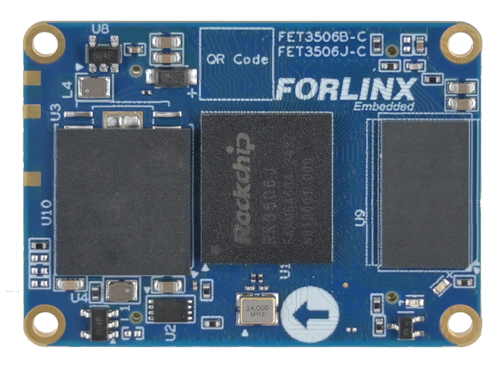

FET3506J-C/FET3506B-C Back（eMMC Version）

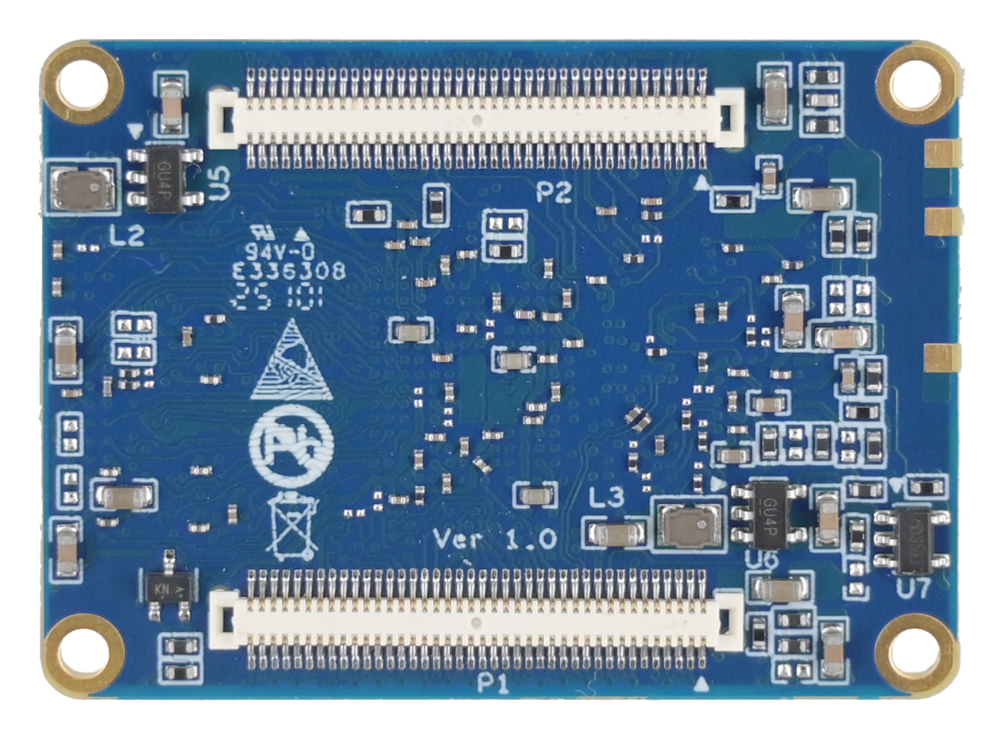

### 2.2 FET3506J-C/ FET3506B-C SoM Dimension Diagram

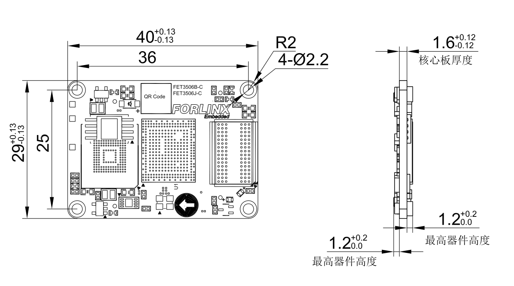

Structure size: 40mm × 29mm, dimensional tolerance ± 0.13mm, refer to DXF file for more dimensional information.

Plate making process: 1.6mm thickness, 8-layer immersion gold PCB.

Two connectors for 160 PINs.

### 2.3 Performance Parameters

#### 2.3.1 System Main Frequency

| **Name**| **Specification**| | | | **Description**|
|:----------:|:----------:|----------|----------|----------|:----------:|
| | **Minimum**| **Typical**| **Maximum**| **Unit**||
| Main Frequency | —| —| 1.5| GHz| —|
| RTC clock | —| 32.768| —| KHz| —|

#### 2.3.2 Power Parameter

| **Parameter**| **Pin number**| **Specification**| | | | **Description**|
|:----------:|:----------:|:----------:|----------|----------|----------|:----------:|
| | | **Minimum**| **Typical**| **Maximum**| **Unit**||
| Main Power Supply Voltage | VSYS| 4.75| 5| 5.25| V| —|
| No-load current | — | | 61 | | mA | See Appendix Power Consumption Table |
| High-load current | — | | 153 | | mA | See Appendix Power Consumption Table |

#### 2.3.3 Operating Environment

| **Parameter**| | **Specification**| | | | **Description**
|:----------:|----------|:----------:|----------|----------|----------|:----------:
| | | **Minimum**| **Typical**| **Maximum**| **Unit**| 
| Operating temperature| Operating Environment| 0| 25| +80| ℃| Commercial level
| | Storage Environment| -40| 25| +125| ℃| 
| | Operating Environment| -40| 25| +85| ℃| Industrial-grade
| | Storage Environment| -40| 25| +125| ℃| 
| Humidity| Operating Environment| 10| —| 90| ％RH| No condensation
| | Storage Environment| 5| —| 95| ％RH| 

### 2.4 SoM Interface Speed

| **Function**| **Quantity**| **Parameter**|
|:-----------|:-----------|:---------|
| USB2.0| 2| Support 2 x USB 2.0 OTG, one of which supports image programming|
| UART(1)| ≤6| The UART3/UART4/UART5 supports flow control with a maximum baud rate of 4Mbps|
| SPI| ≤3| SPI0/SPI1 is a general-purpose SPI controller that supports both master and slave modes; SPI2 is an SPI2APB controller that supports only slave mode and is typically used to push firmware or other data streams.|
| I2C（2）| ≤3| Up to 1Mbit/s|
| RMII| ≤2| Support RMII interface of 10/100Mbps|
| SARADC（3）| ≤4| 10bits resolution, maximum sampling rate 1MS/s|
| FLEXBUS| ≤1| FLEXBUS is equivalent to parallel 16 bit interface and is divided into two groups of FLEXBUS 0/1.|
| Touch Key| ≤8||
| MIPI-DSI（4）| ≤1| Supports 1 x MIPI DSI TX, 2-lanes, 1.5g bps/Lane, resolution up to 1280 X 1280 @ 60fps;|
| RGB| ≤1| Supports RGB 888 format with resolution up to 1280 X 1280 @ 60fps|
| DSMC| ≤1| Support 1x master or 1 x slave|
| TF card(5)| ≤1| Compatible with SDIO 3.0 protocol, 4bits data bit width|
| SAI| ≤4| Supports protocol I2S, PCM, TDM, sampling rate up to 192kHz|
| ACODEC| ≤1| RK3506 has built-in ACODEC and supports 1 pair of differential MIC inputs|
| PDM| ≤1| Up to 8 channels, sampling rate up to 192KHz, master receive mode|
| SPDIF| ≤1||
| CAN| ≤2| Support CAN2.0 B, data rate 8Mbps|
| PWM| ≤11||
| RM\_IO| ≤32| RM \_ IO is an IO matrix of 32 pins|
| GPIO(6)| ≤93||

**Note: **

- **The parameters in the table are the theoretical values of hardware design or CPU; "TBD" refers to functions not yet developed;**

- **UART0 is a debugging serial port and is not recommended to be used for other functions. You can use up to 5 x serial ports;**
- **I2C2 on the SoM is externally connected to an EEPROM (address: 0x50) with a 2K pulled up to 3V3. Avoid address conflicts when using the carrier board. Please note that if the I2C2 bus is damaged externally, it will affect the SoM's ability to read data from the EEPROM, which in turn will affect the normal startup of the SoM;**
- **SARADC\_IN0 is for SYSTEM BOOT setting only. SARADC\_IN1 samples key values and is for Recovery mode (non - modifiable). Not recommended as general ADC. Max 2 ADC for users;**
- **RGB and MIPI - DSI share a VOP, allowing only single - screen display;**
- **TF card and SoM emmc share an SDMMC controller. Only TF card on NAND SoM is usable;**
- **6 MIPI\_DSI pins can only be used as GPO.**

### 2.5 FET3506J-C/FET3506B-C SoM Pins Definition

#### 2.5.1 FET3506J-C/FET3506B-C SoM Pins Schematic

#### 2.5.2 FET3506J-C/FET3506B-C SoM Pins Description

When you have multiple functional expansion requirements, you can refer to the user guide "OK3506-C Pin Multiplexing Table". However, for more detailed information, it is recommended to consult relevant documents, the chip datasheet, and the reference manual.

### 2.6 SoM Hardware Design Description

**Power Pin**

| **Function**| **Signal Name**| **I/O**| **Default Function**| **Connector**| **Pin Number**
|:----------:|:----------:|:----------:|----------|:----------:|----------
| Power| VCC5V0\_SYS| Power Input| The power supply pin for the SoM is 5V, and the carrier board provides a current of no less than 2.0A.| P2| 1,2,3,4
| Power enable| VCC\_3V3| Power output| An enable signal used only to control the external power supply of the carrier board and output by the core board| P2| 9
| Ground| GND| Ground| SoM power ground and signal ground, all GND pins need to be connected| | 

**Function Control Pin**

| **Function**| **Signal Name**| **I/O**| **Default Function**| Connector| **Pin Number**
|:----------:|:----------:|:----------:|----------|:----------:|----------
| CPU reset| NPOR\_L| I| SoM power reset, active low, users should not add additional capacitive loads on this pin, so as not to affect the normal startup of the SoM.| P2| 13
| BOOT mode selection| SARADC0\_IN0\_BOOT| I| When the signal is grounded, the startup card enters the Maskrom download mode.   Pull down 12K resistor for eMMC or SD Card startup priority ; float for FSPI startup priority;| P2| 17
| Reset Mode| SARADC0\_IN1\_RECOVERY/KEY| I| When the signal is grounded, the startup card enters the Recovery download mode.| P2| 19
| Debugging serial port| UART0\_TX/JTAG\_TCK\_M1   UART0\_RX/JTAG\_TMS\_M1| I/O| Debugging serial port.It is recommended that the user keep the port function.| P1| 28.30

FET3506J/FET3506B-C SoM integrates the power supply, reset monitoring circuit, and storage circuit into a compact module. The required external circuits are very simple. To form a minimal system, only a 5V power supply, as shown in the following figure:

Please refer to “Appendix IV. for the minimal system schematic diagram However, in most cases, it is recommended to connect some external devices in addition to the minimal system, such as a debugging serial port, image flashing port, otherwise, users can not check whether the system is booted. After completing these steps, additional user-specific functions can be added based on the default interface definitions provided by Forlinx for the SoM.

Please refer to section 3.5 in “Chapter 3.OK3506x Carrier Board Description” for the peripheral circuits.

## 3\. OK3506J-C FET3506B-C Development Platform Description

### 3.1 OK3506x-C Development Board Interface Diagram

Connection method is B2B, and main interfaces are shown in the figure below:

### 3.2 OK3506x-C Development Board Dimension Diagram

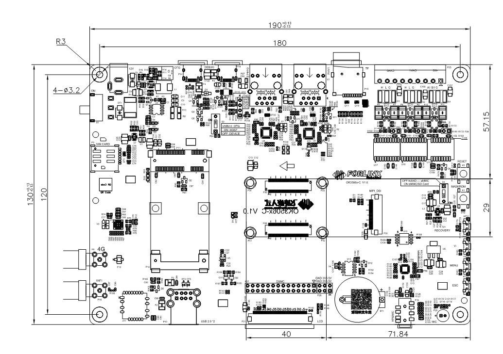

PCB Size: 130mm × 190mm

Fixed hole size: spacing: 120mm × 180mm, hole diameter: 3.2mm.

Plate making process: thickness 1.6mm, 4-layer PCB.

Power supply voltage: DC 12V.

### 3.3 Carrier Board Naming Rules

A-B-C+DEF:G-H

| Field| Field Description| Value| Description|
|:----------:|:----------:|:----------:|:----------:|
| A| Product line identification| OK| Forlinx Embedded carrier board|
| \-| Separator| \-||
| B| CPU Name| 3506| RK3506|
| \-| Segment Identification| \-||
| C| Connection| Cx| Board-to-board Connector|
| \+| Segment Identification| \+| The configuration parameter section follows this identifier.|
| D| Type| M| Carrier board（Carrier board is marked with M, which is not filled in by default.)|
| | | E| Expansion board|
| E| Operating Temperature| C| 0 to 80℃   Commercial-grade|
| | | I| -40 to 85℃   industrial  level|
| F| PCB Version| 10| V1.0|
| | | xx| Vx.x|
| :| Separator| :| It is followed by the manufacturer's internal marking.|
| G| Connector origin| 10| Imported connector|
| \-| Connector| \-| Level labelling connectors|
| H| Level label| PC| Prototype Sample|
| | | Blank| Mass Production|
| | | SC| Dedicated, with special modifications made according to the customer's specific requirements. |

### 3.4 Carrier Board Resources

| Function| Quantity| Parameter
|:----------:|:----------:|----------
| MIPI-DSI（1）| 1| 2-lane MIPI-DSI, support capacitive touch screen and backlight brightness adjustment
| LCD（1）| 1| 24-bit (RGB 888) up to 1280 × 1280 @ 60fps
| CAN| 2| CAN FD, support CAN 2.0B protocol, electrical quarantine.
| RS485| 1| Electrical isolation
| DSMC（2）| 1| Support master and slave modes
| WiFi| 1| Single antenna 2.4G\&5GHz Wi-Fi Dual-band 1X1 802.11b/g/n
| Bluetooth| 1| Bluetooth 4.2
| 4G| 1| 4G module supporting miniPCIE interface, with USB2.0 communication signal
| TF Card| 1| Support maximum SDR52 rate
| KEY ADC| 4| Use 1 x SARADC to export 4 keys.
| USB2.0| 2| USB HUB pinout, supports master mode only
| Ethernet（3）| 2| Standard RJ45 socket pinout, dual 100MHz ports
| Audio| 1| Stereo headphone output; headphone recording + onboard MIC recording
| OTG| 1| Supports USB flashing firmware and OTG function
| RTC| 1| On-board CR2032 battery, keep going when power is off
| PWM| 1| Connect the display for backlight brightness adjustment
| UART Debug| 2| Integrated in a Type-C port that can be connected to a computer for debugging
| JTAG Debug| 1| The carrier board has reserved pins for easy debugging.

**Note:** 

- **The parameters in the table are the theoretical values of hardware design or CPU;** 

- **There is interface multiplexing between MIPI-DSI and LCD, and only one of them can be used;**
- **DSMC and LCD cannot be used simultaneously;**

- **PHY1 is a compatible design, supporting a 1.8V level. For details, refer to Section 3.5.7, Dual 100 - Mbps Ethernet.**

### 3.5 OK3506x -C Carrier Board Description

**Note: The component UID with "\_DNP" mark in the diagram below represents it is not soldered by default. The schematic diagrams in this manual are only for interface description. When you conduct hardware design, please refer to the source file materials.**

#### 3.5.1 Carrier Board Power

Carrier board power supply is DC 12V, led in through DC-005 socket (P1). This 12V DC power supply passes through a switch (S1), TVS protection, a self - recovery fuse, and an anti - reverse connection diode, and then is converted to 5V DC through a DC - DC converter, with a maximum continuous current of 6A. These two power supplies are uncontrolled, and their network names are VCC\_12V and VDD\_5V respectively.

VDD\_5V is converted to VCC5V0\_SYS after passing through two parallel 0 - ohm resistors, R8 and R13. VCC5V0\_SYS is the 5V power supply for the SoM. After the SoM is powered on, it outputs a 3.3V DC voltage as the carrier board power enable signal, with the network named VCC\_3V3\_EN.

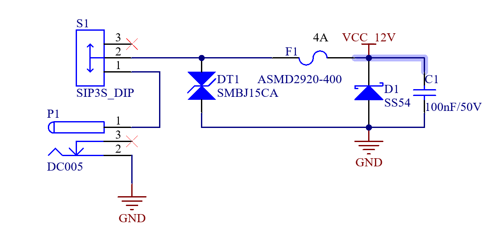

When VCC\_3V3\_EN is at a high level, Q1 conducts. After Q1 conducts, U2 conducts, connecting VDD\_5V to the VCC\_5V network, and the entire carrier board is powered on.

This circuit is to ensure that the SoM is powered on first, and followed by the carrier board, so as to prevent the damage to the CPU caused by latch-up effects.

The DC 3.3V power supply of the carrier board consists of two independent DC-DC and one LDO. The DC 3.3V power supply for the 4G module is obtained by converting DC 5V through a DC-DC converter. Its network name is VCC\_3V3\_4G. The DC 3.3V for the audio of the carrier board is converted from 5V via an LDO, with independent power supply. The clean DC power network is VCC \_ 3V3 \_ CODEC. The remaining DC 3.3V power supply of the carrier board is obtained by converting DC 5V through another set of DC-DC converters, and its network name is VCC\_3V3.

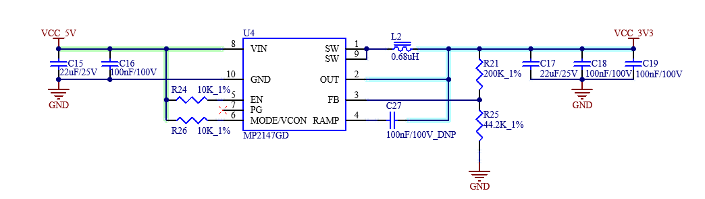

#### 3.5.2 Keys

NPOR\_L is the reset button of the system. The corresponding physical button is located in the middle on the right side of the carrier board, with the silkscreen “RESET”. Pressing it will reset and restart the development board.

SARADC\_IN0\_BOOT is the MASKROM button. The corresponding physical button is located in the middle on the right side of the carrier board, with the silkscreen “MASKROM”. Press this button when the power is off and then power on the system. At this time, the system enters the MASKROM flashing mode.

SARADC\_IN1\_RECOVER/KEY is the system user button and the boot option selection button. The KEY1 is the RECOVERY/V+ button. Press it when the power is off and then power on the system. At this time, the system enters the BOOTLOADER mode. After starting the system, you can customize it as the volume up button. KEY2 is the V- button, which you can configure as the volume down button. KEY3 is the MENU button, which you can configure as the menu button. KEY4 is the ESC button, which you can configure as the back button. All these four buttons are on the right side of the development board, and the buttons face the right side.

#### 3.5.3 BOOT Configuration

SARADC\_IN0\_BOOT serves not only as a button but also as a pin for system boot option selection. When using the SoM configured with SPI\_NAND, turn on switch S3. The boot option order is as follows: boot from the eMMC/TF card first, and then from USB. Turn off S3, and the boot option order becomes: boot from SPI\_NAND first, then from the eMMC/TF card, and finally from USB.

Since the eMMC and TF card share the same set of data buses, only one of them can be used at a time. When using the eMMC version of the SoM, the TF card cannot be used as a system boot medium, nor can it be used as a storage device.

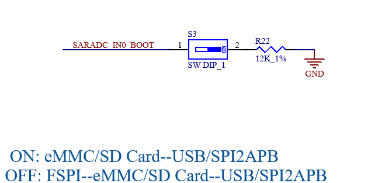

#### 3.5.4 Debugging Serial Port

A USB Type - C interface is used on the carrier board as a debugging serial port. Connect it to a computer with a data cable and select the corresponding serial port to start debugging.

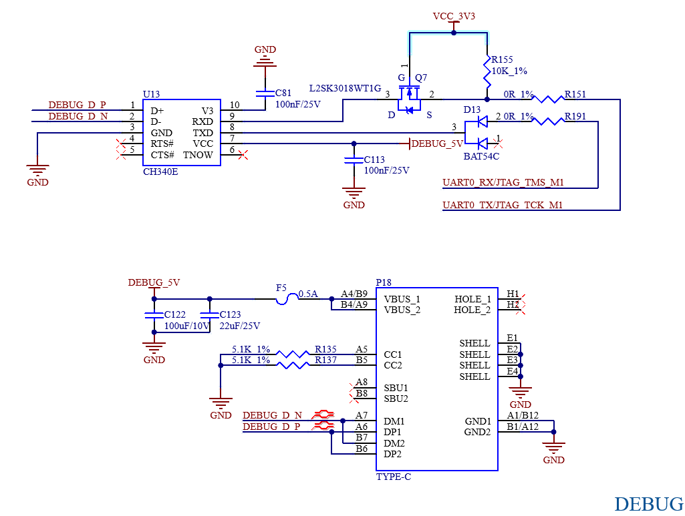

**Note:**

**To facilitate subsequent debugging, please lead out this debugging serial port when designing the carrier board by yourself;**

#### 3.5.5 4G Module 

The carrier board has a reserved MINI PCIE interface, where the Quectel EC20 4G module can be installed. After installing a SIM card, 4G Internet access can be achieved. When using the 4G module, a matching 4G antenna needs to be installed.

P8 is a self - ejecting nano SIM card slot. Please pay attention to the card insertion direction according to the markings on the board. Hot - swapping of the card is not supported.

Before using the 4G function, please power off the board first, install the 4G module and the SIM card, connect the 4G ipex jumper from the module to P8 on the board, and then an external antenna can be connected via the SMA interface of P9.

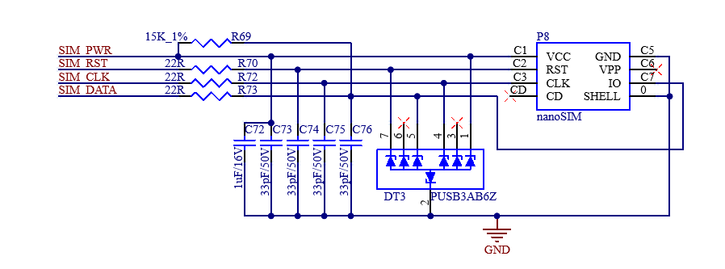

#### 3.5.6 USB Download/OTG

The P14 USB Type - C interface in the upper - left corner of the development board can be used for firmware flashing and OTG functions. The function of this Type - C interface can be selected via the S2 switch: when S2 is turned on, the USB interface is in HOST mode and can be used as HOST; when S2 is turned off, the USB interface is in Device mode, and the development board image can be flashed by connecting to a computer with a data cable.

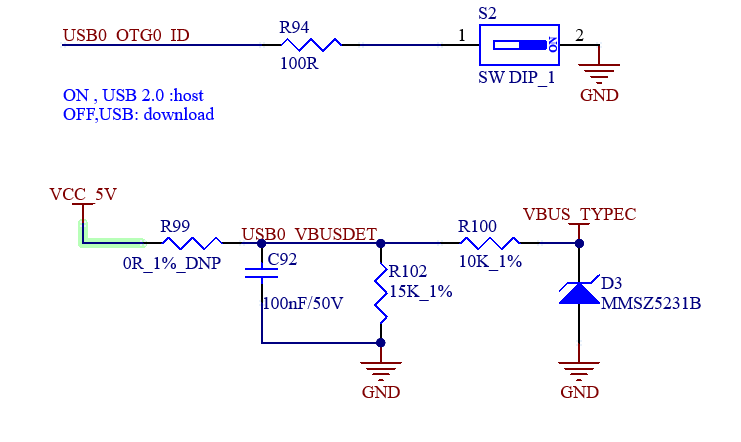

USB0\_VBUSDET is the detection pin for DEVICE status recognition. When the pin level is high, it indicates a DEVICE device, and the typical voltage is 3.0V. By default, VBUS\_TYPEC is used for power supply. If you need to use VCC\_5V for level detection, you need to leave R100 un - soldered and solder a 10K resistor on R99. If you have any special usage requirements, please contact Forlinx’s technical support.

#### 3.5.7 Dual 100-Mbps Ethernet

The CPU supports a maximum of two 100-Mbps network ports. The carrier board provides two 100 - Mbps Ethernet interfaces, both of which are connected to the PHY chip in the form of RMII interfaces and led out through RJ45 sockets, namely P6 and P7. The socket model is FC62115BNL, which has a built - in isolation transformer. 

For the first Ethernet port, the YT8512H is used as the PHY chip The second Ethernet circuit is a compatible design. For the PHY chip, either YT8512H or YT8522H can be used. When using YT8522H, two interface levels of 1.8V and 3.3V are available for selection, and the default level is 3.3V. By default, YT8512H is used. If you want to use YT8522H, please contact Forlinx staff for technical support.

The soldering details of the Ethernet design components are shown in the following table:

| **Ethernet**| **PHY chip**| **Interfaces level**| **Component soldering**
|:----------:|:----------:|:----------:|----------
| PHY0| YT8512H| 3.3V| Keep the default
| PHY1| YT8512H| 3.3V| Keep the default
| PHY1| YT8522H| 3.3V| Weld R64 R124 R132 on a default basis.
| PHY1| YT8522H| 1.8V| Welding R64 R71 R124 R132 R192 R193 R194 R197 R202 R204 Q11 Q12 Q13 empty welding R47 R66 R129 R140 R195

PHY0:

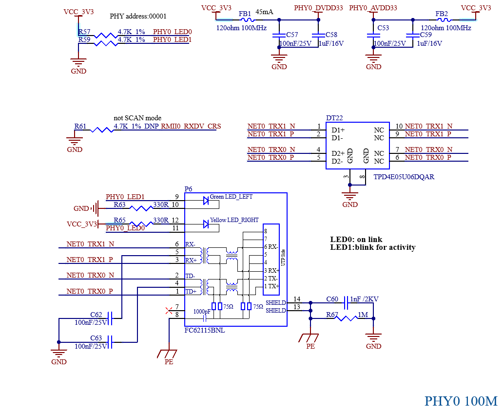

PHY1:

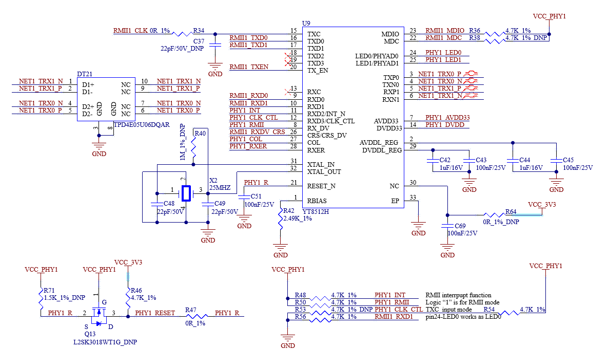

**Note: When designing the PCB, ensure that the PHY chip has a complete ground.**

#### 3.5.8 JTAG/SWD

There is a JTAG debugging interface (P17) on the carrier board, which is convenient for users to simulate and debug RK3506. Led out via a 2.54mm pitch pin.

#### 3.5.9 RTC

The carrier board is externally provided with RTC equipment through I2C2, and is supplied with power through D12 compatible with VCC \_ 3V3 and the button cell. After the carrier board is powered off, the button cell can maintain power supply for the RTC chip. The RX8010SJ chip design is used by default. The button cell model is CR2032.

#### 3.5.10 TF Card

The TF card on the development board shares the CPU's SDMMC channel with the SoM's eMMC. As a result, TF cards cannot be used on development boards configured with eMMC.

**Note:**

**1\. The pull-up resistor on the bus has been adapted on the SoM, so the pull-up can not be processed on the carrier board;**

**2\. The TF card is a hot-swappable device, so ESD protection should be implemented;**

**3\. SD signals must be length-matched.**

#### 3.5.11  MIPI-DSI

The FPC connector at position P20 on the development board can connect to an MIPI-DSI display. The connector is 30P.

It supports a 2 lane MIPI-DSI connection at 1.5Gbps per lane and touchscreens with an I2C interface. MIPI-DSI and LCD screens can only be used alternatively, not simultaneously.

#### 3.5.12 LCD Display

The CPU supports a parallel 24-bit LCD interface, with a maximum RGB888 24-bit mode, a resolution up to 1280x1280, and a refresh rate of 60Hz. The P21 FPC socket on the development board can be connected to the LCD display screen. The connector is 54P, with a pitch of 0.5mm. The lower part is connected to the clamshell, which can be connected to the capacitive touch screen produced by Forlinx. The LCD interface is connected in RGB 888 24bit mode. MIPI-DSI and LVDS screens can only be used alternatively, not simultaneously.

Don't plug or unplug the FPC cable with power on. Mind the direction and angle during operation; incorrect operation may burn the CPU.

#### 3.5.13 DSMC

P27 on the development board reserves the DSMC interface, which shares data lines with the LCD. Users can select the desired function accordingly.

#### 3.5.14 Audio

There is a standard 3.5mm headphone jack on the development board (CTIA international standard) at P19, supporting stereo headphone playback and mono MIC recording.

P26 is an onboard MIC that enables mono recording.

#### 3.5.15 USB2.0

The development board integrates 1 x USB2.0 HUB (position U10), expanding 4 x downstream USB HOST nodes, connecting to 2 x USB2.0-A standard interfaces (position P13), 1 x mini-PCIe interface, and 1 x WiFi module. The mini-PCIe interface supports a 4G module connection.

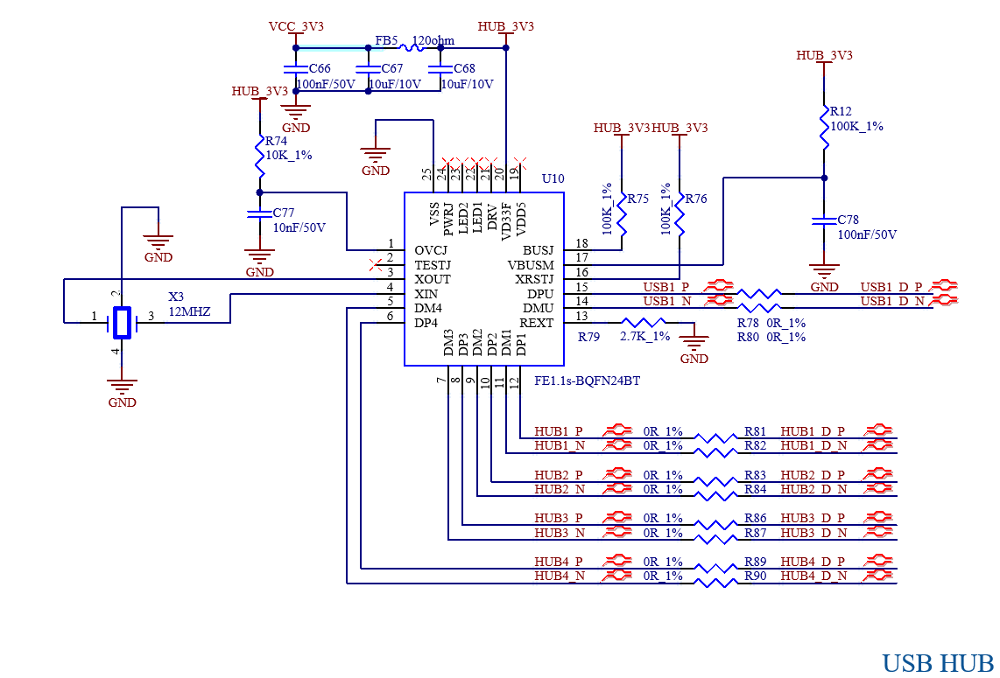

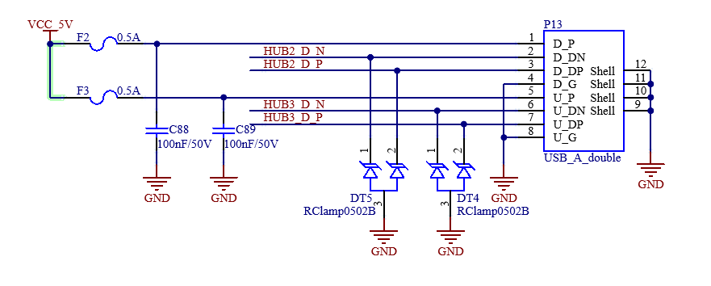

#### 3.5.16 WiFi \& Bluetooth

The development board includes an on-board WiFi \& Bluetooth module, model BL-M8723DU. The WIFI uses a USB 2.0 interface and operates in the 2.4GHz frequency band, complying with IEEE 802.11b/g/n standards. The theoretical maximum data rate can reach up to 150Mbps. The Bluetooth controller complies with the Bluetooth V4.2 standard. Position P16 is an SMA connector for the antenna.

#### 3.5.17 CAN

The development board uses the native CAN0 and CAN1 to lead out 2 x CAN FD interfaces. It supports the CAN 2.0B protocol and is designed with electrical isolation, which can meet the protection requirements in most scenarios. 

The CAN signal is led out through a green terminal with a 3.81mm pitch. Use a jumper cap to install a 120 - ohm terminal resistor.

#### 3.5.18 RS485

The development board uses the native UART2 to lead to the standard RS485 interface, which supports automatic send/receive control and is designed to be electrically isolated to meet the protection requirements in most scenarios.

The RS485 signal is led out through a green terminal with a 3.81mm pitch. Use a jumper cap to install a 120 - ohm terminal resistor.

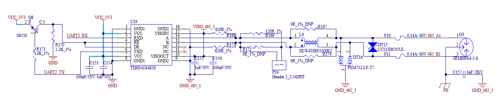

#### 3.5.19 SPI

The carrier board reserves an SPI interface for external storage circuitry. The SPI data lines share the same group as the NAND FLASH on the SoM, so they cannot be used simultaneously.

## 4\. Connector Dimension Diagram

SoM connector: Board-to-board, 0.5mm pitch, 80P, male socket, height 1.25 mm, with locating post.

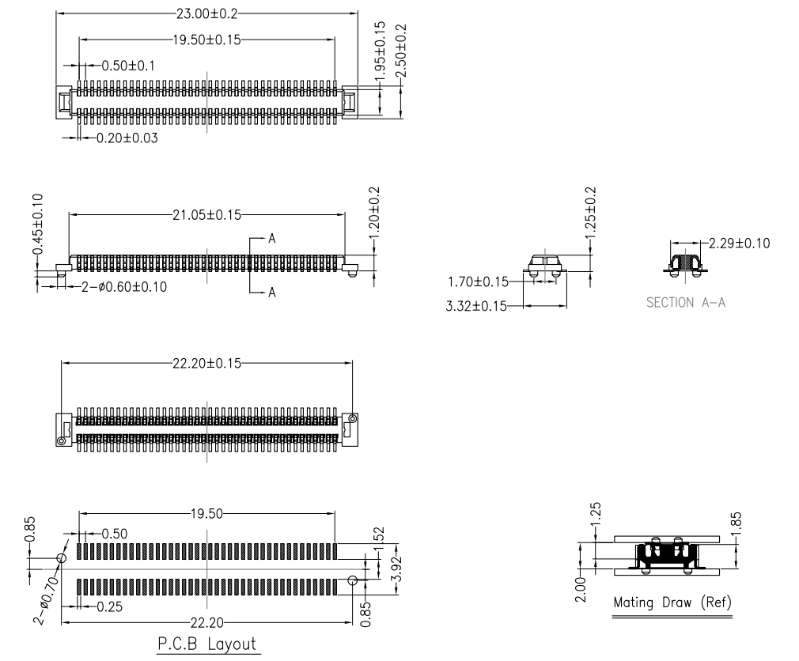

Carrier board connector: Board-to-board, 0.5mm pitch, 80P, femal socket, height 1.85 mm, with locating post.

## 5\. OK3506J-C FET3506B-C Development Board Linux System Power Consumption Table

| **No.**| **Test Item**| **CPU Temperature**| **Usage Rate**| **Frequency**| **SoM Power (W)**| **Development board power (including SoM) **
|:----------:|:----------:|:----------:|:----------:|:----------:|:----------:|:----------:
| 1| No-load starting peak power| /| /| /| 0.78257| 2.46792
| 2| No-load standby peak power| 35.69℃| CPU usage: almost completely idle DDR usage: 11% | CPU frequency: 1416000 DDR frequency: 750MHz| 0.3073485| 1.7257992
| 3| USB read and write power| 33.91℃| CPU usage: 69.7%  DDR usage: 12%| CPU frequency: 1416000 DDR frequency: 750MHz| 0.3805685| 2.2220868
| 4| 4G module PING network power| 32.72℃| CPU usage: almost completely idle DDR usage: 11%| CPU frequency: FM DDR frequency: 750MHz| 0.3074165| 2.069202
| 5| TF read and write power| 33.91℃| CPU usage: almost completely idle DDR usage: 11%| CPU frequency: FM DDR frequency: 750MHz| 0.3969345| 1.9784196
| 6| Network port PING network power| 34.19℃| CPU usage: almost completely idle DDR usage: 11%| CPU frequency: FM DDR frequency: 750MHz| 0.3706895| 1.980738
| 7| Load 7-inch LCD screen power| 38.66℃| CPU usage: 44%  DDR usage: 11%| CPU frequency: FM DDR frequency: 750MHz| 0.526273| 4.0041732
| 8| Load 7-inch MIPI screen power| 38.07℃| CPU usage: 39.3%  DDR usage: 11%| CPU frequency: FM DDR frequency: 750MHz| 0.47136| 4.1112816
| 9| CPU pressure + memory pressure + eMMC read/write pressure test power| 39.85℃| CPU usage: 100%  DDR usage: 97.6%| CPU frequency: 1512000 DDR frequency: 750MHz| 0.767534| 2.177694

+ **Note：**

- **Test conditions: The SoM configuration is 256MB memory + +256MB NAND; the 4G module is Quectel EC20, and the screen is an optional product. SoM power supply is 5V and carrier board is 12V;**
- **U-BOOT：U-Boot 2017.09-gd76af45 #zmx (Apr 03 2025 - 11:08:12 +0800)** 
  **Kernel: Linux ok3506-buildroot 6.1.99 #1 SMP PREEMPT Thu Apr  3 11:23:18 CST 2025 armv7l GNU/Linux;**
- **Power consumption is for reference only.**

---

## 6\. Minimum System Schematic

+ **The minimum system includes the SoM, power supply, debugging serial port, and system image flashing interface.**

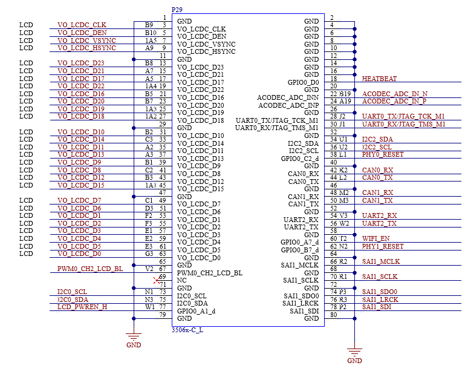

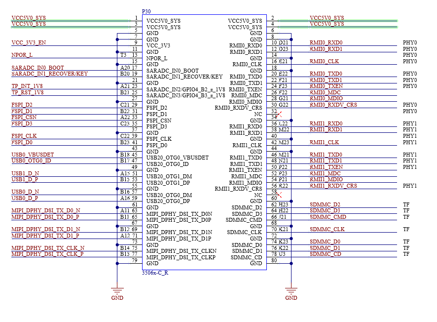

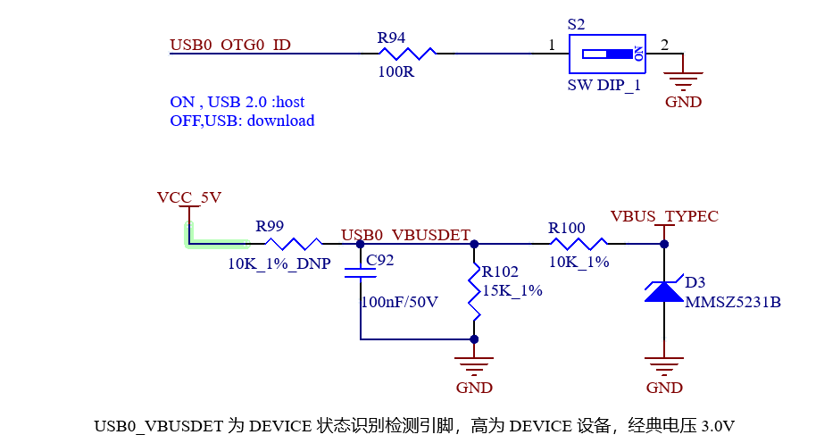